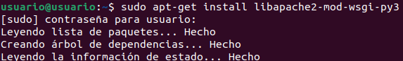

<a href="/ServidoresWeb/readme.md"></a>

<a href="3.md"></a>
&emsp;&emsp;&emsp;&emsp;&emsp;&emsp;&emsp;
<a href="5.md"></a>

---

# Activar el módulo “wsgi” para permitir la ejecución de aplicaciones Python

Para activar el módulo `wsgi`, ejecutaremos el comando:

``` cmd
sudo apt-get install libapache2-mod-wsgi-py3
```



``` cmd
sudo a2enmod wsgi
```