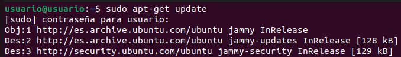
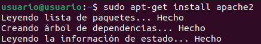
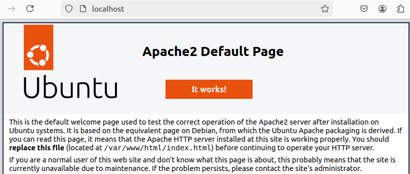
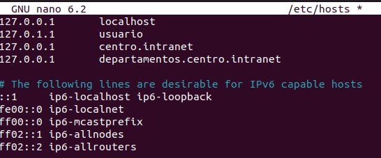
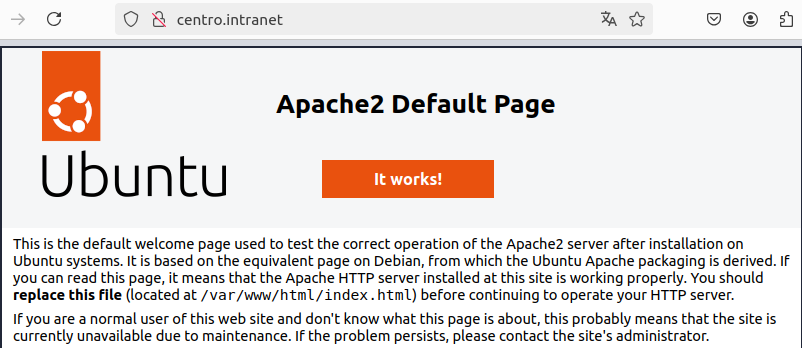
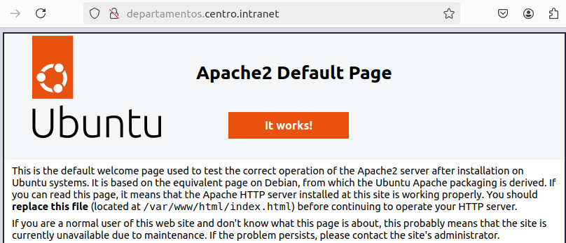

<a href="/ServidoresWeb/readme.md"></a>

<a href="1.md"></a>
&emsp;&emsp;&emsp;&emsp;&emsp;&emsp;&emsp;
<a href="2.md"></a>

---

# Instalación del servidor web apache.

Usaremos dos dominios mediante el archivo hosts: `centro.intranet` y `departamentos.centro.intranet`.

El primero servirá el contenido mediante wordpress y el segundo una aplicación en python

---

## Instalación del servidor web apache

Para ello ejecutamos la siguiente secuencia de comandos:

``` cmd
sudo apt-get update
```



``` cmd
sudo apt-get install apache2
```



Esto nos instalará el servidor web apache, para comprobar que se ha instalado correctamente iremos al navegador y escribiremos `localhost` o `127.0.0.1` en la barra de direcciones.

Si todo esta correcto aparecerá una web como esta:



---

## Configuración del archivo hosts

Ahora, para que los dominios `centro.intranet` y `departamentos.centro.intranet` apunten a nuestro servidor local, debemos editar el archivo `/etc/hosts`:

``` cmd
sudo nano /etc/hosts
```

Y añadimos las siguientes líneas:

``` cmd
127.0.0.1 centro.intranet
127.0.0.1 departamentos.centro.intranet
```



Comprobamos que el archivo hosts se ha modificado correctamente:

``` cmd
apachectl configtest
```

Si todo esta correcto, reiniciamos el servidor apache:

``` cmd
sudo service apache2 restart
```

Comprobamos que ambos dominios funcionan correctamente entrando a `centro.intranet` y `departamentos.centro.intranet` en el navegador.





---

