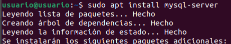
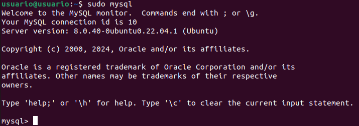
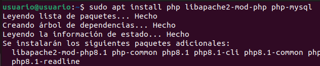
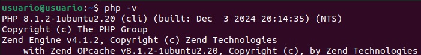

<a href="/ServidoresWeb/readme.md"></a>

<a href="1.md"></a>
&emsp;&emsp;&emsp;&emsp;&emsp;&emsp;
<a href="3.md"></a>

---

# Activar los módulos necesarios para ejecutar php y acceder a mysql

---

## SQL

Para ello, debemos activar los módulos SQL:

``` cmd
sudo apt install mysql-server
```



``` cmd
sudo mysql_secure_installation
```

Para comprobar que se ha instalado correctamente, ejecutamos:

``` cmd
sudo mysql
```



## PHP

Para ello, debemos activar los módulos PHP:

``` cmd
sudo apt install php libapache2-mod-php php-mysql
```



Comprobamos que se instaló correctamente comprobando la versión de PHP:

``` cmd
php -v
```



---