<a href="/ServidoresWeb/readme.md"></a>

<a href="2.md"></a>
&emsp;&emsp;
<a href="4.md"></a>

---

# Instala y configura wordpress

## Directorios

Antes de instalar WordPress, crearemos los directorios de cada dominio:

``` cmd
sudo mkdir /var/www/centro.intranet
sudo mkdir /var/www/departamentos.centro.intranet
```

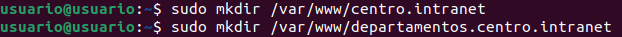

``` cmd
sudo chown -R $USER:$USER /var/www/centro.intranet
sudo chown -R $USER:$USER /var/www/departamentos.centro.intranet
```

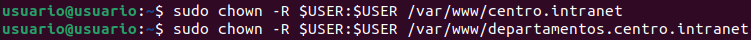

Crearemos tambien el archivo de configuración de Apache para cada dominio:

``` cmd
sudo nano /etc/apache2/sites-available/centro.intranet.conf
sudo nano /etc/apache2/sites-available/departamentos.centro.intranet.conf
```

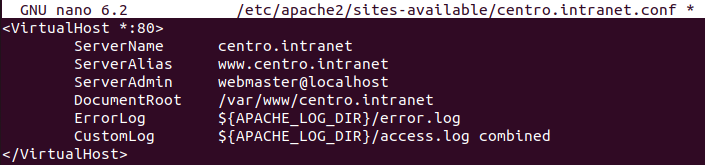

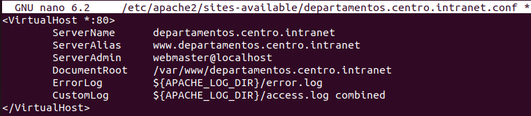

Activamos sendos sitios webs:

``` cmd
sudo a2ensite centro.intranet
sudo a2ensite departamentos.centro.intranet
```

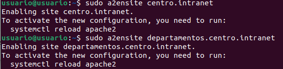

Comprobamos apache.

``` cmd
apachectl configtest
```

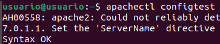


Reiniciamos Apache:

``` cmd
sudo systemctl reload apache2
```

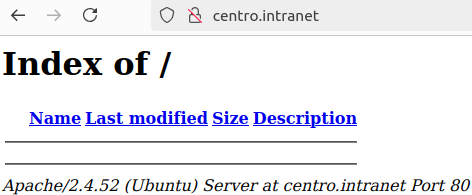
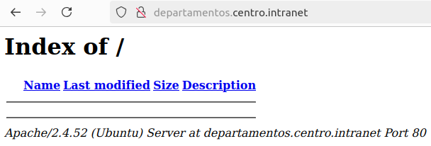

---

## MariaDB

El siguiente paso es instalar MariaDB:

``` cmd
sudo apt-get install mariadb-client mariadb-server
```

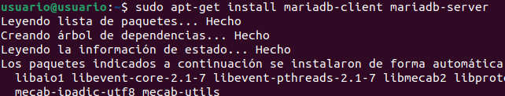
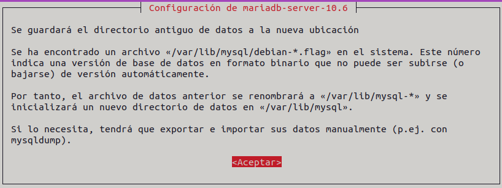

---

## WordPress 

Descargamos el directorio de WordPress.

``` cmd
sudo wget https://wordpress.org/latest.tar.gz
```

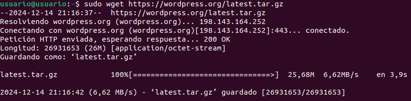

Descomprimimos:

``` cmd
sudo tar -xvf latest.tar.gz
```

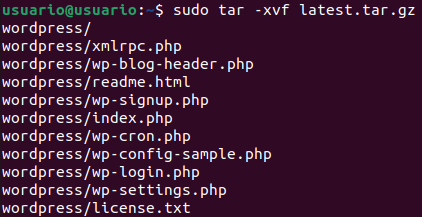

Ahora podremos ver la carpeta en el direcctorio raíz:

``` cmd
ls
```

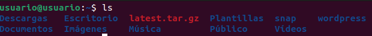

Ahora, moveremos el contido al directorio `centro.intranet`

``` cmd
sudo mv wordpress/* /var/www/centro.intranet
```

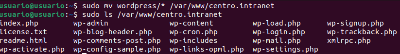

> Haremos una copia del fichero de configuración, el cual configuraremos mas adelante.

``` cmd
sudo cp /var/www/centro.intranet/wp-config-sample.php /var/www/centro.intranet/wp-config.php
```

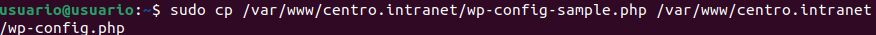

---

## Configuración de MariaDB

Entamos en MariaDB y creamos la base de datos para WordPress:

``` cmd
sudo mariadb
```

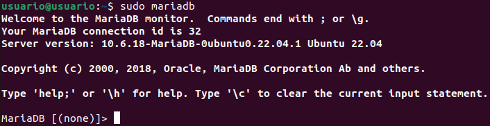

``` sql
CREATE DATABASE centro_intranet;
```

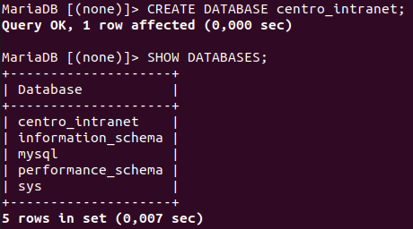

``` sql
CREATE USER 'usuario' IDENTIFIED BY 'usuario';
```

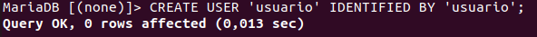

``` sql
GRANT ALL PRIVILEGES ON centro_intranet.* TO 'usuario' IDENTIFIED BY 'usuario';
```

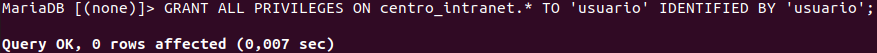

---

## Configuración de WordPress

``` cmd
sudo nano /var/www/centro.intranet/wp-config.php
```
``` php
define( 'DB_NAME',      'centro_intranet' );
define( 'DB_USER',      'usuario' );
define( 'DB_PASSWORD',  'usuario');
```

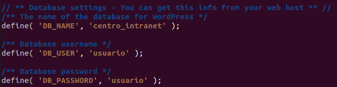

Accedemos a la web de WordPress e instralamos WordPress:

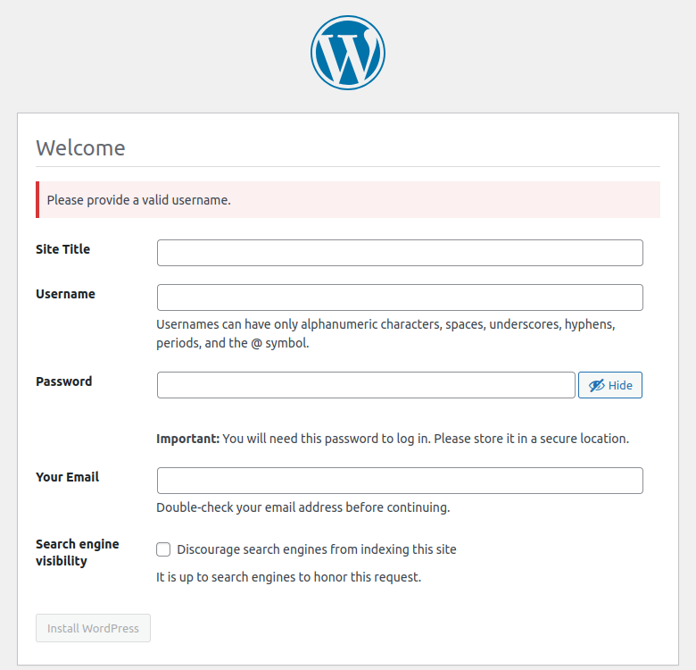

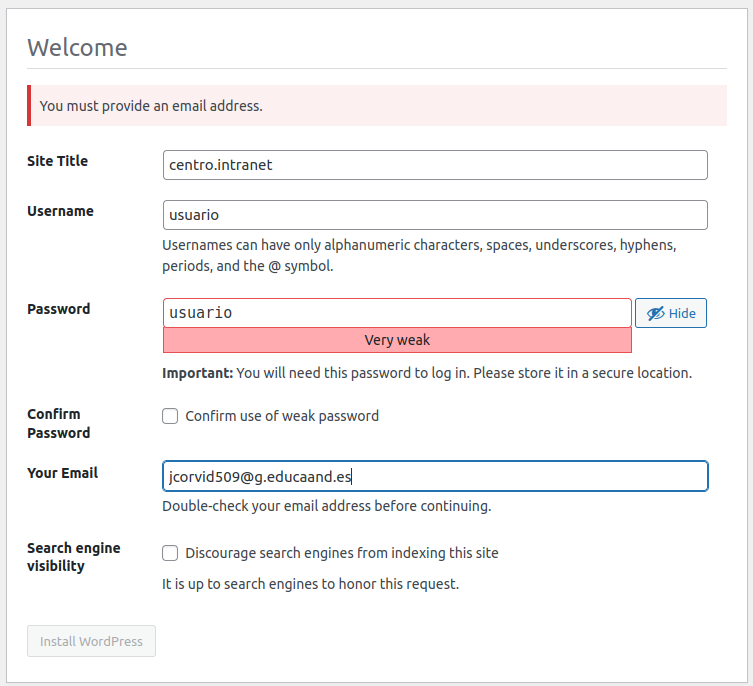

Y ahora podemos acceder a la web de WordPress:

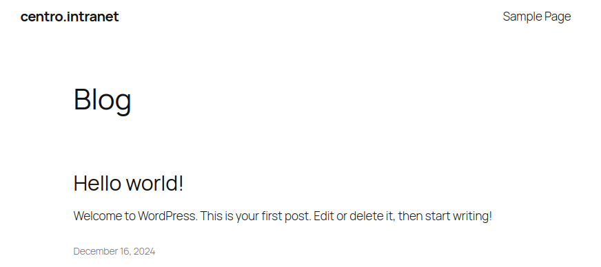