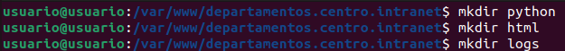
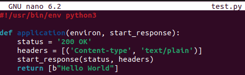
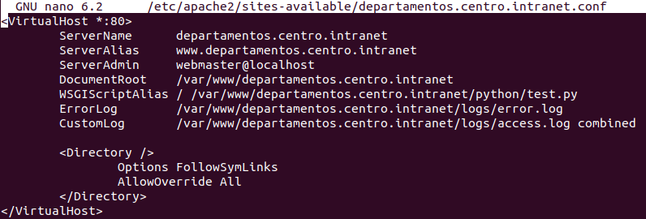
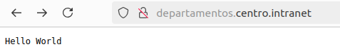

<a href="/ServidoresWeb/readme.md"></a>

<a href="4.md"></a>
&emsp;&emsp;&emsp;&emsp;&emsp;&emsp;&emsp;
<a href="6.md"></a>

---

# 🐍 Crea y despliega una pequeña aplicación python para comprobar que funciona correctamente.

Primero crearemos el directorio para la aplicación y los **logs**

``` cmd
cd /var/www/XXX
```

``` cmd
mkdir python
```

``` cmd
mkdir html
```

``` cmd
mkdir logs
```



Creamos la aplicación de Python

``` cmd
sudo nano python/test.py
```

``` python
#!/usr/bin/env python3

def application(environ, start_response):
    status = '200 OK'
    headers = [('Content-type', 'text/plain')]
    start_response(status, headers)
    return [b"Hello World"]
```



Y en la configuración de nuestro dominio departamentos.centro.intranet agregamos el siguiente código.

``` cmd
sudo nano /etc/apache2/sites-available/departamentos.centro.intranet.conf
```

``` apache
<VirtualHost *:80>
        ServerName      departamentos.centro.intranet
        ServerAlias     www.departamentos.centro.intranet
        ServerAdmin     webmaster@localhost
        DocumentRoot    /var/www/departamentos.centro.intranet
        WSGIScriptAlias / /var/www/departamentos.centro.intranet/python/test.py
        ErrorLog        /var/www/departamentos.centro.intranet/logs/error.log
        CustomLog       /var/www/departamentos.centro.intranet/logs/access.log combined

        <Directory />
                Options FollowSymLinks
                AllowOverride All
        </Directory>
</VirtualHost>
```



Damos permisos a nuestro archivo de configuración y reiniciamos el servicio de Apache.

```cmd
sudo chown -R www-data:www-data /var/www/departamentos.centro.intranet
sudo chmod -R 755 /var/www/departamentos.centro.intranet
```

Reiniciamos el servicio de Apache:

``` cmd
sudo systemctl restart apache2
```

Ahora , cuando accedamos a la URL `http://departamentos.centro.intranet`, deberíamos ver el mensaje "Hello World" en la pantalla.


