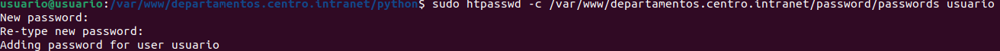
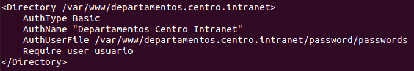
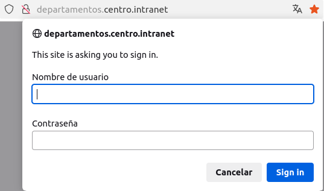

<a href="/ServidoresWeb/readme.md"></a>

<a href="5.md"></a>
&emsp;&emsp;&emsp;&emsp;&emsp;&emsp;&emsp;
<a href="7.md"></a>

---

# 🔒 Protegeremos el acceso a la aplicación python mediante autenticación

Para proteger el acceso a la aplicación Python, podemos utilizar autenticación. En este caso, utilizaremos autenticación de usuario y contraseña.

Creamos un directorio llamdo password dentro de `/var/www/departamentos.centro.intranet`, en el cual almacenaremos los usuarios.

``` cmd
sudo mkdir /var/www/departamentos.centro.intranet/password
```

Creamos las credenciales

``` cmd
sudo htpasswd -c /var/www/departamentos.centro.intranet/password/passwords usuario
```



Ahora dentro del fichero de configuración del servidor agregamos el siguiente código.

``` cmd
sudo nano /etc/apache2/apache2.conf
```

Y añadimos el siguiente codigo

``` apache
<Directory /var/www/departamentos.centro.intranet/python>
    AuthType Basic
    AuthName "Departamentos Centro Intranet"
    AuthUserFile /var/www/departamentos.centro.intranet/password/passwords
    Require user usuario
</Directory>
```



Reiniciamos Apache:

```
sudo systemctl reload apache2
```

Accedemos a la aplicación y nos pedirá la contraseña para acceder a la aplicación.

