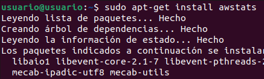
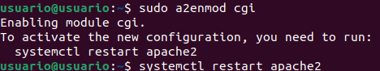
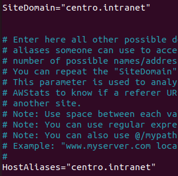
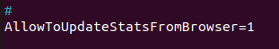
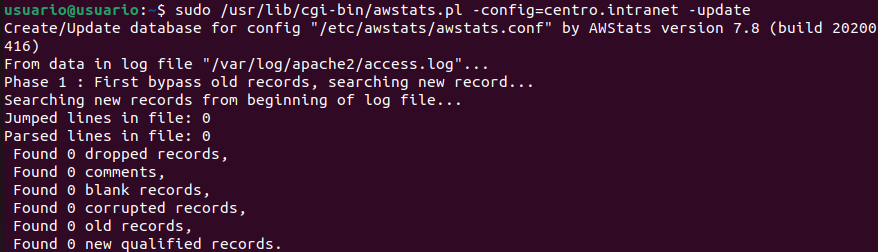
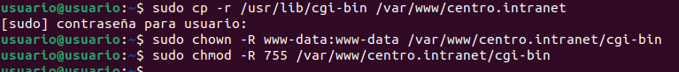
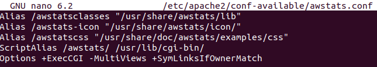
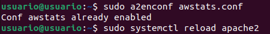
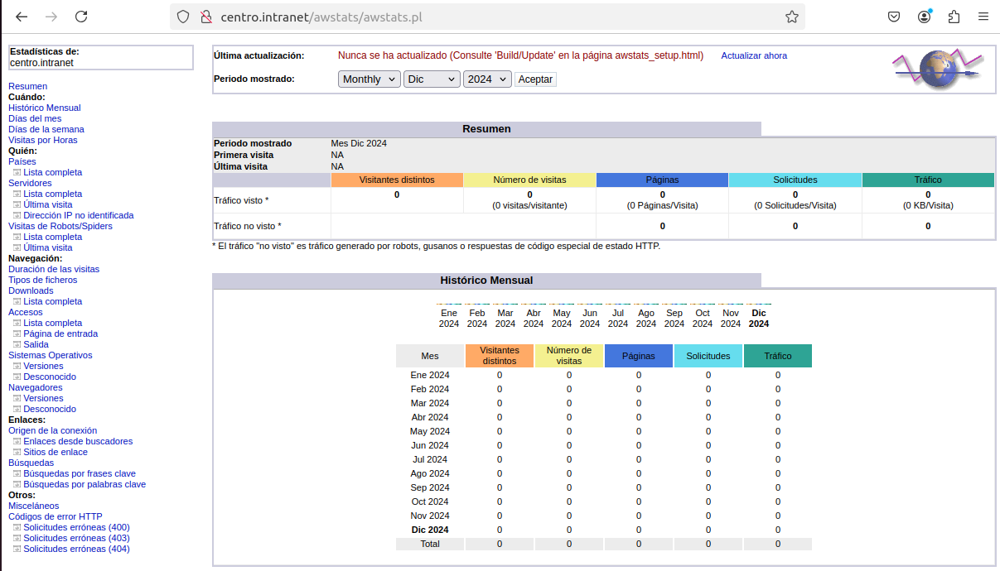

<a href="/ServidoresWeb/readme.md"></a>
<a href="6.md"></a>
<a href="8.md"></a>

---

# Instala y configura ***awstat***.

Para instalar ***awstat***, sigue estos pasos:

Instalamos el servicio de ***awstat***:

``` cmd
sudo apt-get install awstats
```



Activaremos el módulo `a2enmod cgi`:

``` cmd
sudo a2enmod cgi
```

Reiniciamos apache

``` cmd
systemctl restart apache2
```



Modificamos el archivo de configuración de awstats.

``` cmd
sudo nano /etc/awstats/awstats.conf
```

Dentro de él modificamos lo siguiente:

``` apache
SiteDomain="centro.intranet"

HostAliases="centro.intranet"

AllowToUpdateStatsFromBrowser=1
```





Generamos las estadísticas:

```
sudo /usr/lib/cgi-bin/awstats.pl -config=centro.intranet -update
```



Configuramos Apache para que pueda acceder a las estadísticas:

``` cmd
sudo cp -r /usr/lib/cgi-bin /var/www/centro.intranet
```

``` cmd
sudo chown -R www-data:www-data /var/www/centro.intranet/cgi-bin
```

``` cmd
sudo chmod -R 755 /var/www/centro.intranet/cgi-bin
```


Vamos a modificar la configuración de awstats en Apache (creamos el archivo).

``` cmd
sudo nano /etc/apache2/conf-available/awstats.conf
```

Agregamos lo siguiente:

``` apache
Alias /awstatsclasses "/usr/share/awstats/lib"
Alias /awstats-icon "/usr/share/awstats/icon/"
Alias /awstatscss "/usr/share/doc/awstats/examples/css"
ScriptAlias /awstats/ /usr/lib/cgi-bin/
Options +ExecCGI -MultiViews +SymLinksIfOwnerMatch
```



Habilitamos la configuración y reiniciamos Apache.

``` cmd
sudo a2enconf awstats.conf
```

``` cmd
sudo systemctl reload apache2
```



Y si accedemos a `centro.intranet/awstats/awstats.pl` podemos ver las estadísticas de visita de nuestro dominio.

