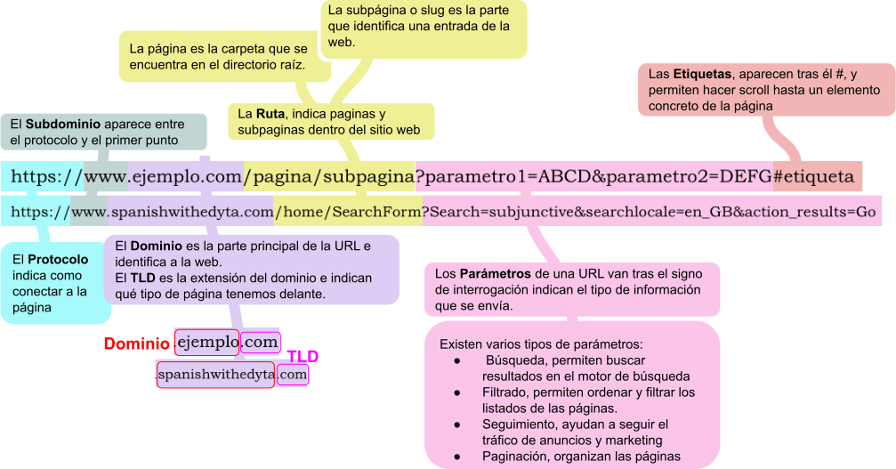

# Actividad 1: HTTP Introducction

## 1 ¿Quién, dónde y cuándo se crea el primer servidor web?

<b>Respuesta</b>

> El
> [**primer servidor web**](https://es.wikipedia.org/wiki/World_Wide_Web#Historia)
> fue creado por
> [**Tim Berners-Lee**](https://es.wikipedia.org/wiki/Tim_Berners-Lee) en 1990 en el
>[**CERN**](https://es.wikipedia.org/wiki/Organizaci%C3%B3n_Europea_para_la_Investigaci%C3%B3n_Nuclear)
> (Organización Europea para la Investigación Nuclear) en Suiza.
>
> 
>

## 2 ¿Cuál es la pila de protocolos usados por http?

<b>Respuesta</b>

> El protocolo
> [http](https://es.wikipedia.org/wiki/Protocolo_de_transferencia_de_hipertexto) (protocolo de transferencia de hiperterto)
> usa los protocolos [TCP/IP](https://es.wikipedia.org/wiki/Modelo_TCP/IP)
> 
> 
> 

## 3 ¿Componentes de una URL?

<b>Respuesta</b>

> 

## 4 ¿Pasos en la recuperación de una página web mediante HTTP?

<b>Respuesta</b>

>

## 5 Diferencia entre páginas dinámicas y estáticas

<b>Respuesta</b>

> ### Páginas Estáticas
>
> * Son faciles de crear y alojar
> * Muestran el mismo contenido a todos los usuarios
> * Tienen tiempos de carga mas rapidos gracias a su simplicidad
>
> |Beneficios|Desventajas|
> |--|--|
> |Al ser mas ligeras cargan mas rápido|El contenido no es personalizado o interactuar con el usuario|
> |Menor riesgo de vulnerabilidad de seguridad|Cualquier actualización requiere intervención|
> |Pueden ser alojadas en cualquier servidor|No son ideales para webs que necesitan de actualizaciones constantes|
>
> ### Páginas Dinámicas
>
> * Permiten interactuar con el contenido
> * Usan lenguajes como JavaScript o PHP, que generan cambios en la pagina como respuesta a las acciones del usuario
> * Incluyen recursos para automatizar tareas
>
> |Beneficios|Desventajas|
> |--|--|
> |Contenido personalizado | Requieren de habilidasdes avanzadas de programación y de una infraestructura mas compleja |
> | Mayor interacción con el usuario | Mantenimiento mas costoso |
> | Actualiza el contenido automaticamente | Riesgo mayor de vulnerabilidades |

## 6 ¿Cómo usar telnet para acceder a un servidor web?

<b>Respuesta</b>

>

