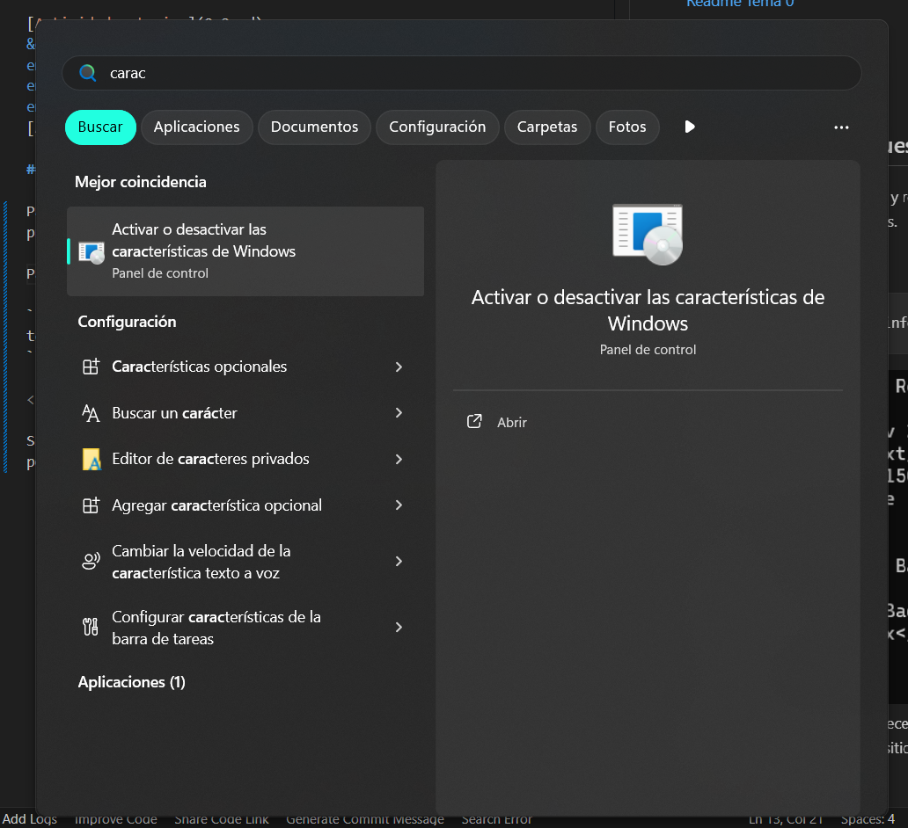
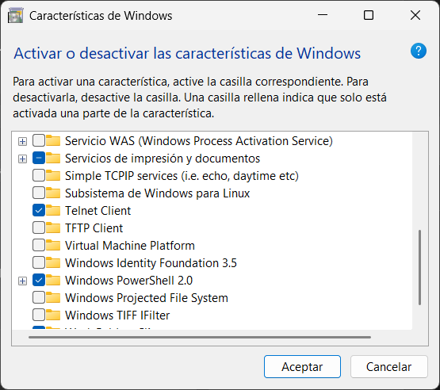
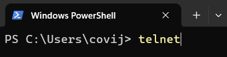
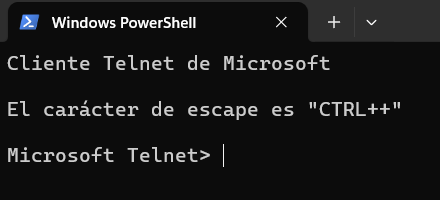

<a href="/Tema0/readme.md"></a>

# Actividad 3: Práctica telnet/http

[Actividad anterior](0.2.md)
&emsp;&emsp;&emsp;&emsp;&emsp;&emsp;&emsp;&emsp;&emsp;&emsp;&emsp;&emsp;&emsp;&emsp;&emsp;&emsp;&emsp;&emsp;&emsp;&emsp;&emsp;&emsp;&emsp;&emsp;&emsp;&emsp;&emsp;&emsp;&emsp;&emsp;&emsp;&emsp;&emsp;
[Actividad siguiente](0.4.md)

## 2 Peticiones y respuestas en telnet

Para poder realizar peticiones y respuestas en telnet, primero debemos activar esta caracteristica en Windows.

Para ello, buscaremos la opción de "Activar o desactivar características de Windows" en el menú de inicio y abriremos la aplicación.



<br>
<br>
Dentro de la aplicación, buscaremos la opción de "Telnet Client" y la activaremos.
<br>
<br>



<br>
<br>

Una vez activada la característica, podemos abrir el cliente de telnet desde el menú de inicio o desde la terminal, mediante el comando.

``` cmd
telnet
```





``` cmd
telnet www.profesordeinformatica.com 80
```


Si este puerto esta activo, aprecerá una pantalla en negro, pondremos ``GET`` para obtener la cabecera del sitio web.