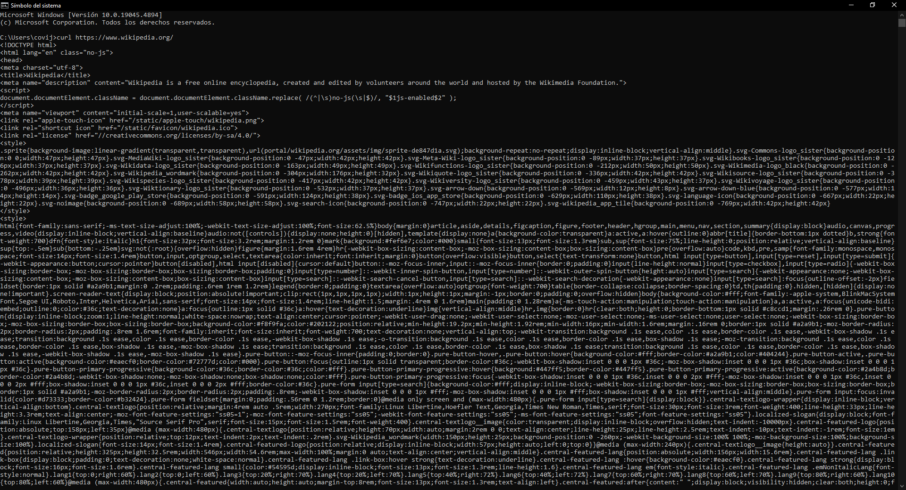
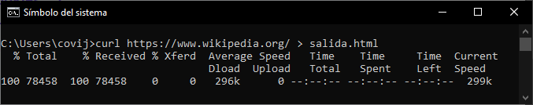

# Actividad 4: Usando cUrl

[Readme Tema 0](/Tema0/readme.md)

[Actividad anterior](0.3.md)
&emsp;&emsp;&emsp;&emsp;&emsp;&emsp;&emsp;&emsp;&emsp;&emsp;&emsp;&emsp;&emsp;&emsp;&emsp;&emsp;&emsp;&emsp;&emsp;&emsp;&emsp;&emsp;&emsp;&emsp;&emsp;&emsp;&emsp;&emsp;&emsp;&emsp;&emsp;&emsp;&emsp;
[Actividad siguiente](0.5.md)

## 1 Busca información sobre el comando curl y muestra al menos cinco ejemplos de uso

El comando ``curl`` es una herramienta de línea de comandos utilizada para transferir datos desde o hacia un servidor, utilizando diversos protocolos como HTTP, HTTPS, FTP, entre otros:

<details>

<summary>Verificar la versión de cURL</summary>

> <br>
> Usando el comando `curl --version`, podremos ver la versión de cURL disponible en nuestro equipo.
>
> ``` cmd
> C:\Users\user>curl --version
> curl 8.7.1 (Windows) libcurl/8.7.1 Schannel zlib/1.3 WinIDN
> Release-Date: 2024-03-27
> Protocols: dict file ftp ftps http https imap imaps ipfs ipns mqtt pop3 pop3s smb smbs smtp smtps telnet tftp
> Features: alt-svc AsynchDNS HSTS HTTPS-proxy IDN IPv6 Kerberos Largefile libz NTLM SPNEGO SSL > SSPI threadsafe Unicode UnixSockets
> ```
>
</details>

<details>

<summary>Realizar una solicitud HTTP básica</summary>

> Este comando muestra el contenido de la página web en la terminal
>
> ``curl http://ejemplo.com``
>
<<<<<<< Updated upstream
> ``` cmd
=======
>``` cmd
>>>>>>> Stashed changes
> C:\Users\user>curl https://wikipedia.org
> 
> <!DOCTYPE HTML PUBLIC "-//IETF//DTD HTML 2.0//EN">
> <html><head>
> <title>301 Moved Permanently</title>
> </head><body>
> <h1>Moved Permanently</h1>
> <p>The document has moved <a href="https://www.wikipedia.org/">here</a>.</p>
> </body></html>
> ```
>
>
> Si por ejemplo hacemos ``curl https://wikipedia.org``, este nos devuelve que la dirección actual de la url que hemos solicitado, está en ``https://www.wikipedia.org/``, y si realizamos ``curl https://www.wikipedia.org/``, este nos devuelve la pagina completa de la dirección
>
> 
</details>

<details>

<summary>Guardar la salida en un archivo</summary>

> <br>
> Mediante este comando, podremos crear una pagina html estatica de la solicitud del anterior ejemplo
>
> ``curl http://ejemplo.com > salida.html``
>
> 
>
> <a href="res/0.4.2_salida.html">código de salida</a>
>
> [web de salida](https://htmlpreview.github.io/?https://github.com/jcorvid509/SREI/blob/d7a634bdaf65df4cb7ab79475c74a8450b25714c/Tema0/Actividades/res/0.4.2_salida.html)
>
> [web de entrada](https://www.wikipedia.org/)
>
</details>

<details>

<summary>Información de IP</summary>

> <br>
> Se puede usar el comando `curl ipinfo.io` para obtener toda la información de la red sobre el dispositivo.
>
> ``` cmd
> C:\Users\user>curl ipinfo.io
> {
>   "ip": "80.24.235.188",
>   "hostname": "188.red-80-24-235.staticip.rima-tde.net",
>   "city": "Sevilla",
>   "region": "Andalusia",
>   "country": "ES",
>   "loc": "37.3828,-5.9732",
>   "org": "AS3352 TELEFONICA DE ESPANA S.A.U.",
>   "postal": "41005",
>   "timezone": "Europe/Madrid",
>   "readme": "https://ipinfo.io/missingauth"
> }
> ```
>
</details>

<details>

<summary>Diccionario</summary>

> <br>
> El protocolo `dict`, proporcionado por *libcurl* se puede usar para encontrar el significado de una palabra. Usa como fuente
> [WordNet](https://wordnet.princeton.edu/)
>
> ``` cmd
> C:\Users\2ASIR>curl dict://dict.org/d:platypus
> 220 dict.dict.org dictd 1.12.1/rf on Linux 4.19.0-10-amd64 <auth.mime> <376245610.23395.1728456703@dict.dict.org>
> 250 ok
> 150 2 definitions retrieved
> 151 "Platypus" gcide "The Collaborative International Dictionary of English v.0.48"
> Platypus \Plat"y*pus\, n. [NL., fr. Gr. ? + ? foot.] (Zool.)
>    The {duck mole}. See under {Duck}.
> 
>    Syn: Duck Mole, duckbill, duck-bill platypus, duck-billed
>         platypus. [1913 Webster]
> .
> 151 "platypus" gcide "The Collaborative International Dictionary of English v.0.48"
> Duck \Duck\, n. [OE. duke, doke. See {Duck}, v. t. ]
>    1. (Zool.) Any bird of the subfamily {Anatin[ae]}, family
>       {Anatid[ae]}.
>       [1913 Webster]
> 
>    Note: The genera and species are numerous. They are divided
>          into {river ducks} and {sea ducks}. Among the former
>          are the common domestic duck ({Anas boschas}); the wood
>          duck ({Aix sponsa}); the beautiful mandarin duck of
>          China ({Dendronessa galeriliculata}); the Muscovy duck,
>          originally of South America ({Cairina moschata}). Among
>          the sea ducks are the eider, canvasback, scoter, etc.
>          [1913 Webster]
> 
>    2. A sudden inclination of the bead or dropping of the
>       person, resembling the motion of a duck in water.
>       [1913 Webster]
> ```
>
</details>

## Referencias
[DzTechs](https://es.dztechy.com/useful-curl-commands/)