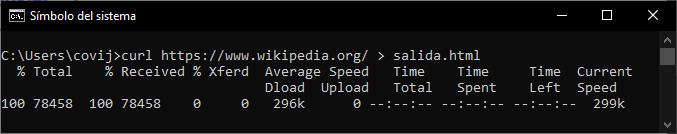

# Actividad 4: Usando cUrl

[Readme Tema 0](/Tema0/readme.md)

>
> </img>
>

## 1 Busca información sobre el comando curl y muestra al menos cinco ejemplos de uso


El comando ``curl`` es una herramienta de línea de comandos utilizada para transferir datos desde o hacia un servidor, utilizando diversos protocolos como HTTP, HTTPS, FTP, entre otros
 
<details>

<summary>Realizar una solicitud HTTP básica</summary> 

> Este comando muestra el contenido de la página web en la terminal
>
> ``curl http://ejemplo.com``
>
>```
> C:\Users\user>curl https://wikipedia.org
> 
> <!DOCTYPE HTML PUBLIC "-//IETF//DTD HTML 2.0//EN">
> <html><head>
> <title>301 Moved Permanently</title>
> </head><body>
> <h1>Moved Permanently</h1>
> <p>The document has moved <a href="https://www.wikipedia.org/">here</a>.</p>
> </body></html>
> ```
>
>
> Si por ejemplo hacemos ``curl https://wikipedia.org``, este nos devuelve que la dirección actual de la url que hemos solicitado, está en ``https://www.wikipedia.org/``, y si realizamos ``curl https://www.wikipedia.org/``, este nos devuelve la pagina completa de la dirección
>
> 
</details>

<details>

<summary>Guardar la salida en un archivo</summary>

> Mediante este comando, podremos crear una pagina html estatica de la solicitud del anterior ejemplo
>
> ``curl http://ejemplo.com > salida.html``
>
> 
>
> [web de salida](res/0.4.2_salida.html)
>
> </details>