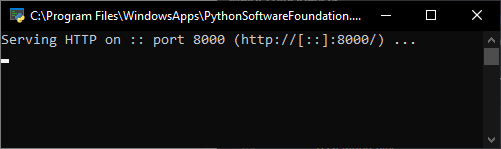
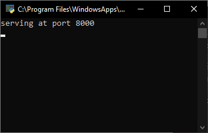

# Actividad 5: Práctica servidor web

[Actividad anterior](0.4.md)
&emsp;&emsp;&emsp;&emsp;&emsp;&emsp;&emsp;&emsp;&emsp;&emsp;&emsp;&emsp;&emsp;&emsp;&emsp;&emsp;&emsp;&emsp;&emsp;&emsp;&emsp;&emsp;&emsp;&emsp;&emsp;&emsp;&emsp;&emsp;&emsp;&emsp;&emsp;&emsp;&emsp;
[Actividad siguiente](0.6.md)

## 1 Visita los siguientes enlaces

>
> [Simple web server (ejemplo 1)](https://docs.python.org/3/library/http.server.html)
>
> ``python -m http.server 8000``
>
> [http server (ejemplo 2)](https://github.com/python/cpython/blob/main/Lib/http/server.py)
>
> [dummy web server (ejemplo 3)](https://gist.github.com/kabinpokhrel/6fd1275603e9d5f1e284be717cbd1bff)

## 2 Instala Python

>
> Para instalar **Python**, iremos a la propia
> [web de python](https://www.python.org/)
> y descargaremos la ultima versión de Python.
>
> Esto, nos descargará un archivo .exe, el cual ejecutaremos y nos instalará Python en nuestro equipo.
>

## 3 Ejecuta los ejemplos mostrados con anterioridad

>
> ### [Primer ejemplo](res/0.5.1.py)
>
> ### [Segundo ejemplo](res/0.5.2.py)
>
> ### [Tercer ejemplo](res/0.5.3.py)
>

>
> ### Segundo ejemplo
>
> 
>
> ### Tercer ejemplo
>
> 

## 4 Pública en GitHub los ejemplos llevados a cabo. Los ejemplos se acompañan con capturas de pantalla en las que se muestre su funcionamiento

