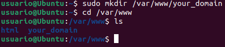
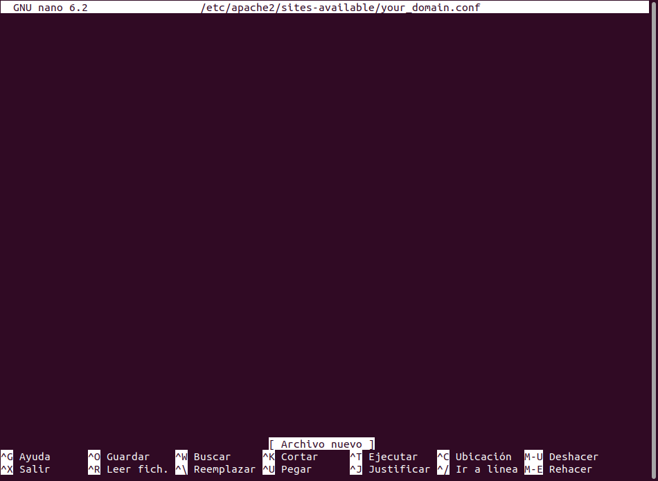
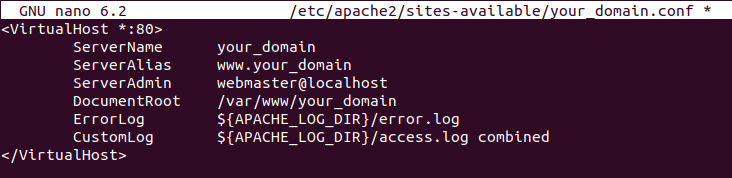
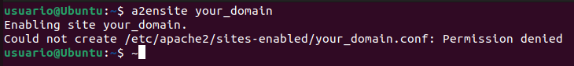
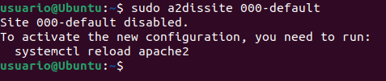
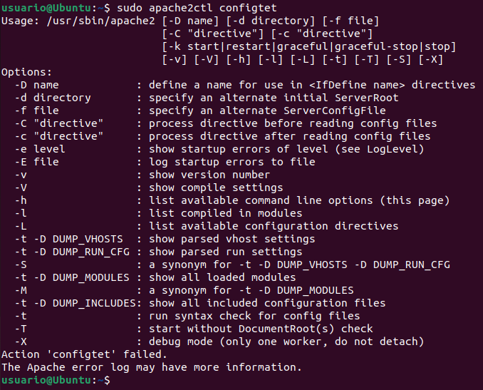
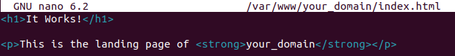
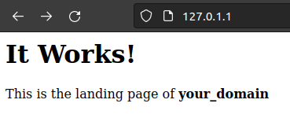
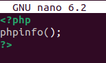
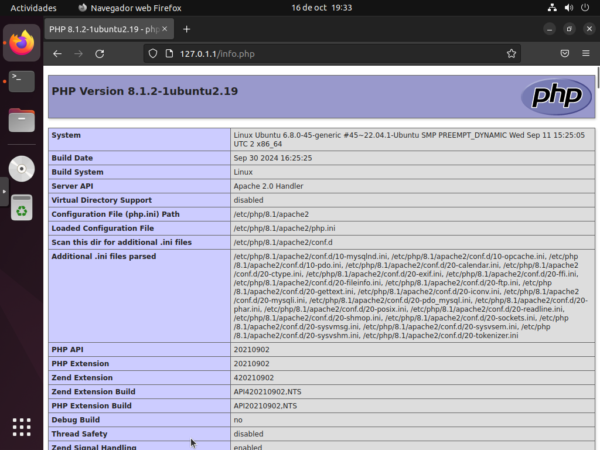

# Actividad 1: Instalación de Apache

[Readme Tema 1](/Tema1/readme.md)

&emsp;&emsp;&emsp;&emsp;&emsp;&emsp;&emsp;&emsp;&emsp;&emsp;&emsp;&emsp;&emsp;&emsp;&emsp;&emsp;&emsp;&emsp;&emsp;&emsp;&emsp;&emsp;&emsp;&emsp;&emsp;&emsp;&emsp;&emsp;&emsp;&emsp;&emsp;&emsp;&emsp;&emsp;&emsp;&emsp;&emsp;&emsp;&emsp;&emsp;&emsp;
[Actividad siguiente](1.2.md)

## La arquitectura Web es un modelo compuesto de tres capas

¿Cuáles son y cuál es  la función de cada una de ellas?

>
>
>

[Hubspot](https://blog.hubspot.es/website/que-es-arquitectura-en-capas)

## Una plataforma web es el entorno de desarrollo de software empleado para  diseñar y ejecutar un sitio web.

Destacan dos plataformas web, LAMP y WISA.
<br>
Explica en qué consiste cada una de ellas.

## Lee el siguiente artículo e instala Apache en Ubuntu:

[Instalar LAMP en Ubuntu 18.04](https://www.digitalocean.com/community/tutorials/how-to-install-linux-apache-mysql-php-lamp-stack-ubuntu-18-04)
<br>
[Instalar LAMP en Ubuntu 20.04](https://www.digitalocean.com/community/tutorials/how-to-install-linux-apache-mysql-php-lamp-stack-on-ubuntu-20-04-es)

Nota: Para más información sobre apt-get, puedes leer [esto](http://www.ubuntu-guia.com/2011/01/comando-apt-get-en-ubuntu.html)

Nota: Si no dispones de una partición con linux, puedes [instalar una máquina virtual](https://www.neoguias.com/instalar-ubuntu-windows-virtual-box/)

Una pila "LAMP" es un conjunto de aplicaciones de software de codigo abierto que se suelen instalar juntas para que un servidor pueda alojar aplicaciones y sitios web dinámicos escritos en php.
En realidad es un acr´pnimo que representa los sistemas operativos **L**inux, con el servidor web **A**pache. Los datos del sitio se almacenan en una base de datos **M**ySQL y el contenido dinámico se procesa mediante **P**HP.

<br>

---

### Paso 1: Instalar Apache y actualizar el firewall

---

<br>

Instalaremos Apache usamdo el administrador de paquetes de Ubuntu, `apt`

``` bash
sudo apt update
sudo apt install apache2
```


A la hora de instalar Apache, nos hemos encontrado, con un error, el cual nos bloquea la instalación.
<br>
`No se pudo obtener el bloqueo /var/lib/dpkg/lock-frontend`
<br>
El error se produce al intentar instalar o desinstalar alguna aplicación. Cuando el sistema hace uso del gestor de paquetes Dpkg, y éste intenta bloquear los recursos necesarios para realizar sus tareas, se encuentra que estos ya están bloqueados y lanza el error.


Ya que segun nos explica el artículo el proceso que necesitamos esta usandolo otro programa, reiniciaremos el SO, aunque en el carticulo tenemos otra solución.

Y ahora sí podremos instalar Apache.


Para ello, primero hablitaremos el ufw.

``` bash
sudo ufw enable
```

Una vez que la instalación se complete, deberá ajustar la configuración de su firewall para permitir tráfico HTTP y HTTPS. UFW tiene diferentes perfiles de aplicaciones que puede aprovechar para hacerlo. Para enumerar todos los perfiles de aplicaciones de UFW disponibles, puede ejecutar

``` bash
sudo ufw app list
```


Explicación de los perfiles:

> **Apache**: este perfil abre solo el puerto 80 (tráfico web normal no cifrado).
>
> **Apache Full**: este perfil abre los puertos 80 (tráfico web normal no cifrado) y 443 (tráfico TLS/SSL cifrado).
>
> **Apache Secure**: este perfil abre solo el puerto 443 (tráfico TLS/SSL cifrado).

En este caso solo permitiremos las conexiones del puerto `80`, para ello primero habilitaremos el perfil de Apache mediante el siguiente comando.

``` bash
sudo ufw allow in "Apache"
```

Para verificar que todo se ha instalado correctamente, veremos el estado del mismo. 

``` bash
sudo ufw status
```


Una vez completados estos pasos, tendremos habilitado el tráfico por el puerto 80 a traves del firewall.
<br>
Para verificar que todo se haya realizado segun lo previsto, nos dirigiremos a nuestra IP de equipo local a traves de nuestro navegador.

`127.0.0.1`

Verá la página web predeterminada de Apache para Ubuntu 20.04, que se encuentra allí para fines informativos y de prueba. Debería tener un aspecto similar a este:


Si ve esta página, su servidor web estará correctamente instalado y el acceso a él será posible a través de su firewall.

<br>

---

### Paso 2: Instalar MySQL

---

<br>

Ahora que dispone de un servidor web funcional, deberá instalar un sistema de base de datos para poder almacenar y gestionar los datos de su sitio. MySQL es un sistema de administración de bases de datos popular que se utiliza en entornos PHP.
<br>
Para ello, usaremos el comando:

``` bash
sudo apt install mysql-server
```


Cuando la instalación se complete, se recomienda ejecutar una secuencia de comandos de seguridad que viene preinstalada en MySQL Con esta secuencia de comandos se eliminarán algunos ajustes predeterminados poco seguros y se bloqueará el acceso a su sistema de base de datos. Inicie la secuencia de comandos interactiva ejecutando lo siguiente:

``` bash
sudo mysql_secure_installation
```

Se le preguntará si desea configurar el VALIDATE PASSWORD PLUGIN.Elija Y para indicar que sí, o cualquier otra cosa para continuar sin la habilitación.


Se le solicitará que introduzca un nivel de validación de contraseña, siendo `2` el nivel mas seguro. Como en este caso es simplemente una prueba, usaremos el menor nivel `0`.


Marcaremos las siguientes opciones que nos piden con `y`.

Cuando se termine, comprobaremos que podemos inciar sesión en la consola de MyQL, para ello ejecutaremos:

``` bash
sudo mysql
```


Para salir pondremos

``` bash
exit
```

En la opción de VALIDATE PASSWORD PLUGIN, elegiremos `Y`, por lo cual nos pedirá que configuremos la seguridad de las contraseñas `0, 1, 2`, siendo 2 el nivel mas seguro

<br>

---

### Paso 3: Instalar PHP

---

<br>

PHP es el componente de nuestra configuración que procesa el código para mostrar contenido dinámico al usuario final.
<br>
Tambien instalaremos `php-mysql`, un módulo php que permite que se comunique con bases de datos basadas en MySQL. Ademas de instalar `libapache2-mod-php`, el cual habilita Apache para gestionar archivos php.
<br>
Para ello ejecutaremos el comando.

``` bash
sudo apt install php libapache2-mod-php php-mysql
```


Una vez instalado, ejecutaremos el siguiente comando.

``` bash
hp -v
```

Entonces se nos mostrará información de la versión de php instalada, lo cual significa que todo se ha instaldao correctamente.


<br>

---

### Paso 4: Crear un host virtual para el sitio web

---

<br>

En este punto, ya tendriamos operativa la pila **LAMP**, pero para poder usar la configuración de la misma usando comandos php, deberemos instalar un host virtual de Apache, el cual almacenará los directorios y ficheros del sitio web.
Para ello vamos a configurar un dominio al que llamaremos **your domain**.

Ubuntu 20.04 tiene habilitado un bloque de servidor por defecto, que está configurado para proporcionar documentos del directorio `/var/www/html`.
<br>
Anque esto funcione correctamente para un solo sitio web, suele ser dificil de manejar si se alojan varios. En lugar de modificarlo, vamos a crear una estructura de directorio dentro de `/var/www`, para el sitio **your_domain** y dejaremos `/var/www/html` como directorio predeterminado para las solicitudes que no coincidan con ningun otro sitio.

Para ello crearemos un directorio para nuestro dominio de la siguiente manera.

``` bash
sudo mkdir /var/www/your_domain
```



A continuiación, asignaremos la propiedad del directorio con la variable de entorno `$USER`, que hará referencia al usaurio de sistema actual:

``` bash
sudo chown -R $USER:$USER /var/www/your_domain
```


Luego, abriremos un nuevo archivo de configuración en el directorio `sites-available` de Apache usando el editor de línea de comandos que prefiera. En este caso, utilizaremos `nano`:

``` bash
sudo nano /etc/apache2/sites-available/your_domain.conf
```



De esta manera, se creará un nuevo archivo en blanco. Pegue la siguiente configuración básica:

``` bash
<VirtualHost *:80>
    ServerName your_domain
    ServerAlias www.your_domain
    ServerAdmin webmaster@localhost
    DocumentRoot /var/www/your_domain
    ErrorLog ${APACHE_LOG_DIR}/error.log
    CustomLog ${APACHE_LOG_DIR}/access.log combined
</VirtualHost>
```



Con esta configuración de VirtualHost, le indicamos a Apache que proporcione `your_domain` usando `/var/www/your_domain` como directorio root web.

> Si desea probar Apache sin un nombre de dominio, puede eliminar o convertir en comentario las opciones ServerName y ServerAlias añadiendo un carácter # al principio de las líneas de cada opción.

Ahora, puede usar `a2ensite` para habilitar el nuevo host virtual

``` bash
sudo a2ensite your_domain
```



Puede ser conveniente deshabilitar el sitio web predeterminado que viene instalado con Apache. Es necesario hacerlo si no se utiliza un nombre de dominio personalizado, dado que, en este caso, la configuración predeterminada de Apache sobrescribirá su host virtual. Para deshabilitar el sitio web predeterminado de Apache, escriba lo siguiente:

``` bash
sudo a2dissite 000-default
```



Para asegurarse de que su archivo de configuración no contenga errores de sintaxis, ejecute lo siguiente:

``` bash
sudo apache2ctl configtest
```



Por último, vuelva a cargar Apache para que estos cambios surtan efecto:

``` bash
sudo systemctl reload apache2
```

Ahora, su nuevo sitio web está activo, pero el directorio root web ``/var/www/your_domain`` todavía está vacío. Cree un archivo ``index.html`` en esa ubicación para poder probar que el host virtual funcione según lo previsto:

``` bash
nano /var/www/your_domain/index.html
```

Incluya el siguiente contenido en este archivo:

``` html
<h1>It works!</h1>
<p>This is the landing page of <strong>your_domain</strong>.</p>
```



Ahora, diríjase a su navegador y acceda al nombre de dominio o la dirección IP de su servidor una vez más:

``` http
http://server_domain_or_IP
```



Si ve esta página, su host virtual de Apache está funcionando según lo previsto.

Puede dejar este archivo establecido como página de destino temporal de su aplicación hasta que configure un archivo index.php que lo sustituya. Cuando lo haga, recuerde eliminar el archivo index.html de su root de documentos, o cambiarle el nombre, ya que tendría precedencia sobre un archivo index.php por defecto.

<br>

---

### Paso 5: Probar el procesamiento de PHP en su servidor web

---

<br>

Ahora que dispone de una ubicación personalizada para alojar los archivos y las carpetas de su sitio web, crearemos una secuencia de comandos PHP de prueba para verificar que Apache pueda gestionar solicitudes y procesar solicitudes de archivos PHP.

Cree un archivo nuevo llamado info.php dentro de su carpeta root web personalizada:

``` bash
nano /var/www/your_domain/info.php
```

Con esto se abrirá un archivo vacío. Añada el siguiente texto, que es el código PHP válido, dentro del archivo:

``` php
<?php
phpinfo();
```



Cuando termine, guarde y cierre el archivo.

Para probar esta secuencia de comandos, diríjase a su navegador web y acceda al nombre de dominio o la dirección IP de su servidor, seguido del nombre de la secuencia de comandos, que en este caso es info.php:



En esta página, se proporciona información básica sobre su servidor desde la perspectiva de PHP. Es útil para la depuración y para asegurarse de que sus ajustes se apliquen correctamente.

Si puede ver esta página en su navegador, su instalación de PHP funciona según lo previsto.

Tras comprobar la información pertinente sobre su servidor PHP a través de esa página, es recomendable que elimine el archivo que creó, dado que contiene información confidencial sobre su entorno PHP y su servidor de Ubuntu. Puede usar rm para hacerlo:

``` bash
sudo rm /var/www/your_domain/info.php
```

### Recursos

[Eror lock-frontend](https://blog.ahierro.es/no-se-pudo-obtener-el-bloqueo-var-lib-dpkg-lock-open-recurso-temporalmente-no-disponible/)
