# Actividad 1: Instalación de Apache

[Readme Tema 1](/Tema1/readme.md)

&emsp;&emsp;&emsp;&emsp;&emsp;&emsp;&emsp;&emsp;&emsp;&emsp;&emsp;&emsp;&emsp;&emsp;&emsp;&emsp;&emsp;&emsp;&emsp;&emsp;&emsp;&emsp;&emsp;&emsp;&emsp;&emsp;&emsp;&emsp;&emsp;&emsp;&emsp;&emsp;&emsp;&emsp;&emsp;&emsp;&emsp;&emsp;&emsp;&emsp;&emsp;
[Actividad siguiente](1.2.md)

## La arquitectura Web es un modelo compuesto de tres capas

¿Cuáles son y cuál es  la función de cada una de ellas?

>
>
>

[Hubspot](https://blog.hubspot.es/website/que-es-arquitectura-en-capas)

## Una plataforma web es el entorno de desarrollo de software empleado para  diseñar y ejecutar un sitio web.

Destacan dos plataformas web, LAMP y WISA.
<br>
Explica en qué consiste cada una de ellas.

## Lee el siguiente artículo e instala Apache en Ubuntu:

[Instalar LAMP en Ubuntu 18.04](https://www.digitalocean.com/community/tutorials/how-to-install-linux-apache-mysql-php-lamp-stack-ubuntu-18-04)
<br>
[Instalar LAMP en Ubuntu 20.04](https://www.digitalocean.com/community/tutorials/how-to-install-linux-apache-mysql-php-lamp-stack-on-ubuntu-20-04-es)

Nota: Para más información sobre apt-get, puedes leer [esto](http://www.ubuntu-guia.com/2011/01/comando-apt-get-en-ubuntu.html)

Nota: Si no dispones de una partición con linux, puedes [instalar una máquina virtual](https://www.neoguias.com/instalar-ubuntu-windows-virtual-box/)

Una pila "LAMP" es un conjunto de aplicaciones de software de codigo abierto que se suelen instalar juntas para que un servidor pueda alojar aplicaciones y sitios web dinámicos escritos en php.
En realidad es un acr´pnimo que representa los sistemas operativos **L**inux, con el servidor web **A**pache. Los datos del sitio se almacenan en una base de datos **M**ySQL y el contenido dinámico se procesa mediante **P**HP.

### Paso 1: Instalar Apache y actualizar el firewall

Instalaremos Apache usamdo el administrador de paquetes de Ubuntu, `apt`

``` bash
sudo apt update
sudo apt install apache2
```

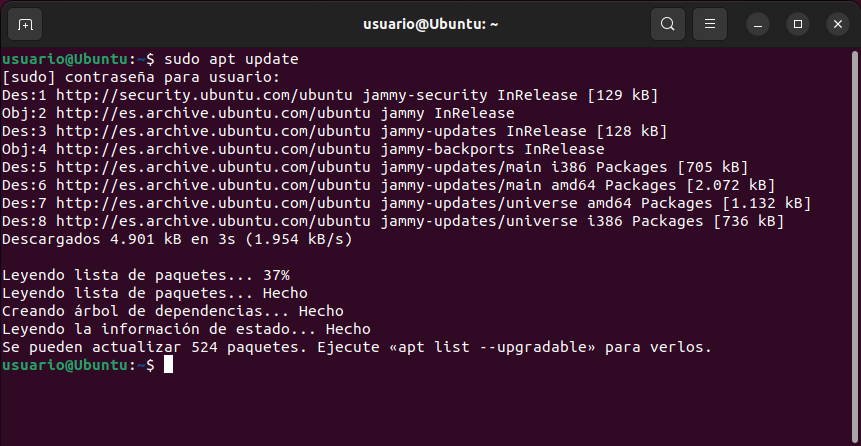

A la hora de instalar Apache, nos hemos encontrado, con un error, el cual nos bloquea la instalación.
<br>
`No se pudo obtener el bloqueo /var/lib/dpkg/lock-frontend`
<br>
El error se produce al intentar instalar o desinstalar alguna aplicación. Cuando el sistema hace uso del gestor de paquetes Dpkg, y éste intenta bloquear los recursos necesarios para realizar sus tareas, se encuentra que estos ya están bloqueados y lanza el error.

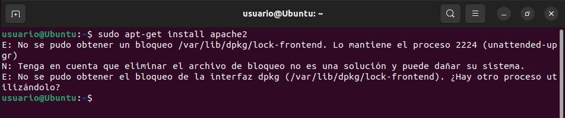

Ya que segun nos explica el artículo el proceso que necesitamos esta usandolo otro programa, reiniciaremos el SO, aunque en el carticulo tenemos otra solución.

Y ahora sí podremos instalar Apache.

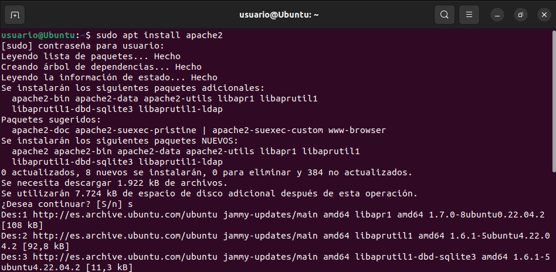

Para ello, primero hablitaremos el ufw.

``` bash
sudo ufw enable
```

Una vez que la instalación se complete, deberá ajustar la configuración de su firewall para permitir tráfico HTTP y HTTPS. UFW tiene diferentes perfiles de aplicaciones que puede aprovechar para hacerlo. Para enumerar todos los perfiles de aplicaciones de UFW disponibles, puede ejecutar

``` bash
sudo ufw app list
```

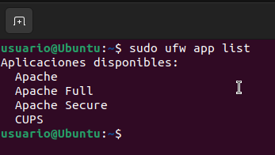

Explicación de los perfiles:

> **Apache**: este perfil abre solo el puerto 80 (tráfico web normal no cifrado).
>
> **Apache Full**: este perfil abre los puertos 80 (tráfico web normal no cifrado) y 443 (tráfico TLS/SSL cifrado).
>
> **Apache Secure**: este perfil abre solo el puerto 443 (tráfico TLS/SSL cifrado).

En este caso solo permitiremos las conexiones del puerto `80`, para ello primero habilitaremos el perfil de Apache mediante el siguiente comando.

``` bash
sudo ufw allow in "Apache"
```

Para verificar que todo se ha instalado correctamente, veremos el estado del mismo. 

``` bash
sudo ufw status
```

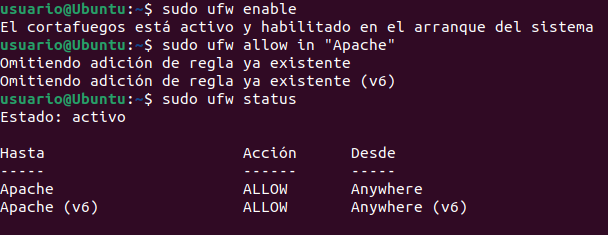

Una vez completados estos pasos, tendremos habilitado el tráfico por el puerto 80 a traves del firewall.
<br>
Para verificar que todo se haya realizado segun lo previsto, nos dirigiremos a nuestra IP de equipo local a traves de nuestro navegador.

`127.0.0.1`

Verá la página web predeterminada de Apache para Ubuntu 20.04, que se encuentra allí para fines informativos y de prueba. Debería tener un aspecto similar a este:

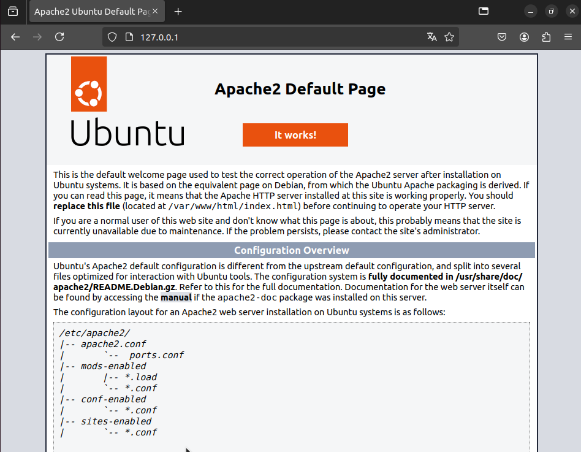

Si ve esta página, su servidor web estará correctamente instalado y el acceso a él será posible a través de su firewall.

### Paso 2: Instalar MySQL

Ahora que dispone de un servidor web funcional, deberá instalar un sistema de base de datos para poder almacenar y gestionar los datos de su sitio. MySQL es un sistema de administración de bases de datos popular que se utiliza en entornos PHP.
<br>
Para ello, usaremos el comando:

``` bash
sudo apt install mysql-server
```

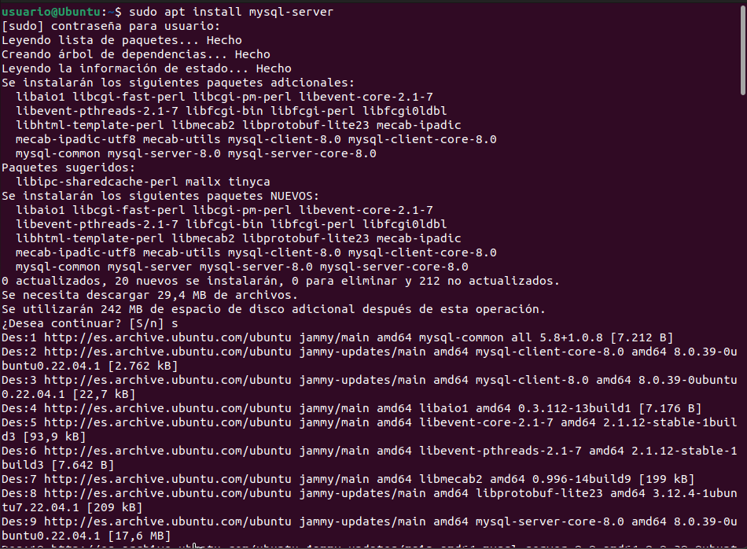

Cuando la instalación se complete, se recomienda ejecutar una secuencia de comandos de seguridad que viene preinstalada en MySQL Con esta secuencia de comandos se eliminarán algunos ajustes predeterminados poco seguros y se bloqueará el acceso a su sistema de base de datos. Inicie la secuencia de comandos interactiva ejecutando lo siguiente:

``` bash
sudo mysql_secure_installation
```

Se le preguntará si desea configurar el VALIDATE PASSWORD PLUGIN.Elija Y para indicar que sí, o cualquier otra cosa para continuar sin la habilitación.

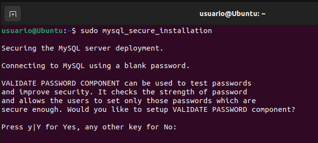

Se le solicitará que introduzca un nivel de validación de contraseña, siendo `2` el nivel mas seguro. Como en este caso es simplemente una prueba, usaremos el menor nivel `0`.

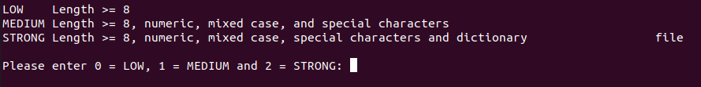

Marcaremos las siguientes opciones que nos piden con `y`.

Cuando se termine, comprobaremos que podemos inciar sesión en la consola de MyQL, para ello ejecutaremos:

``` bash
sudo mysql
```

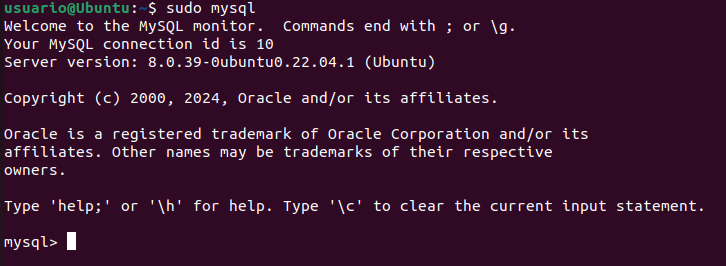

En la opción de VALIDATE PASSWORD PLUGIN, elegiremos `Y`, por lo cual nos pedirá que configuremos la seguridad de las contraseñas `0, 1, 2`, siendo 2 el nivel mas seguro

### Paso 3: Instalar PHP

PHP es el componente de nuestra configuración que procesa el código para mostrar contenido dinámico al usuario final.
<br>
Tambien instalaremos `php-mysql`, un módulo php que permite que se comunisqie con bases de datos basadas en MySQL. Ademas de instalar `libapache2-mod-php`, el cual habilita Apache para gestionar archivos php.
<br>
Para ello ejecutaremos el comando.

``` bash
sudo apt install php libapache2-mod-php php-mysql
```


Una vez instalado, ejecutaremos el siguiente comando.

``` bash
hp -v
```

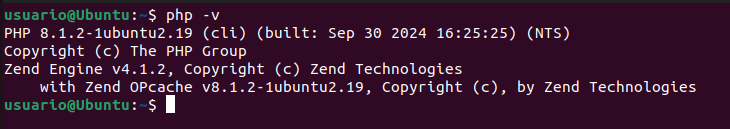

### Recursos

[Eror lock-frontend](https://blog.ahierro.es/no-se-pudo-obtener-el-bloqueo-var-lib-dpkg-lock-open-recurso-temporalmente-no-disponible/)
