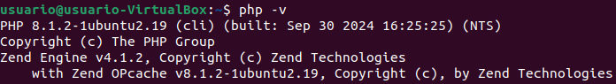

<a href="/Tema1/readme.md"></a>

# Actividad 1: Instalación de LAMP

&emsp;&emsp;&emsp;&emsp;&emsp;&emsp;&emsp;&emsp;&emsp;&emsp;&emsp;&emsp;&emsp;&emsp;&emsp;&emsp;&emsp;&emsp;&emsp;&emsp;&emsp;&emsp;&emsp;&emsp;&emsp;&emsp;&emsp;&emsp;&emsp;&emsp;&emsp;&emsp;&emsp;&emsp;&emsp;&emsp;&emsp;&emsp;&emsp;&emsp;&emsp;
[Actividad siguiente](1.2.md)

---

## 1 Instalación de Apache

Para instalar Apache en Ubuntu, primero tendremos que tener instalado el Sistema Operativo de Ubuntu.

``` cmd
sudo apt-get update
```


``` cmd
sudo apt-get install apache2
```


Una vez que la instalación se complete, deberá ajustar la configuración de su firewall para permitir tráfico HTTP y HTTPS.
UFW tiene diferentes perfiles de aplicaciones que puede aprovechar para hacerlo.
Para enumerar todos los perfiles de aplicaciones de UFW disponibles, puede ejecutar lo siguiente:

``` cmd
sudo ufw app list
```


> **Apache**: este perfil abre solo el puerto 80 (tráfico web normal no cifrado).
>
> **Apache Full**: este perfil abre los puertos 80 (tráfico web normal no cifrado) y 443 (tráfico TLS/SSL cifrado).
>
> **Apache Secure**: este perfil abre solo el puerto 443 (tráfico TLS/SSL cifrado).

Por ahora, es mejor permitir conexiones únicamente en el puerto 80, ya que se trata de una instalación nueva de Apache y todavía no tiene un certificado TLS/SSL configurado para permitir tráfico HTTPS en su servidor.

Para permitir tráfico únicamente en el puerto 80 utilice el perfil Apache:

``` cmd
sudo ufw allow in "Apache"
```


Activaremos el Firewall

``` cmd
sudo ufw enable
```


Comprobamos el estado

``` cmd
sudo ufw status
```


> Ahora, se permite el tráfico en el puerto 80 a través del firewall.

Podremos comprobar que todo se ha instalado correctamente si accedemos al navegador y buscamos la ip '`127.0.0.1`, nos aparecerá la web por defecto de Apache.


---

## 2 Instalación de MySQL

Ahora que dispone de un servidor web funcional, deberá instalar un sistema de base de datos para poder almacenar y gestionar los datos de su sitio. MySQL es un sistema de administración de bases de datos popular que se utiliza en entornos PHP.

Una vez más, utilice apt para adquirir e instalar este software:

``` cmd
sudo apt install mysql-server
```


Cuando la instalación se complete, se recomienda ejecutar una secuencia de comandos de seguridad que viene preinstalada en MySQL Con esta secuencia de comandos se eliminarán algunos ajustes predeterminados poco seguros y se bloqueará el acceso a su sistema de base de datos. Inicie la secuencia de comandos interactiva ejecutando lo siguiente:

``` cmd
sudo mysql_secure_installation
```


Se le preguntará si desea configurar el `VALIDATE PASSWORD PLUGIN`.
<br>Elige `Y` para indicar que si.

Se le solicitará que seleccione un nivel de validación de contraseña.
<br>
Elegiremos la opción más insegura ya que solo haremos pruebas.


Para el resto de las preguntas, presione `Y` y `ENTER` en cada mensaje.

Con esto, se eliminarán algunos usuarios anónimos y la base de datos de prueba, se deshabilitarán las credenciales de inicio de sesión remoto de root y se cargarán estas nuevas reglas para que MySQL aplique de inmediato los cambios que realizó.

Cuando termine, compruebe si puede iniciar sesión en la consola de MySQL al escribir lo siguiente:

``` cmd
sudo mysql
```


Esto permitirá establecer conexión con el servidor de MySQL como root user de la base de datos administrativa, lo que se infiere del uso de sudo cuando se ejecuta este comando.

Para salir pondremos `exit`

---

## 3 Instalación de PHP

Ahora que tenemos instalado apache y mysql para almacenar y gestionar datos, instalaremos php el cual es el lenguaje de programación que se utiliza para crear sitios web dinámicos.

Para instalar estos paquetes, ejecute lo siguiente:

``` cmd
sudo apt install php libapache2-mod-php php-mysql
```


Una vez que la instalación se complete, podrá ejecutar el siguiente comando para confirmar su versión de PHP:

``` cmd
php -v
```



## 4 Creación del Host Virtual

Ubuntu 20.04 tiene habilitado un bloque de servidor por defecto, que está configurado para proporcionar documentos del directorio `/var/www/html`.

Si bien esto funciona bien para un solo sitio, puede ser difícil de manejar si aloja varios.

En lugar de modificar `/var/www/html`, crearemos una estructura de directorio dentro de `/var/www` para el sitio your_domain y dejaremos `/var/www/html` establecido como directorio predeterminado que se presentará si una solicitud de cliente no coincide con ningún otro sitio.

Cree el directorio para your_domain de la siguiente manera:

``` cmd
sudo mkdir /var/www/your_domain
```


A continuación, asigne la propiedad del directorio con la variable de entorno `$USER`, que hará referencia a su usuario de sistema actual:

``` cmd
sudo chown -R $USER:$USER /var/www/your_domain
```


Luego, abra un nuevo archivo de configuración en el directorio `sites-available` de Apache usando el editor de línea de comandos que prefiera. En este caso, utilizaremos `nano`:

``` cmd
sudo nano /etc/apache2/sites-available/your_domain.conf
```

De esta manera, se creará un nuevo archivo en blanco. Pegue la siguiente configuración básica:

``` conf
<VirtualHost *:80>
    ServerName your_domain
    ServerAlias www.your_domain
    ServerAdmin webmaster@localhost
    DocumentRoot /var/www/your_domain
    ErrorLog ${APACHE_LOG_DIR}/error.log
    CustomLog ${APACHE_LOG_DIR}/access.log combined
</VirtualHost>
```


Haciendo `ls` en el directorio `sites-available` se puede ver el archivo creado:

``` cmd
sudo ls /etc/apache2/sites-available
```


Con esta configuración de VirtualHost, le indicamos a Apache que proporcione `your_domain` usando `/var/www/your_domain` como directorio root web.

Si desea probar Apache sin un nombre de dominio, puede eliminar o convertir en comentario las opciones ServerName y ServerAlias añadiendo un carácter `#` al principio de las líneas de cada opción.

Ahora, puede usar a2ensite para habilitar el nuevo host virtual:

``` cmd
sudo a2ensite your_domain
```


Puede ser conveniente deshabilitar el sitio web predeterminado que viene instalado con Apache.

Es necesario hacerlo si no se utiliza un nombre de dominio personalizado, dado que, en este caso, la configuración predeterminada de Apache sobrescribirá su host virtual.

Para deshabilitar el sitio web predeterminado de Apache, escriba lo siguiente:

``` cmd
sudo a2dissite 000-default.conf
```


Para asegurarse de que su archivo de configuración no contenga errores de sintaxis, ejecute lo siguiente:

``` cmd
sudo apache2ctl configtest
```


Por último, vuelva a cargar Apache para que estos cambios surtan efecto:

``` cmd
sudo systemctl reload apache2
```


Ahora, su nuevo sitio web está activo, pero el directorio root web `/var/www/your_domain` todavía está vacío.

Cree un archivo `index.html` en esa ubicación para poder probar que el host virtual funcione según lo previsto:

``` cmd
sudo nano /var/www/your_domain/index.html
```

Programamos el archivo html como queramos, por ejemplo:

``` html
<h1>It works!</h1>
<p>This is the landing page of <strong>your_domain</strong></p>
```


Comprobamos que el archivo `html`, se ha creado correctamente:

``` cmd
sudo ls /var/www/your_domain
```


Y ahora si volvemos a entrar al dominio, nos mostrará este html.


---

## 5 Prueba del procesamiento PHP

Ya tendremos una ubicación propia para alojar los archivos y carpetas del sitio web, ahora crearemos una secuencia de comandos php para probar que Apache puede gestionarlo.

Dentro de `/var/ww/your_domain`, crearemos un archivo `info.php`.

``` cmd
sudo nano /var/www/your_domain/info.php
```

En este archivo, añadiremos el siguiente texto y guardaremos el archivo.

``` php
<?php
phpinfo();
?>
```


Si vamos al navegador y ponemos la siguiente dirección:

``` url
http://127.0.0.1/info.php
```

Si todo está correcto, nos aparecerá la siguiente página


---

## Recursos

[Digital Ocean](https://www.digitalocean.com/community/tutorials/how-to-install-linux-apache-mysql-php-lamp-stack-on-ubuntu-20-04-es#paso-1-instalar-apache-y-actualizar-el-firewall)