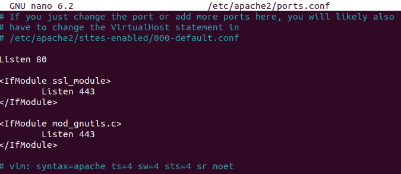
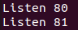
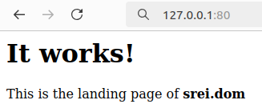
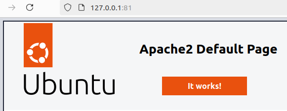
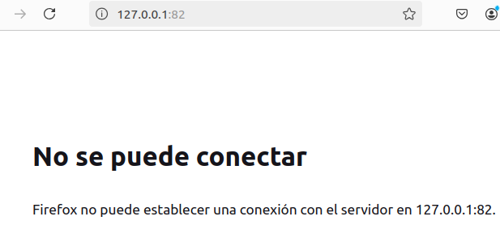
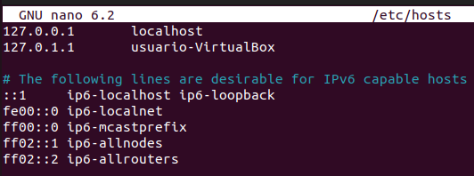
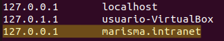
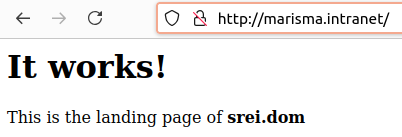
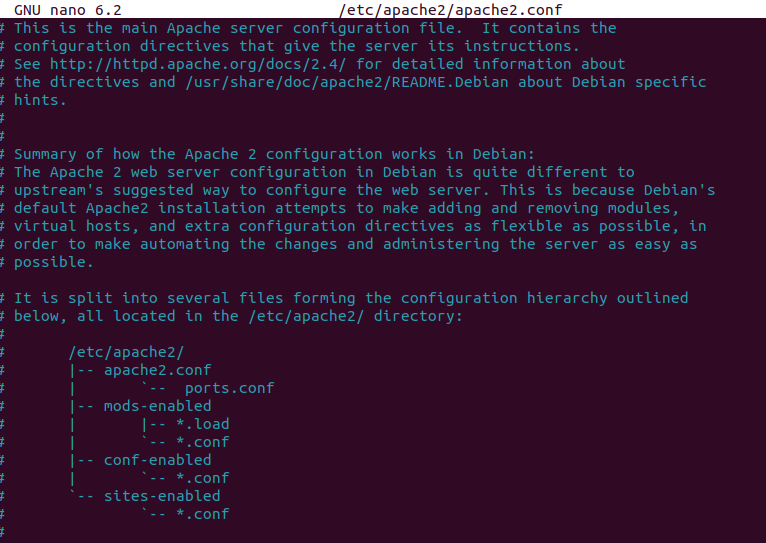
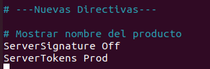

# Actividad 2: Configuración básica de Apache

[Readme Tema 1](/Tema1/readme.md)

&emsp;&emsp;&emsp;&emsp;&emsp;&emsp;&emsp;&emsp;&emsp;&emsp;&emsp;&emsp;&emsp;&emsp;&emsp;&emsp;&emsp;&emsp;&emsp;&emsp;&emsp;&emsp;&emsp;&emsp;&emsp;&emsp;&emsp;&emsp;&emsp;&emsp;&emsp;&emsp;&emsp;&emsp;&emsp;&emsp;&emsp;&emsp;&emsp;&emsp;&emsp;
[Actividad siguiente](1.2.md)

---
## Apache usa el puerto 81 ademas del 80

[Recurso](https://www.tecmint.com/change-apache-port-in-linux/)

Para cambiar los puertos de escucha de apache, abriremos la consola de comandos y escribiremos el siguiente comando:

``` cmd
sudo nano /etc/apache2/ports.conf
```

Aparecerá un archivo similar a este.



Para poder usar el puerto 81, debemos agregar la siguiente línea al final del archivo:

```
Listen 81
```



Reiniciamos el servicio de apache para que se apliquen los cambios:

```
sudo systemctl reload apache2
```


Para comprobar que los puertos estan activos, buscaremos en el navegador la siguiente dirección:

```
127.0.0.1:80        Para probar el puerto 80
127.0.0.1:81        Para probar el puerto 81
```

|  |  |
| --- | --- |
|  |  Vemos que para el puerto 80,<br>el navegador nos muestra el contenido de la carpeta<br>/var/www/srei.dom |
|  |  El puerto 81,redirige a la página<br>por defecto de apache |
|  | Cualquier otro puerto, nos<br>indicará que no se puede conectar. |

---

## Añadir el dominio “marisma.intranet” en el fichero “hosts”

[Recurso](https://www.btactic.com/editar-y-modificar-archivo-hosts-en-linux/)

Para añadir un dominio en el fichero host, buscaremos el archivo `hosts`, el cual se encuentra el la ruta `/etc/host`, y lo abriremos mediante `nano`.

``` cmd
sudo nano /etc/hosts
```

El archivo tendrá la siguiente estructura:



Para añadir el dominio `marisma.intranet`, bajo las líneas donde se definen los demás dominios, pondremos lo siguiente:

```
127.0.0.1   marisma.intranet
```



Con esto, le indicamos que si se busca `marisma.intranet` en el navegador, este redirecciona a la ubicación en la que tenemos almacenado nuestro servidor.



---

## Cambia la directiva “ServerTokens” para mostrar el nombre del producto.

[Recurso](https://medium.com/guayoyo/hardening-asegurando-apache-abc52f87d750)

Para cambiar la directiva `ServerTokens`, nos dirigiremos a la ruta `/etc/apache2/apache2` y abriremos el archivo `apache2.conf` mediante `nano`.

```
sudo nano /etc/apache2/apache2.conf
```

El archivo tendrá la siguiente estructura:



Al final del documento, pondremos lo siguiente:

```
ServerSignature Off
ServerTokens Prod
```



---

## Haz que se visualice el pie de página de Apache en tu navegador
	
---

## Crea un directorio “prueba” y otro directorio “prueba2”. Incluye un par de páginas en cada una de ellas.
	
---

## Redirecciona el contenido de la carpeta “prueba” hacia “prueba2”
	
---

## Es posible redireccionar tan solo una página en lugar de toda la carpeta. Pruébalo.
	
---

## Usa la directiva userdir
	
---

## Usa la directiva alias para redireccionar a una carpeta dentro del directorio de usuario.
	
---

## ¿Para qué sirve la directiva Options y dónde aparece. Comprueba si apache indexa los directorios. Si es así, ¿cómo lo desactivamos?
