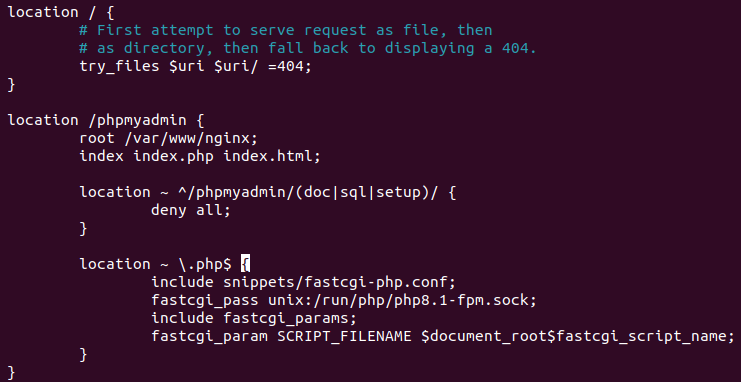
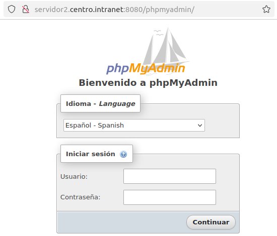

<a href="/Tema1/ServidoresWeb/readme.md"></a>

<a href="/md/7.md"></a>
<a href="/md/8.md"></a>

---

# Instala un segundo servidor de tu elección (nginx, lighttpd) bajo el dominio “servidor2.centro.intranet”.

Debes configurarlo para que sirva en el puerto 8080 y haz los cambios necesarios para ejecutar php.

Instala phpmyadmin.

Para ello usaremos `nginx` como servidor web.

``` cmd
sudo apt-get install nginx
```


Modificamos el archivo `nginx.conf` para que el servidor web se ejecute en el puerto 8080.

``` cmd
sudo nano /etc/nginx/nginx.conf
```

Buscamos la sección `http/server` y agregamos la siguiente línea:

``` apache
http{
    server {
        listen 8080;
        listen [::]:8080;
    }
}
```


Creamos un nuevo fichero de configuración.

``` cmd
sudo nano /etc/nginx/sites-available/default
```

Modificamos la siguientes líneas:

``` apache
server {
    listen 8080 default_server;
    listen [::]:8080 default_server;
}
```

||->||
|--|--|--|

Comprobamos la configuración y reiniciamos el servicio de `nginx`:

``` cmd
sudo nginx -t
```

``` cmd
sudo systemctl restart nginx
```


Creamos el directorio para nuestro archivos `/var/www/nginx`, y creamos un `index.html`

``` cmd
sudo mkdir /var/www/nginx
```

``` cmd
sudo nano /var/www/nginx/index.html
```


Y añadimos el siguiente codigo al html.

``` html
<!DOCTYPE html>
<html>
<head>
<title>Welcome to nginx!</title>
<style>
html { color-scheme: light dark; }
body { width: 35em; margin: 0 auto;
font-family: Tahoma, Verdana, Arial, sans-serif; }
</style>
</head>
<body>
<h1>Welcome to nginx!</h1>
<p>If you see this page, the nginx web server is successfully installed and
working. Further configuration is required.</p>

<p>For online documentation and support please refer to
<a href="http://nginx.org/">nginx.org</a>.<br/>
Commercial support is available at
<a href="http://nginx.com/">nginx.com</a>.</p>

<p><em>Thank you for using nginx.</em></p>
</body>
</html>
```


En el fichero de configuración anterior, cambiaremos la línea `root /var/www/html;` a `root /var/www/nginx;` y añadimos el `server_name`.

``` cmd
sudo nano /etc/nginx/sites-available/default
```

``` apache
server {
    root /var/www/nginx;

    server_name servidor2.centro.intranet;
}
```


Agregamos el nombre del dominio al fichero hosts.

``` cmd
sudo nano /etc/hosts
```

``` apache
127.0.0.1       servidor2.centro.intranet
```


Reiniciamos el servidor

``` cmd
sudo systemctl restart nginx
```

Ahora, si accedemos a `http://servidor2.centro.intranet:8080` en nuestro navegador, deberíamos ver la página de inicio de nginx.


Ahora instalaremos phpmyadmin

``` cmd
sudo apt install phpmyadmin
```


Creamos un enlace simbólico para acceder a phpmyadmin desde el navegador.

``` cmd
sudo ln -s /usr/share/phpmyadmin /var/www/nginx/phpmyadmin
```


Modificamos los permisos del directorio phpmyadmin para que pueda ser accedido desde el navegador.

``` cmd
sudo chown -R www-data:www-data /usr/share/phpmyadmin
```

``` cmd
sudo chmod -R 755 /usr/share/phpmyadmin
```


En la configuración del sitio web, agregamos lo siguiente:

``` cmd
sudo nano /etc/nginx/sites-available/default
```

``` apache
location / {
  try_files $uri $uri/ =404;
}

location /phpmyadmin {
  root /var/www/nginx;
  index index.php index.html;

  location ~ ^/phpmyadmin/(doc|sql|setup)/ {
    deny all;
  }

  location ~ \.php$ {
    include snippets/fastcgi-php.conf;
    fastcgi_pass unix:/run/php/php8.1-fpm.sock;
    include fastcgi_params;
    fastcgi_param SCRIPT_FILENAME $document_root$fastcgi_script_name;
  }
}
```


Instalamos php-fpm:

``` cmd
sudo apt-get install php8.1-fpm
```

Reiniciamos el servicio de nginx:

```
sudo service nginx restart
```

Ahora, accedemos a phpmyadmin desde el navegador `http://servidor2.centro.intranet:8080/phpmyadmin` y podemos acceder a la base de datos.


Iniciamos sesión con nuestro usuario y ya tendremos acceso a la base de datos.

