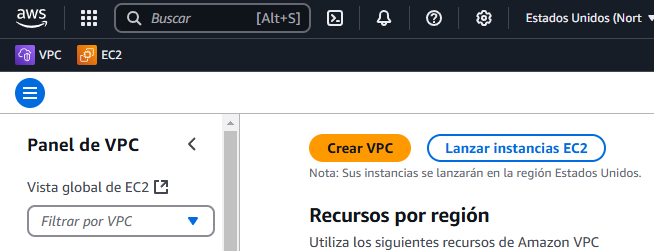
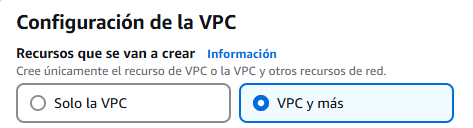
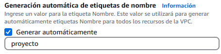
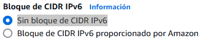
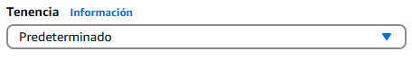
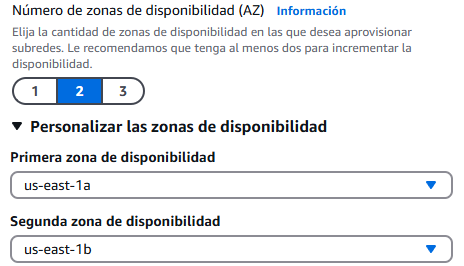
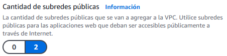
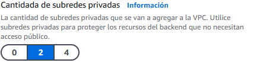

&emsp;&emsp;
&emsp;&emsp;&emsp;&emsp;&emsp;&emsp;&emsp;

---

# Actividad 1 VPC

> VPC (Virtual Private Cloud) permite crear una red virtual dentro de AWS. Esta red virtual es una red privada que se puede configurar para que se conecte a Internet o a otras redes privadas. Los recursos de AWS se pueden conectar a la VPC para que puedan comunicarse entre sí.

Para crear una VPC, debemos seguir los siguientes pasos:

1. Accedemos a la consola del servicio de Amazon vPC y pulsamos en crear VPC.

2. Una vez en la ventana de la consola de administración del servicio de AmazonVPC, en el apartado **Recursos que se van a crear**, se selecciona la opción **VPC y mas**.

A continuación, parametrizamos nuestra
VPC, indicando los siguientes valores:

- Generación automática de etiquetas de nombre: marcamos la casilla de **Generar automáticamente**

- Bloque de CIDR IPv4: Indicamos el bloque CIDR de nuestra red, en esta práctica será 10.2.0.0/16

- Bloque de CIDR IPv6: marcamos la opción **Sin bloque de CIDR IPv6**

- Tenencia: Indica la tenencia por defecto de nuestras instancias EC2 que se lancen en esta VPC. Seleccionaremos la opción Default

- Número de zonas de disponibilidad (AZ): Indicaremos el valor **2** y ampliaremos la opción **Personalizar las zonas de disponibilidad**, indicando como primera zona de disponibilidad **us-east-1a** y como segunda zona de disponibilidad **us-east-1b**.

- Cantidad de subredes públicas: Seleccionaremos el valor 2

- Cantidada de subredes privadas: Seleccionaremos el valor 2

- Personalizar bloques de CIDR de subredes: Indicaremos los bloques CIDR de nuestras cuatro subredes:
  - Bloque de CIDR de la subred pública en us-east-1a

o Public subnet CIDR block in us-east-1a: 10.2.0.0/24
o Public subnet CIDR block in us-east-1b: 10.2.1.0/24
o Private subnet CIDR block in us-east-1a: 10.2.2.0/24
o Private subnet CIDR block in us-east-1b: 10.2.3.0/24
• NAT gateways: Indicaremos el valor None. Los NAT Gateway son dispositivos completamente
administrados, escalables horizontalmente y altamente disponibles en una zona de
disponibilidad que permiten que los recursos desplegados en subredes privadas puedan
acceder a Internet. En esta práctica, omitiremos su uso debido al alto coste económico que
puede repercutir para la implementación de la práctica.
• VPC endpoints: Indicaremos el valor None.
• DNS options:
o Enable DNS hostnames: Este atributo determina si las instancias lanzadas en nuestra VPC
recibirán un nombre DNS de host público que se resuelva a su IP pública. Marcamos la
casilla de verificación
o Enable DNS resolution: Este atributo determina si se debe resolver las solicituydes DNS a
través del servidor de Amazon en la VPC. Marcamos la casilla de verificación