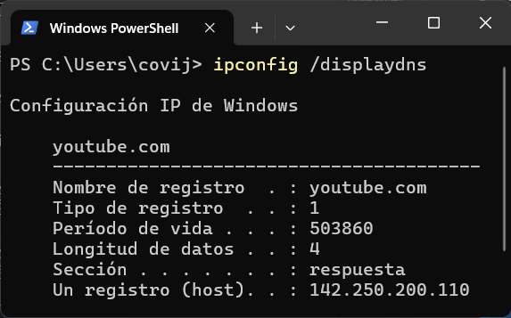
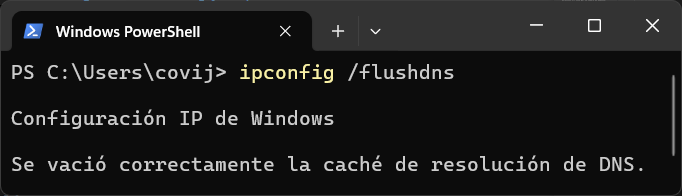

---

# Apuntes introducción

## Sistema DNS &nbsp;&nbsp;&nbsp;&nbsp;&nbsp;

El DNS (Sistema de Nombres de Dominio) convierte los nombres de dominio en direcciones IP. En cierto sentido, es como una guía telefónica.

> | Dirección IP | URL/Nombre de Dom |
> | --------------------------- | ----------------- |
> | 165.227.86.21               | cellstream.com    |
> | 2604:a880:400:d0:850:9001   | cellstream.com    |
> | 138.197.71.240              | netscionline.com  |
> | 2604:a880:800:a1:7e4:8001   | netscionline.com  |

Para entender esto analizaremos como es escribe una URL

`https://www.cellstream.com/resources/wireshark-profiles-repository?filterB%5D=wi-fi`

- **Protocolo**: `https`
- **Nombre de host**: `www`
- **Nombre de Dominio**: `cellstream`
- **TLD**: `com`
- **Directorio y ruta**: `/resources/wireshark-profiles-repository`
  - Puede incluir un nombre de archivo `.html` o `.php`
- **Parámetros de consulta**: `?filterB%5D=wi-fi`

Para poder acceder a esta URL, necesitamos traducir el **Nombre de Dominio** a una **Dirección IP**

### 1. Caché local

Inicialmente, el sistema comprueba en la caché local la solución de DNS.

|Comprobar caché local|Limiar caché local|
|--|--|
|||

### 2. ISP Recursive Resolver

Si la respuesta no se encuentra en la caché local, el sistema envía una solicitud de DNS a su solución **ISP Recursive Resolver** local.

> Si la respuesta esta en la caché del ISP, se recive la respuesta, se actualiza la caché local y se conecta al sitio web.

### 3. DNS

En caso de que el **ISP** no tuviera respuesta, pregunta al **Root Server**.

La respuesta del **Root Server** no contiene la dirección IP, sino que nos proporciona acceso al servidor de **Dominio de Nivel Superior (TLD)**

.

A continuación, el servidor **ISP** consulta al servidor **TLD**, esto nos proporciona un **Servidor de Nombre Autoritario**, no la respuesta en si.

Preguntamos al **Servidor Autoritario** y obtenemos la respuesta, la manda al cliente y actualiza la caché.

Por último podremos comunicarnos con el servidor web de destino.

