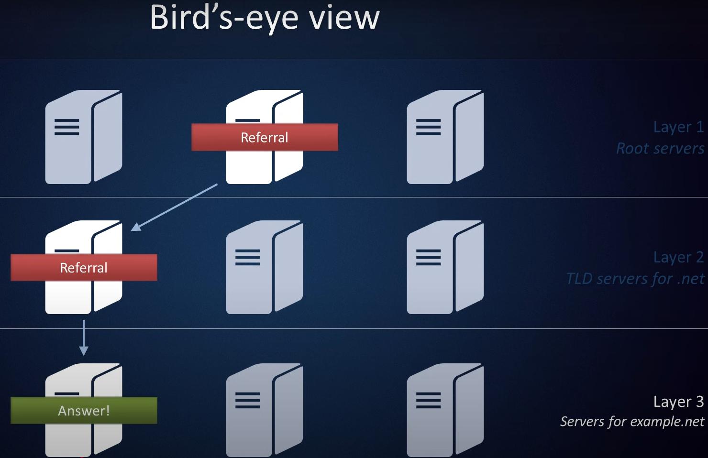

<a href="/README.md"></a>

---

# Apuntes introducción

## Como trabaja un servidor DNS

Para facilitar la comunicación entre equipos informáticos y humanos y facilitar la comunicación, se desarrolló el **DNS**.

> DNS (Sistemas de Nombres de Dominio) <br>
> El DNS resuelve **nombres de dominio** a **direcciones IP**.

Cuando buscamos un sitio web, no lo hacemos por su dirección IP, sino por su nombre de dominio.

Por lo cual, cuando buscamos `google.com` en el navegador, el DNS busca en su base de datos el nombre de dominio `google.com`.

Una vez encontrado, el DNS nos devuelve la dirección IP correspondiente a `google.com` y el navegador se conecta a esa IP.

> Funciona como una guia telefónica, primero buscamos el nombre del dominio y obtenemos la dirección IP correspondiente.

Desglosandolo con mas detalle:

1. Cuando ingresamos `google.com` en el navegador, este busca la dirección ip en su **memoria cache**.<br>Si no encuentra la dirección IP en la memoria cache, el navegador envía una consulta al **Servidor de Resolución**

> El **Servidor de Resolución** (ISP) es el servidor del proveedor de servicios de internet 

2. Cuando el ISP recive la consulta la comprueba en su propia memoria cache, si no la encuentra, envia la consulta al siguiente nivel **Root Server**.

3. El **Root Server** o **Servidor Raiz**, son la raiz de todo el sistema de nombres de dominio, 

> Los **Servidores Raiz** estan ubicados estrategicamente en todo el mundo.<br>
> Cada uno de estos tienen su propia dirección IP

4. Cuando el **Servidor Raiz** recive la consulta `google.com`, este no conoce cual es su dirección IP, pero sabe donde enviar al **Servidor de Resolución** para encontrar la dirección IP.

5. Entonces el **Servidor Raiz** envia al **Servidor de Resolución** al `Servidor TLD` para el dominio `com`.

6. El **Servidor de Resolución** pedirá al **Servidor TLD** la dirección IP correspondiente a `google.com`, estos servidores conocen las direcciones par dominios de nivel superior como `.com` o `.net`.

7. Entonces cuando un servidor TLD recive una consulta de `google.com`, este no sabe la dirección IP de `google.com`, pero dirigirá al servidor de resolución para los **Servidores de Nombres Autorizados** .com.

8. Por ultimo, el **Servidor de Resolución** envia la consulta a los **Servidores de Nombres Autorizados** para el dominio `google.com`.

9.  Estos servidores buscan en su base de datos la dirección IP correspondiente a `google.com` y la envian al servidor de resolución.

> Cada vez que el Servidor de Resolución recibe una dirección IP, almacena esta en su memoria cache para que la próxima vez que se reciba la misma consulta, no tenga que volver a buscarla.

---

## Como se traducen los dominios a direcciones IP

Cuando preguntamos donde se ecnuentra `google.com`, el servisor DNS no sabrá la respuesta.

Sin embargo, este sabe que servidores son responsables de los dominios `.com`

Ahora, con la dirección IP del servidor de nivel superior para los dominios `.com`.

Una vez conectados al servidor **TLD** responsable de los dominios `.com`, este no nos devolverá una respuesta, pero nos dirá una lista de servidores que son responsables de los dominios `google.com`.



Query: `google.com`

```
google.com: dominio a buscar
IN:         clas de DNS (internet)
A:          tipo de registro (dirección)
```

Respuesta del Root Server: `seridores de dominio de nivel superior para .net`

```
com.    172800  IN  NS  m.gtld-servers.com.
com.    172800  IN  NS  l.gtld-servers.com.
com.    172800  IN  NS  k.gtld-servers.com.
```

## [Sistema DNS](https://www.cellstream.com/2017/07/19/the-dns-system-in-depth/)

El DNS (Sistema de Nombres de Dominio) convierte los nombres de dominio en direcciones IP. En cierto sentido, es como una guía telefónica.

> | Dirección IP | URL/Nombre de Dom |
> | --------------------------- | ----------------- |
> | 165.227.86.21               | cellstream.com    |
> | 2604:a880:400:d0:850:9001   | cellstream.com    |
> | 138.197.71.240              | netscionline.com  |
> | 2604:a880:800:a1:7e4:8001   | netscionline.com  |

Para entender esto analizaremos como es escribe una URL


| https|://|www|.|cellstream|.|com|/|resources/whireshark-profiles-repository|?filterB%5D=wi-fi |
| -- | -- | -- | -- | -- | -- | -- | -- | -- | -- |
| protocolo | | nombre de host | | nombre de dominio | | TLD | | directorio y ruta | parámetros de consulta |