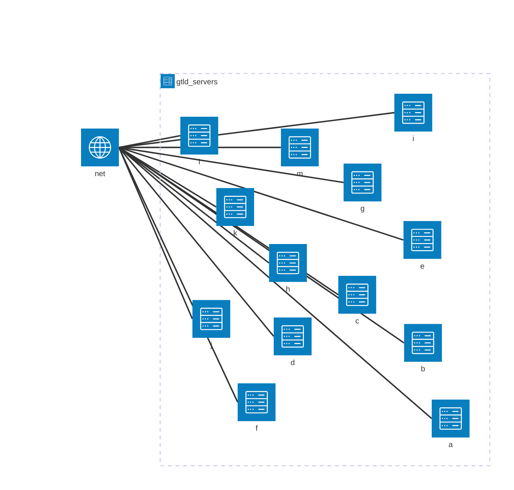

<a href="/Tema2/readme.md"></a>

<a href="3.md"></a>
&emsp;&emsp;&emsp;&emsp;&emsp;&emsp;&emsp;
<a href="5.md"></a>
<a href="4.1.md"></a>

---

# dig

> [Ejemplos Comando DIG](http://www.thegeekstuff.com/2012/02/dig-command-examples/)
> 
> [Uso del comando DIG](http://www.2daygeek.com/dig-command-examples-to-check-dns-records/#)

## Actividades

1. Obtén la dirección IP de los siguientes dominios: www.uhu.es, www.us.es, es.wikipedia.org

Usando el_ comando `dig` seguido de la `url` del dominio, obtendremos la información de DNS del dominio solicitado.

```bash
dig www.uhu.es
```

| Domínio | Dirección IP |
| --- | --- |
| www.uhu.es | 150.214.167.13 |
| www.us.es | 193.147.175.38 |
| es.wikipedia.org | 185.15.58.224 |

2. Obtén la dirección y los servidores DNS que corresponden a los siguientes dominios:  net, com, us.es, wikipedia.org.

Para obtener los servidores DNS de dominios AAA, debemos utilizar el comando `dig` con el parámetro `+short` seguido del nombre del dominio y `NS`

```cmd
dig +short net NS
```



3. Averigua los registros MX de los siguientes dominios:  uhu.es, us.es, wikipedia.org


4. Obten la dirección IPV6 de www.isc.org


5. Muestra los servidores de correo de yahoo.com


6. Muestra la información asociada con la dirección 75.126.153.206


7. Muestra la dirección de www.google.es utilizando uno de los servidores DNS de google.com


8. Muestra información sobre el TTL de drive.google.com. Ejecútalo en varias ocasiones y comprueba cómo cambia el valor


9. Muestra los registro type NS de redhat.com


10. Muestra todos los registros de redhat


11. Crea un fichero de texto que contenga los dominios;

12. Haz una consulta con dig empleando el fichero anterior
