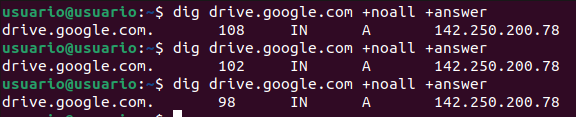

<a href="/Tema2/readme.md"></a>

<a href="3.md"></a>
&emsp;&emsp;&emsp;&emsp;&emsp;&emsp;&emsp;
<a href="5.md"></a>
<a href="4.1.md"></a>

---

# dig

> [Ejemplos Comando DIG](http://www.thegeekstuff.com/2012/02/dig-command-examples/)
> 
> [Uso del comando DIG](http://www.2daygeek.com/dig-command-examples-to-check-dns-records/#)
>
> [Comando DIG](https://www.hostinger.es/tutoriales/comando-dig-linux#Consultar_un_tipo_de_registro_DNS_especifico)

## Índice

- [dig](#dig)
  - [Índice](#índice)
  - [Actividades](#actividades)
    - [1. Obtén la dirección IP de los siguientes dominios: www.uhu.es, www.us.es, es.wikipedia.org](#1-obtén-la-dirección-ip-de-los-siguientes-dominios-wwwuhues-wwwuses-eswikipediaorg)
    - [2. Obtén la dirección y los servidores DNS que corresponden a los siguientes dominios:  net, com, us.es, wikipedia.org.](#2-obtén-la-dirección-y-los-servidores-dns-que-corresponden-a-los-siguientes-dominios--net-com-uses-wikipediaorg)
    - [3. Averigua los registros MX de los siguientes dominios:  uhu.es, us.es, wikipedia.org](#3-averigua-los-registros-mx-de-los-siguientes-dominios--uhues-uses-wikipediaorg)
    - [4. Obten la dirección IPV6 de www.isc.org](#4-obten-la-dirección-ipv6-de-wwwiscorg)
    - [5. Muestra los servidores de correo de yahoo.com](#5-muestra-los-servidores-de-correo-de-yahoocom)
    - [6. Muestra la información asociada con la dirección 75.126.153.206](#6-muestra-la-información-asociada-con-la-dirección-75126153206)
    - [7. Muestra la dirección de www.google.es utilizando uno de los servidores DNS de google.com](#7-muestra-la-dirección-de-wwwgooglees-utilizando-uno-de-los-servidores-dns-de-googlecom)
    - [8. Muestra información sobre el TTL de drive.google.com. Ejecútalo en varias ocasiones y comprueba cómo cambia el valor](#8-muestra-información-sobre-el-ttl-de-drivegooglecom-ejecútalo-en-varias-ocasiones-y-comprueba-cómo-cambia-el-valor)
    - [9. Muestra los registro type NS de redhat.com](#9-muestra-los-registro-type-ns-de-redhatcom)
    - [10. Muestra todos los registros de redhat](#10-muestra-todos-los-registros-de-redhat)
    - [11. Crea un fichero de texto que contenga los dominios](#11-crea-un-fichero-de-texto-que-contenga-los-dominios)
    - [12. Haz una consulta con dig empleando el fichero anterior](#12-haz-una-consulta-con-dig-empleando-el-fichero-anterior)

## Actividades

### 1. Obtén la dirección IP de los siguientes dominios: www.uhu.es, www.us.es, es.wikipedia.org

Usando el comando `dig` seguido de la `url` del dominio, obtendremos la información de DNS del dominio solicitado.

```bash
dig www.uhu.es
```

| Domínio | Dirección IP |
| --- | --- |
| www.uhu.es | 150.214.167.13 |
| www.us.es | 193.147.175.38 |
| es.wikipedia.org | 185.15.58.224 |

### 2. Obtén la dirección y los servidores DNS que corresponden a los siguientes dominios:  net, com, us.es, wikipedia.org.

Para obtener los servidores DNS de dominios:

```cmd
dig +short net NS
dig +short com NS
dig +short us.es NS
dig +short wikipedia.org NS
```

| Domínio | Servidores DNS |
| --- | --- |
| net | a.gtld-servers.net.<br>b.gtld-servers.net.<br>c.gtld-servers.net.<br>d.gtld-servers.net.<br>e.gtld-servers.net.<br>f.gtld-servers.net.<br>g.gtld-servers.net.<br>h.gtld-servers.net.<br>i.gtld-servers.net.<br>j.gtld-servers.net.<br>k.gtld-servers.net.<br>l.gtld-servers.net.<br>m.gtld-servers.net.<br> |
| com | a.gtld-servers.net.<br>b.gtld-servers.net.<br>c.gtld-servers.net.<br>d.gtld-servers.net.<br>e.gtld-servers.net.<br>f.gtld-servers.net.<br>g.gtld-servers.net.<br>h.gtld-servers.net.<br>i.gtld-servers.net.<br>j.gtld-servers.net.<br>k.gtld-servers.net.<br>l.gtld-servers.net.<br>m.gtld-servers.net.<br> |
| us.es | chico.rediris.es.<br>sun.rediris.es.<br>dns1.cica.es.<br>dns2.cica.es.<br>jade.us.es.<br>onix.us.es. |
| wikipedia.org | ns0.wikimedia.org<br>ns1.wikimedia.org<br>n2.wikimedia.org<br> |

### 3. Averigua los registros MX de los siguientes dominios:  uhu.es, us.es, wikipedia.org

Para obtener los registros MX de un dominio:

```cmd
dig +short uhu.es MX
dig +short us.es MX
dig +short wikipedia.org MX
```

| Dominio | Registros MX |
| -- | -- |
| uhu.es | mx04.puc.rediris.es<br>mx03.puc.rediris.es|
| us.es| buzon.us.es |
| wikipedia.org| mx-in1001.wikimedia.org<br>mx-in2001.wikimedia.org |

### 4. Obten la dirección IPV6 de www.isc.org

```cmd
dig +short www.isc.org AAAA

isc.map.fastlydns.net.

isc.map.fastlydns.net
2a04:4e42:600::729
2a04:4e42:200::729
2a04:4e42:400::729
2a04:4e42::729

```

### 5. Muestra los servidores de correo de yahoo.com

```cmd
dig +short yahoo.com MX

1 mta5.am0.yahoodns.net.
2 mta6.am0.yahoodns.net.
3 mta7.am0.yahoodns.net.
```

### 6. Muestra la información asociada con la dirección 75.126.153.206

Para ello, usaremos el comando:

```cmd
dig -x 75.126.153.206

; <<>> DiG 9.18.28-0ubuntu0.22.04.1-Ubuntu <<>> -x 75.126.153.206
;; global options: +cmd
;; Got answer:
;; ->>HEADER<<- opcode: QUERY, status: NOERROR, id: 44798
;; flags: qr rd ra; QUERY: 1, ANSWER: 1, AUTHORITY: 0, ADDITIONAL: 1

;; OPT PSEUDOSECTION:
; EDNS: version: 0, flags:; udp: 65494
;; QUESTION SECTION:
;206.153.126.75.in-addr.arpa.    IN    PTR

;; ANSWER SECTION:
206.153.126.75.in-addr.arpa.    3600    IN    PTR    ce.99.7e4b.ip4.static.sl-reverse.com.

;; Query time: 110 msec
;; SERVER: 127.0.0.53#53(127.0.0.53) (UDP)
;; WHEN: Tue Jan 28 21:04:55 CET 2025
;; MSG SIZE  rcvd: 106
```

### 7. Muestra la dirección de www.google.es utilizando uno de los servidores DNS de google.com

Buscamos el dns de google con el comando:

```cmd
dig www.google.es NS
```

```cmd
dig @ns1.google.com www.google.es

; <<>> DiG 9.18.28-0ubuntu0.22.04.1-Ubuntu <<>> @ns1.google.com www.google.es
; (2 servers found)
;; global options: +cmd
;; Got answer:
;; ->>HEADER<<- opcode: QUERY, status: NOERROR, id: 18116
;; flags: qr aa rd; QUERY: 1, ANSWER: 1, AUTHORITY: 0, ADDITIONAL: 1
;; WARNING: recursion requested but not available

;; OPT PSEUDOSECTION:
; EDNS: version: 0, flags:; udp: 512
;; QUESTION SECTION:
;www.google.es.                 IN      A

;; ANSWER SECTION:
www.google.es.          300     IN      A       216.58.215.163

;; Query time: 50 msec
;; SERVER: 216.239.32.10#53(ns1.google.com) (UDP)
;; WHEN: Tue Jan 28 21:34:09 CET 2025
;; MSG SIZE  rcvd: 58
```

### 8. Muestra información sobre el TTL de drive.google.com. Ejecútalo en varias ocasiones y comprueba cómo cambia el valor



### 9. Muestra los registro type NS de redhat.com


### 10. Muestra todos los registros de redhat

Al consultar los registros de redhat usando:

```cmd
dig redhat.com ANY +noall +answer
```

No podemos obtener todos los resultados juntos, por lo que hemos de preguntar uno a uno a cada uno de los registros.

```cmd
dig redhat.com A +noall +answer
dig redhat.com MX +noall +answer
dig redhat.com NS +noall +answer
etc
```


### 11. Crea un fichero de texto que contenga los dominios

```cmd
nano dom.txt

redhat.com
google.com
amazon.com
wikipedia.org
```

### 12. Haz una consulta con dig empleando el fichero anterior

```cmd
dig -f dom.txt +noall +answer
```

