<a href="/Tema2/readme.md"></a>

---

# Configuración de BIND9 como Servidor Caché y Forwarding

## Introducción
BIND9 (Berkeley Internet Name Domain) es uno de los servidores DNS más utilizados en sistemas Linux. Se puede configurar para trabajar como un **servidor caché** (almacena respuestas de consultas para mejorar el rendimiento) o como un **servidor forwarding** (reenvía las consultas a otros servidores DNS). En este documento, aprenderás cómo instalar y configurar BIND9 en Ubuntu.

### **Enlaces de referencia**
- [Guía de DigitalOcean](https://www.digitalocean.com/community/tutorials/how-to-configure-bind-as-a-caching-or-forwarding-dns-server-on-ubuntu-16-04)
- [Documentación de Zytrax](http://www.zytrax.com/books/dns/ch4/)
- [Guía de Ubuntu](https://help.ubuntu.com/community/BIND9ServerHowto)

---

## **Paso 1: Instalar BIND9**
1. Abre una terminal y actualiza los paquetes:
   ```bash
   sudo apt update && sudo apt upgrade -y
   ```
    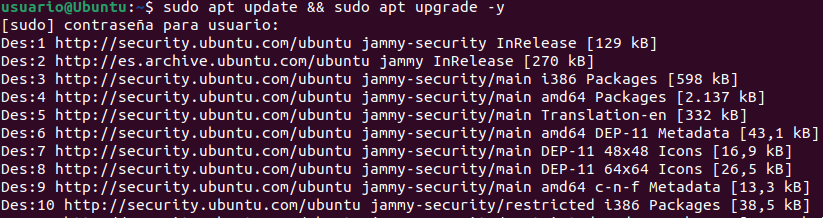
2. Instala BIND9:
   ```bash
   sudo apt install bind9 -y
   ```
    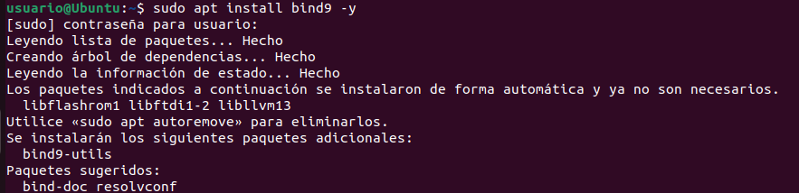
3. Verifica que el servicio está en ejecución:
   ```bash
   systemctl status bind9
   ```
    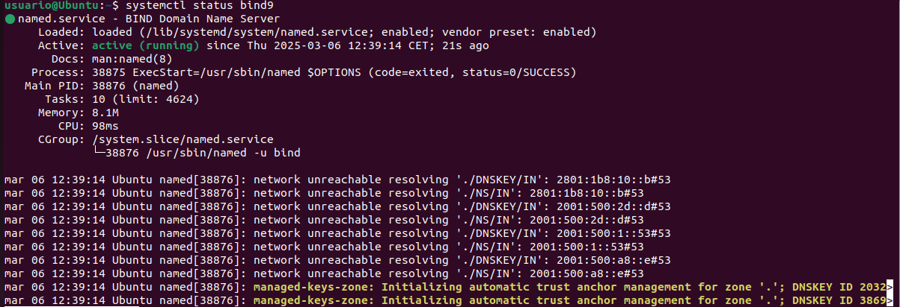

   Si no está en ejecución, inícialo con:
   ```bash
   sudo systemctl start bind9
   sudo systemctl enable bind9
   ```


---

## **Paso 2: Configurar BIND9 como Servidor Caché**

### **1. Editar la configuración de BIND9**
Edita el archivo de configuración:
```bash
sudo nano /etc/bind/named.conf.options
```
Modifica el contenido para que quede así:
```bash
options {
    directory "/var/cache/bind";
    
    recursion yes;
    allow-recursion { any; };
    listen-on { any; };
    forwarders {};  
    dnssec-validation auto;
    
    listen-on-v6 { any; };
};
```
Guarda y cierra el archivo.

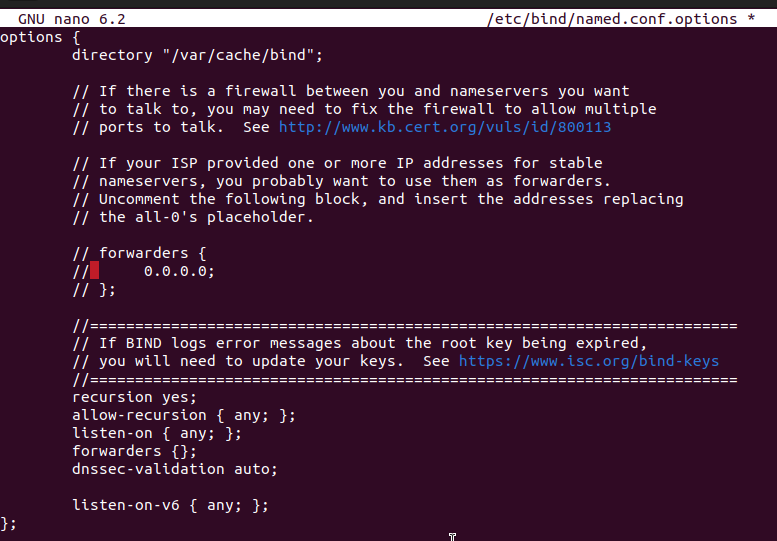

### **2. Comprobar la sintaxis**
```bash
sudo named-checkconf
```
Si no hay errores, continúa.

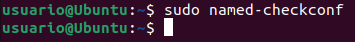

### **3. Reiniciar BIND9**
```bash
sudo systemctl restart bind9
```
Verifica que está funcionando:
```bash
systemctl status bind9
```

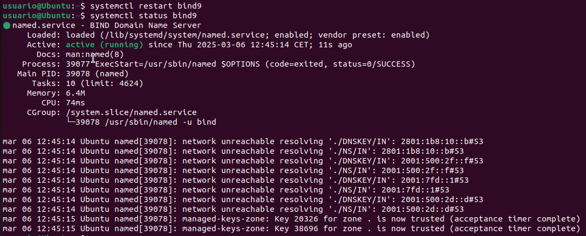

### **4. Verificar que responde correctamente**
Prueba resolviendo un dominio:
```bash
nslookup google.com 127.0.0.1
```
Si devuelve una respuesta con la IP de Google, el servidor caché está funcionando.

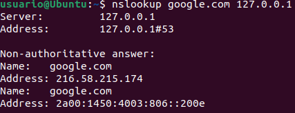

Revisa el log:
```bash
sudo tail -f /var/log/syslog
```

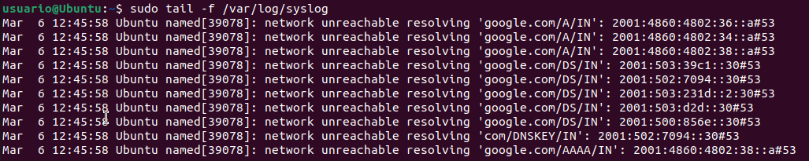

---

## **Paso 3: Configurar BIND9 como Servidor Forwarding**

### **1. Editar la configuración**
Edita el archivo:
```bash
sudo nano /etc/bind/named.conf.options
```
Modifica la sección `options` para usar servidores DNS externos (por ejemplo, Google y Cloudflare):
```bash
options {
    directory "/var/cache/bind";

    recursion yes;
    allow-recursion { any; };
    forward only;
    forwarders {
        8.8.8.8;
        8.8.4.4;
        1.1.1.1;
    };

    dnssec-validation auto;
    
    listen-on { any; };
    listen-on-v6 { any; };
};
```
Guarda y cierra el archivo.

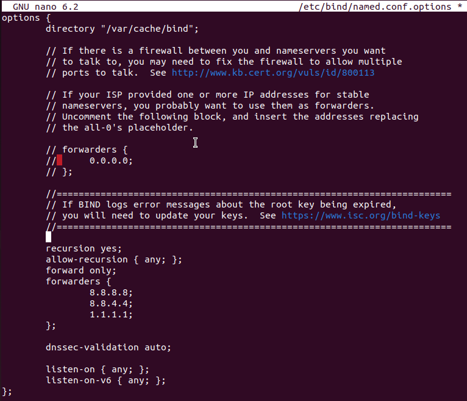

### **2. Comprobar la sintaxis**
```bash
sudo named-checkconf
```
Si no hay errores, continúa.

### **3. Reiniciar BIND9**
```bash
sudo systemctl restart bind9
```

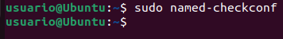

Verifica el estado:
```bash
systemctl status bind9
```

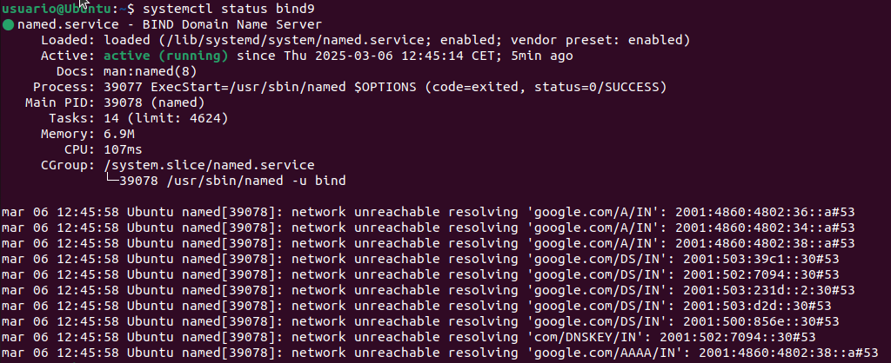

### **4. Probar el servidor Forwarding**
Realiza una consulta DNS:
```bash
nslookup facebook.com 127.0.0.1
```
Si devuelve una IP correctamente, el servidor está funcionando.

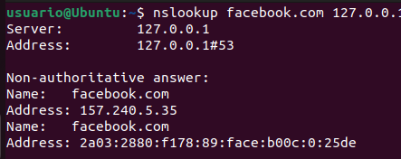