<a href="/Tema2/readme.md"></a>

---

# 🏗 Configuración de un Servidor DNS Maestro en Ubuntu

## Introducción
En esta actividad, configuraremos un servidor DNS maestro utilizando BIND en Ubuntu. Crearemos zonas directa e inversa para el dominio **marisma.intranet** e incluiremos los registros necesarios para servidores DNS, FTP, correo y web. Posteriormente, modificaremos la configuración del cliente para emplear el nuevo servidor DNS y realizaremos pruebas de resolución.

## Paso 1: Configurar la Zona Directa
Editamos el archivo de configuración de BIND para añadir la zona directa.

```bash
sudo nano /etc/bind/named.conf.local
```
Añadimos la siguiente configuración:

```plaintext
zone "marisma.intranet" {
    type master;
    file "/etc/bind/db.marisma";
};
```

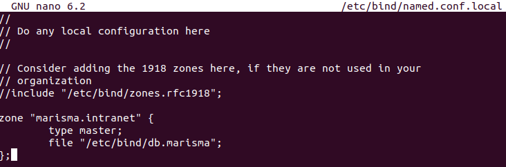

Creamos el archivo de zona:

```bash
sudo cp /etc/bind/db.local /etc/bind/db.marisma
sudo nano /etc/bind/db.marisma
```

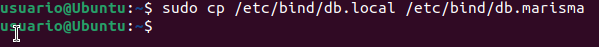

Editamos su contenido:

```plaintext
;
; Archivo de zona para marisma.intranet
;
$TTL    604800
@       IN      SOA     ns1.marisma.intranet. admin.marisma.intranet. (
                              2         ; Serial
                         604800         ; Refresh
                          86400         ; Retry
                        2419200         ; Expire
                         604800 )       ; Negative Cache TTL
;
@       IN      NS      ns1.marisma.intranet.
ns1     IN      A       192.168.1.1
ftp1    IN      A       192.168.1.2
mail1   IN      A       192.168.1.3
mail2   IN      A       192.168.1.4
www     IN      A       192.168.1.5
departamentos IN A      192.168.1.6
@       IN      MX 10   mail1.marisma.intranet.
@       IN      MX 20   mail2.marisma.intranet.
```

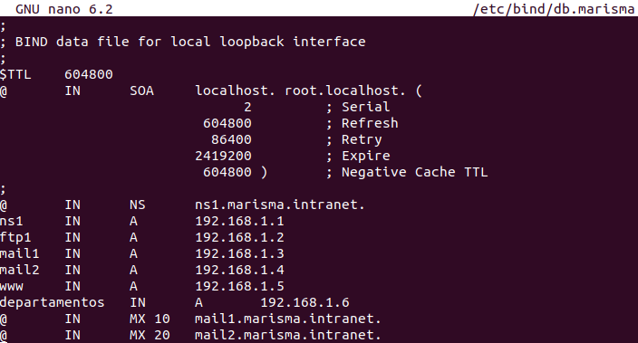
## Paso 2: Configurar la Zona Inversa
Editamos el archivo de configuración de BIND:

```bash
sudo nano /etc/bind/named.conf.local
```

Añadimos la zona inversa:

```plaintext
zone "1.168.192.in-addr.arpa" {
    type master;
    file "/etc/bind/db.192";
};
```

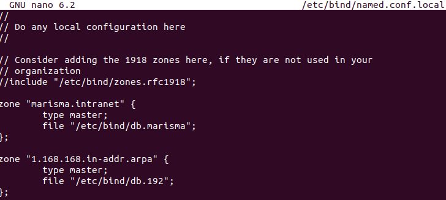

Creamos el archivo de zona inversa:

```bash
sudo cp /etc/bind/db.127 /etc/bind/db.192
sudo nano /etc/bind/db.192
```

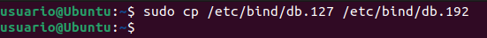

Editamos su contenido:

```plaintext
;
; Archivo de zona inversa para 192.168.1.x
;
$TTL    604800
@       IN      SOA     ns1.marisma.intranet. admin.marisma.intranet. (
                              2         ; Serial
                         604800         ; Refresh
                          86400         ; Retry
                        2419200         ; Expire
                         604800 )       ; Negative Cache TTL
;
@       IN      NS      ns1.marisma.intranet.
1       IN      PTR     ns1.marisma.intranet.
2       IN      PTR     ftp1.marisma.intranet.
3       IN      PTR     mail1.marisma.intranet.
4       IN      PTR     mail2.marisma.intranet.
5       IN      PTR     www.marisma.intranet.
6       IN      PTR     departamentos.marisma.intranet.
```

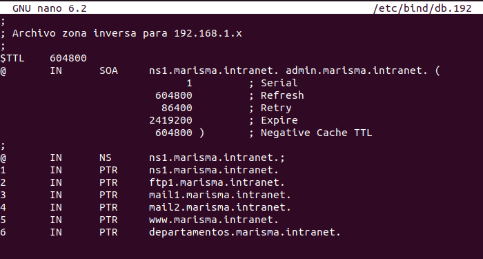

## Paso 3: Reiniciar el Servidor DNS

```bash
sudo systemctl restart bind9
```

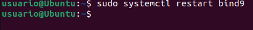

Verificamos la configuración:

```bash
sudo named-checkconf
sudo named-checkzone marisma.intranet /etc/bind/db.marisma
sudo named-checkzone 1.168.192.in-addr.arpa /etc/bind/db.192
```

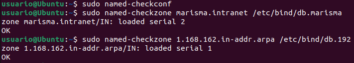

## Paso 4: Configurar el Cliente DNS
Editamos el archivo de resolución DNS:

```bash
sudo nano /etc/resolv.conf
```

Agregamos la siguiente línea:

```plaintext
nameserver 192.168.1.1
```

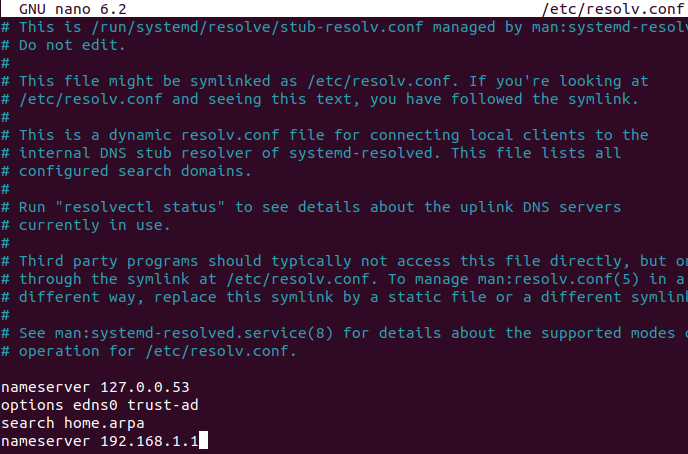

Para hacer esta configuración persistente, editamos:

```bash
sudo nano /etc/systemd/resolved.conf
```

Modificamos o agregamos:

```plaintext
DNS=192.168.1.1
Domains=marisma.intranet
```

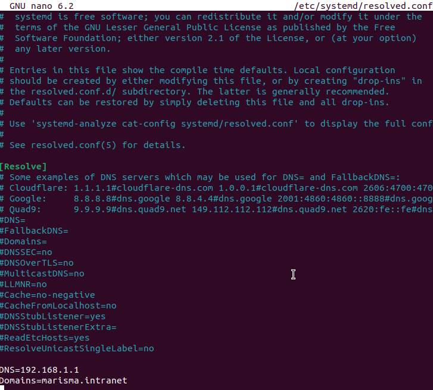

Reiniciamos el servicio:

```bash
sudo systemctl restart systemd-resolved
```

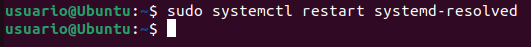

## Paso 5: Pruebas de Resolución de Nombres
Realizamos consultas para comprobar la configuración:

```bash
dig @192.168.1.1 marisma.intranet
dig @192.168.1.1 -x 192.168.1.1
dig @192.168.1.1 NS marisma.intranet
dig @192.168.1.1 MX marisma.intranet
```

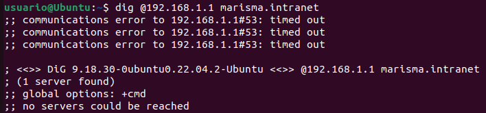

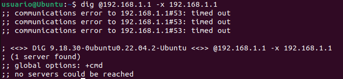

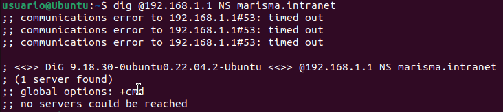

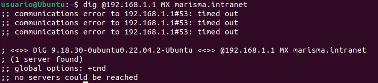

## Conclusión
Con esta configuración, hemos implementado un servidor DNS maestro en Ubuntu, definiendo registros esenciales y asegurando su correcta resolución en los clientes. Además, verificamos el funcionamiento del servidor y corregimos posibles problemas de resolución.

## Enlaces

- [digitalocean](https://www.digitalocean.com/community/tutorials/how-to-configure-bind-as-an-authoritative-only-dns-server-on-ubuntu-14-04)

- [zytrax](http://www.zytrax.com/books/dns/ch6/)

- [help.ubuntu](https://help.ubuntu.com/community/BIND9ServerHowto)

- [askubuntu](http://askubuntu.com/questions/81797/nslookup-finds-ip-but-ping-doesnt)

- [netroby](https://www.netroby.com/view/3630#.U2mTfHVdUc0)

