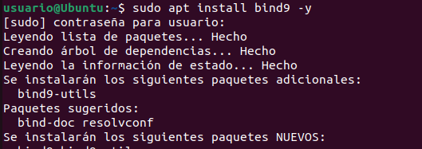
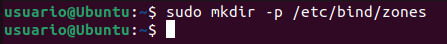
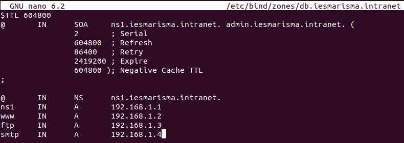
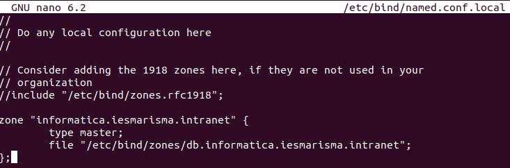
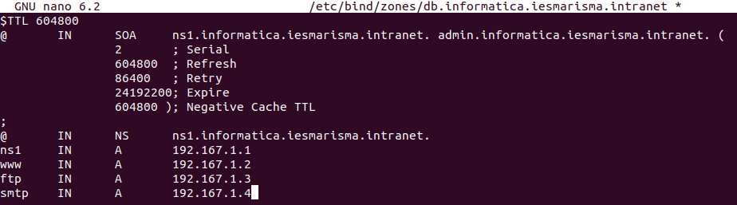
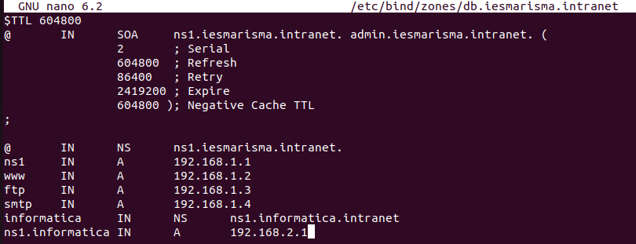
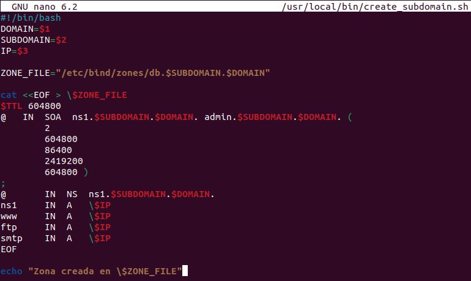
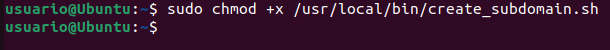
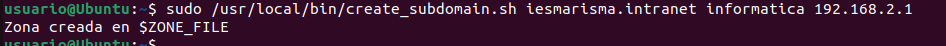

<a href="/Tema2/readme.md"></a>

---

# Configuración de un DNS Primario y Creación de Subdominios

## Introducción
En este documento se detallará el proceso de configuración de un servidor DNS primario para el dominio `iesmarisma.intranet`, así como la creación y delegación del subdominio `informatica.iesmarisma.intranet`. Además, se incluirá un script en Bash para automatizar la creación de subdominios y se explorará una alternativa en Python usando `subprocess.Popen`.

## Requisitos previos
Antes de comenzar, asegúrate de tener instalado y configurado el servidor DNS BIND9 en tu sistema. Puedes instalarlo con:
```bash
sudo apt update
sudo apt install bind9 bind9utils bind9-doc
```



## Configuración del DNS Primario
### 1. Configurar el archivo de zona principal
Edita el archivo de configuración de BIND9:
```bash
sudo nano /etc/bind/named.conf.local
```
Añade la siguiente configuración:
```bash
zone "iesmarisma.intranet" {
    type master;
    file "/etc/bind/zones/db.iesmarisma.intranet";
};
```

### 2. Crear el archivo de zona
Crea el directorio si no existe y luego el archivo de zona:
```bash
sudo mkdir -p /etc/bind/zones
sudo nano /etc/bind/zones/db.iesmarisma.intranet
```



Agrega el siguiente contenido:
```bash
$TTL 604800
@   IN  SOA  ns1.iesmarisma.intranet. admin.iesmarisma.intranet. (
        2         ; Serial
        604800    ; Refresh
        86400     ; Retry
        2419200   ; Expire
        604800 )  ; Negative Cache TTL
;
@       IN  NS  ns1.iesmarisma.intranet.
ns1     IN  A   192.168.1.1
www     IN  A   192.168.1.2
ftp     IN  A   192.168.1.3
smtp    IN  A   192.168.1.4
```



### 3. Configurar el subdominio
Edita `named.conf.local` y añade:
```bash
sudo nano /etc/bind/named.conf.local
```
```bash
zone "informatica.iesmarisma.intranet" {
    type master;
    file "/etc/bind/zones/db.informatica.iesmarisma.intranet";
};
```



Crea el archivo de zona:
```bash
sudo nano /etc/bind/zones/db.informatica.iesmarisma.intranet
```
Con el siguiente contenido:
```bash
$TTL 604800
@   IN  SOA  ns1.informatica.iesmarisma.intranet. admin.informatica.iesmarisma.intranet. (
        2         ; Serial
        604800    ; Refresh
        86400     ; Retry
        2419200   ; Expire
        604800 )  ; Negative Cache TTL
;
@       IN  NS  ns1.informatica.iesmarisma.intranet.
ns1     IN  A   192.168.2.1
www     IN  A   192.168.2.2
ftp     IN  A   192.168.2.3
smtp    IN  A   192.168.2.4
```



## Delegación del Subdominio
Si deseas delegar la gestión del subdominio a otro servidor, en `db.iesmarisma.intranet` añade:
```bash
sudo nano /etc/bind/zones/db.iesmarisma.intranet
```
```bash
informatica  IN  NS  ns1.informatica.iesmarisma.intranet.
ns1.informatica  IN  A   192.168.2.1
```



## Creación de Subdominios mediante Script Bash
Crea un script para automatizar la creación de zonas DNS:
```bash
sudo nano /usr/local/bin/create_subdomain.sh
```
Añade:
```bash
#!/bin/bash
DOMAIN=$1
SUBDOMAIN=$2
IP=$3

ZONE_FILE="/etc/bind/zones/db.$SUBDOMAIN.$DOMAIN"

cat <<EOF > \$ZONE_FILE
$TTL 604800
@   IN  SOA  ns1.$SUBDOMAIN.$DOMAIN. admin.$SUBDOMAIN.$DOMAIN. (
        2
        604800
        86400
        2419200
        604800 )
;
@       IN  NS  ns1.$SUBDOMAIN.$DOMAIN.
ns1     IN  A   \$IP
www     IN  A   \$IP
ftp     IN  A   \$IP
smtp    IN  A   \$IP
EOF

echo "Zona creada en \$ZONE_FILE"
```



Dale permisos de ejecución:
```bash
sudo chmod +x /usr/local/bin/create_subdomain.sh
```


Ejemplo de uso:
```bash
sudo /usr/local/bin/create_subdomain.sh iesmarisma.intranet informatica 192.168.2.1
```



## Implementación en Python
Crea un script en Python usando `subprocess.Popen`:
```python
import subprocess

def create_subdomain(domain, subdomain, ip):
    zone_file = f"/etc/bind/zones/db.{subdomain}.{domain}"
    config = f"""
$TTL 604800
@   IN  SOA  ns1.{subdomain}.{domain}. admin.{subdomain}.{domain}. (
        2
        604800
        86400
        2419200
        604800 )
;
@       IN  NS  ns1.{subdomain}.{domain}.
ns1     IN  A   {ip}
www     IN  A   {ip}
ftp     IN  A   {ip}
smtp    IN  A   {ip}
"""
    with open(zone_file, "w") as file:
        file.write(config)
    
    subprocess.Popen(["systemctl", "restart", "bind9"], stdout=subprocess.PIPE)
    print(f"Zona creada en {zone_file}")

# Uso
domain = "iesmarisma.intranet"
subdomain = "informatica"
ip = "192.168.2.1"
create_subdomain(domain, subdomain, ip)
```
Ejecuta el script:
```bash
sudo python3 create_subdomain.py
```


## Recursos
- [Subdominio virtual](http://www.zytrax.com/books/dns/ch9/subdomain.html)
- [Delegación del subdominio](http://www.zytrax.com/books/dns/ch9/delegate.html)
- [Libro Pro DNS and BIND (Chapter 4 DNS types)](http://it-ebooks.info/book/5022/)
- [Creación mediante script de subdominios](http://bash.cyberciti.biz/domain/create-bind9-domain-zone-configuration-file/)
- [Otro recurso para scripts](http://www.freeos.com/guides/lsst/scripts/AddDomain)
- [Python for system administrators](https://python-for-system-administrators.readthedocs.io/en/latest/)
- [Solución a problemas con ping y Firefox](http://askubuntu.com/questions/81797/nslookup-finds-ip-but-ping-doesnt)
- [Persistencia de DNS en Ubuntu](https://www.netroby.com/view/3630#.U2mTfHVdUc0)

## Conclusión
Siguiendo estos pasos, habrás configurado un DNS primario, creado y delegado un subdominio, y automatizado el proceso con scripts en Bash y Python. ¡Ahora tu infraestructura DNS está lista para ser utilizada! 🚀


