&emsp;&emsp;
&emsp;&emsp;&emsp;&emsp;&emsp;&emsp;&emsp;

---

# Actividad 1 VPC

> VPC (Virtual Private Cloud) permite crear una red virtual dentro de AWS. Esta red virtual es una red privada que se puede configurar para que se conecte a Internet o a otras redes privadas. Los recursos de AWS se pueden conectar a la VPC para que puedan comunicarse entre sí.

```mermaid
architecture-beta
service ssh(logo:computer)[Cliente SSH]
```

