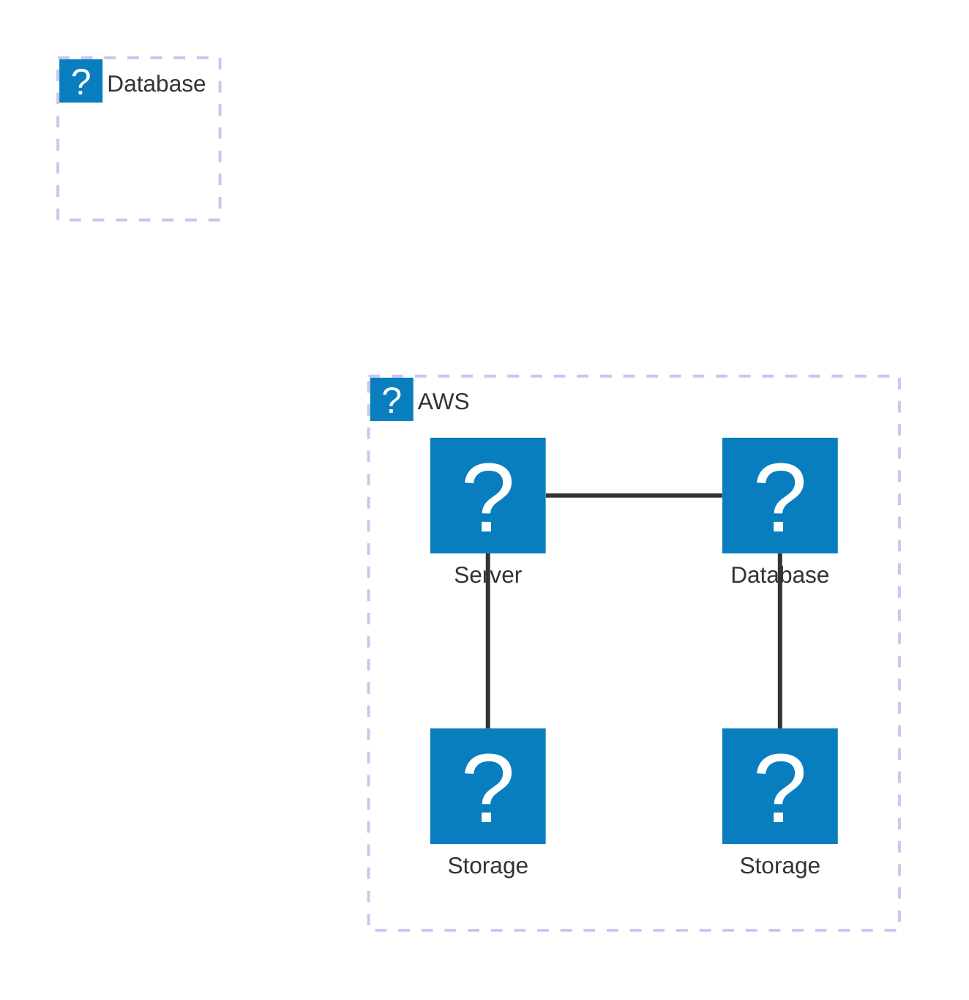

&emsp;&emsp;
&emsp;&emsp;&emsp;&emsp;&emsp;&emsp;&emsp;

---

# Amazon Web Services

```mermaid
architecture-beta
    group api(bxl:aws)[AWS]
    group database(bxl:unity)[Database]

    service db(logos:aws-aurora)[Database] in api
    service disk1(logos:aws-glacier)[Storage] in api
    service disk2(logos:aws-s3)[Storage] in api
    service server(logos:aws-ec2)[Server] in api

    db:L -- R:server
    disk1:T -- B:server
    disk2:T -- B:db

```

|||
| --- | --- |
| **Actividad VPC 1** |  |
| **Actividad VPC 2** |  |