&emsp;&emsp;
&emsp;&emsp;&emsp;&emsp;&emsp;&emsp;&emsp;

<svg xmlns="http://www.w3.org/2000/svg" width="24" height="24" viewBox="0 0 24 24"><g fill="none" stroke="currentColor" stroke-linecap="round" stroke-linejoin="round" stroke-width="2"><path fill="currentColor" fill-opacity="0" stroke-dasharray="64" stroke-dashoffset="64" d="M4 12v7c0 0.55 0.45 1 1 1h14c0.55 0 1 -0.44 1 -1v-14c0 -0.55 -0.45 -1 -1 -1h-14c-0.55 0 -1 0.45 -1 1Z"><animate fill="freeze" attributeName="stroke-dashoffset" dur="0.6s" values="64;0"/><animate fill="freeze" attributeName="fill-opacity" begin="1.1s" dur="0.15s" values="0;0.3"/></path><path stroke-dasharray="12" stroke-dashoffset="12" d="M7 12h9.5"><animate fill="freeze" attributeName="stroke-dashoffset" begin="0.7s" dur="0.2s" values="12;0"/></path><path stroke-dasharray="8" stroke-dashoffset="8" d="M17 12l-4 4M17 12l-4 -4"><animate fill="freeze" attributeName="stroke-dashoffset" begin="0.9s" dur="0.2s" values="8;0"/></path></g></svg>

---

# Amazon Web Services

```mermaid
architecture-beta
    group api(bxl:aws)[AWS]
    group database(bxl:unity)[Database]

    service db(logos:aws-aurora)[Database] in api
    service disk1(logos:aws-glacier)[Storage] in api
    service disk2(logos:aws-s3)[Storage] in api
    service server(logos:aws-ec2)[Server] in api

    db:L -- R:server
    disk1:T -- B:server
    disk2:T -- B:db

```

|||
| --- | --- |
| **Actividad VPC 1** |  |
| **Actividad VPC 2** |  |