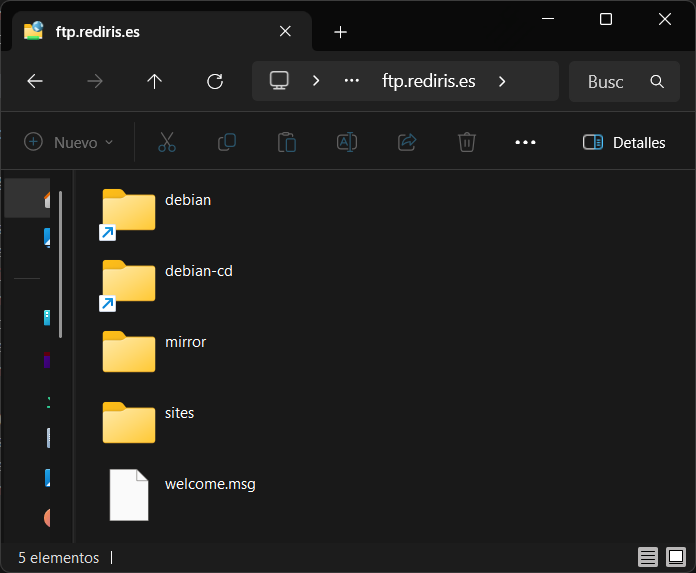

&emsp;&emsp;&emsp;&emsp;&emsp;&emsp;&emsp;

---

# Basic FTP Commands

> [Basic FTP Commands](https://www.cs.colostate.edu/helpdocs/ftp.html)

## Actividad 1

> Realizar una descarga utilizando como cliente FTP un navegador web o un cliente como Filezilla.

1. Escribe la URL ftp://ftp.rediris.es
2. Navega por los directorios
3. Descarga varios ficheros
4. Comprueba que los ficheros se guardaron en la carpeta de descargas por defecto del navegador.

## Actividad 2

> Programa de consola cliente FTP

1. Desde el intérprete de comandos CMD, ejecuta el programa FTP.
2. Ejecuta “open ftp.rediris.es” dejando en blanco el login y la contraseña para iniciar una sesión anónima.
3. Cambia el directorio local a C:\Users\Usuario\Downloads. Entonces el cliente envía el comando PORT al servidor, y éste intenta abrir un puerto en nuestro host. Eso provoca que el cortafuegos nos advierta de la amenaza. 
4. Cambia el directorio remoto a mirror/FreeBSD. Ten en cuenta que FTP viene del mundo de Unix, donde las barras son hacia adelante (forward slash) y las mayúsculas distintas de las minúsculas.
5. Descarga el fichero README.TXT.
6. Cierra la conexión con el servidor.
7. Comprueba que el fichero se descargó en la carpeta local.
