<a href="/aws/readme.md"></a>

---

# Virtual Private Cloud (VPC)

## Índice

- [Virtual Private Cloud (VPC)](#virtual-private-cloud-vpc)
  - [Índice](#índice)
  - [1. Crear una VPC](#1-crear-una-vpc)
  - [2. Crear una instancia EC2](#2-crear-una-instancia-ec2)
  - [3. Instalación de WordPress en la instancia EC2](#3-instalación-de-wordpress-en-la-instancia-ec2)
  - [4. Creación de la base de datos](#4-creación-de-la-base-de-datos)
  - [  \< **EFS** \> ](#---efs--)
  - [EFS ](#efs-)


---

## 1. Crear una VPC

El primer paso es crear una VPC. Una VPC es una red virtual que permite a los usuarios crear y configurar redes privadas seguras dentro de la nube de AWS.

- Vamos al menú de **AWS** y buscamos **VPC** y entramos en el servicio.

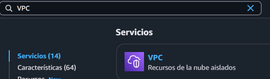

- En el menú de **VPC**, seleccionamos **Crear VPC**

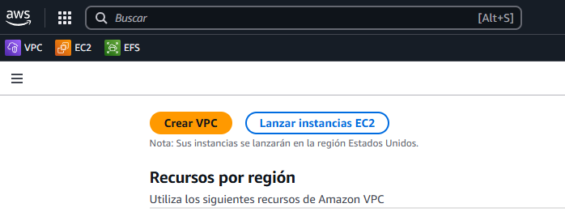

- En la página de **Configuración de la VPC**, configuramos los siguientes parámetros:

  - **Nombre de la VPC**: `proyecto` (Activamos Generar automáticamente)
  - **Bloque de CIDR IPv4**: `10.0.0.0/16`
  - **Bloque de CIDR IPv6**: `Sin bloque de CIDR IPv6`
  - **Tenencia**: `Predeterminado`

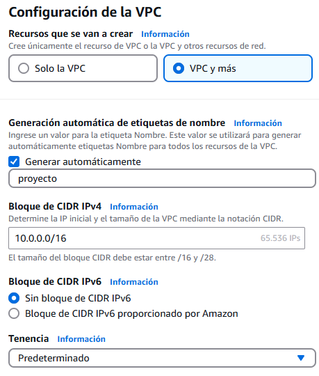

  - **Número de zonas de disponibilidad (AZ)**: `2`
  -  **Personalizar las zonas de disponibilidad**
     -  **Primera zona de disponibilidad**: `us-east-1a`
     -  **Segunda zona de disponibilidad**: `us-east-1b`

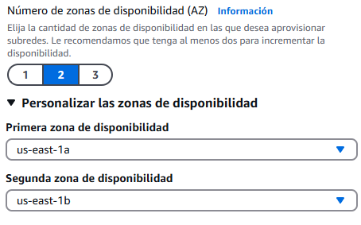

  - **Cantidad de subredes públicas**: `2`
  - **Cantidada de subredes privadas**: `2`
  - **Personalizar bloques de CIDR de subredes**
    - **Bloque de CIDR de la subred pública en us-east-1a**: `10.0.1.0/24`
    -  **Bloque de CIDR de la subred pública en us-east-1b**: `10.0.2.0/24`
    -  **Bloque de CIDR de la subred privada en us-east-1a**: `10.0.3.0/24`
    -  **Bloque de CIDR de la subred privada en us-east-1b**: `10.0.4.0/24`

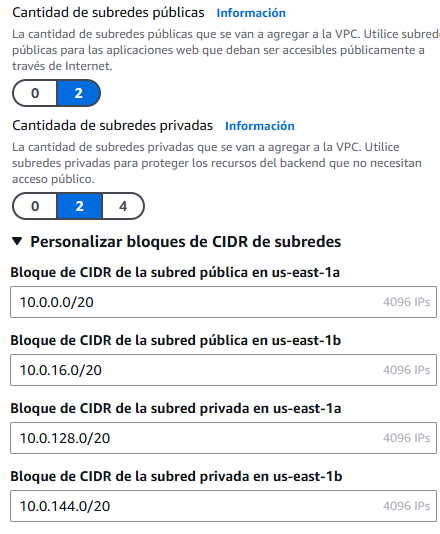

  - **Gateways NAT**: `Ninguna`
  - **Puntos de enlace de la VPC**: `Ninguno`
  - **Opciones de DNS**
    - **Habilitar nombres de host DNS**: ✅
    - **Habilitar resolución de nombres DNS**: ✅

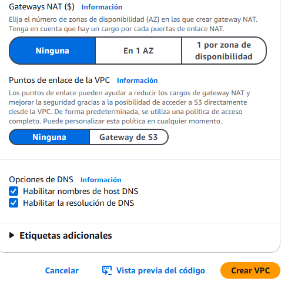

  - Creamos la VPC pulsando en el botón **Crear VPC**

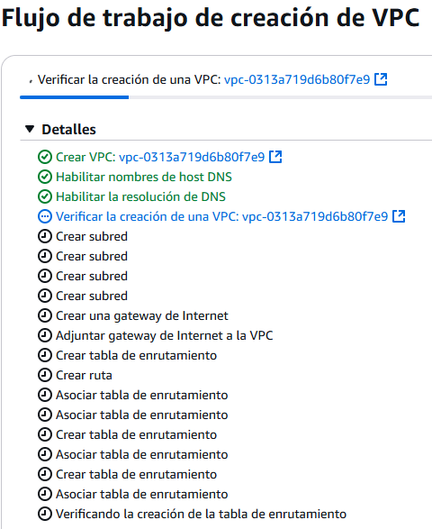

 


---

## 2. Crear una instancia EC2


- Vamos al menú de AWS y buscamos **EC2** y entramos en el servicio.

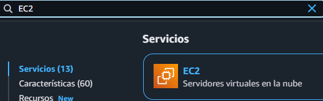

- En el menú de **EC2 > Instancias > Instancia**, pulsamos en el botón **Lanzar instancias**.

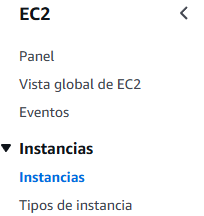

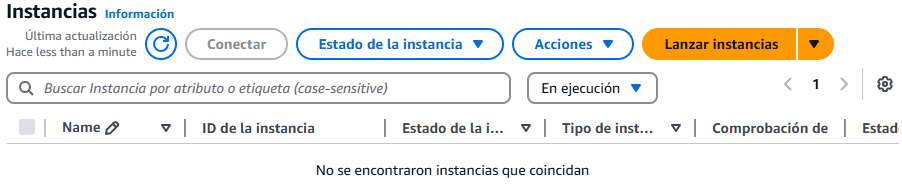

- En el menú de **Lanzar una instancia**, configuramos los siguientes parámetros:

  - **Nombre y etiquetas**: `serverwp`

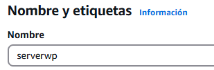

  - **Imágenes de aplicaciones y sistemas operativos (Imagen de máquina de Amazon)**: `Ubuntu Server 20.04 LTS (HVM) - 64 bits`

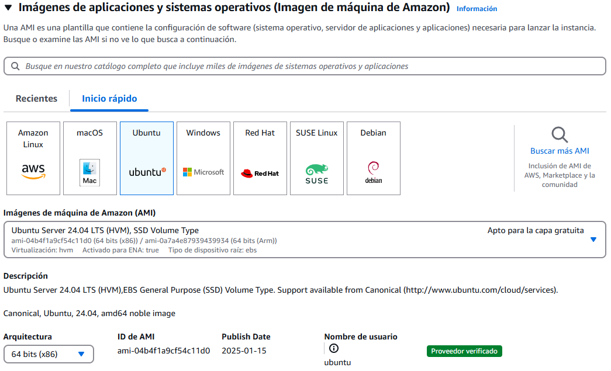

  - **Tipo de instancia**: `t2.medium`

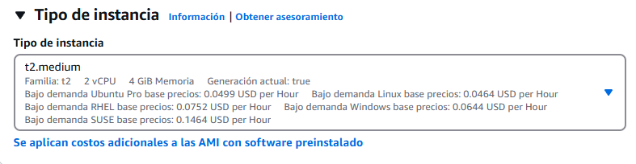

  - **Par de claves (inicio de sesión)**: `vockey`

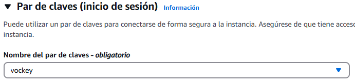

  - **Configuraciones de red > Editar**
    - **VPC**: `proyecto-vpc`
    - **Subred**: `proyecto-subnet-public1-us-east-1a`
    - **Asignar automáticamente la IP pública**: `Habilitar`
    - **Firewall (grupos de seguridad)**: `Crear grupo de seguridad`
    - **Nombre del grupo de seguridad**: `serverwp-sg`

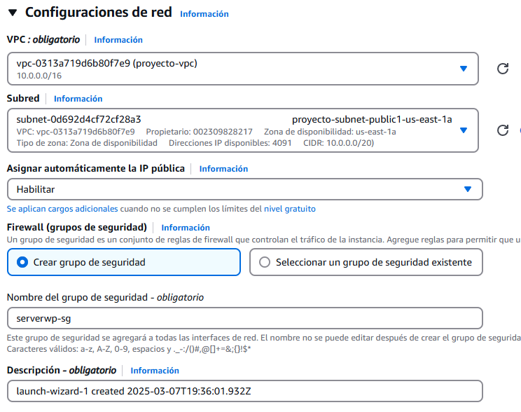

  - **Reglas de grupos de seguridad de entrada**
    - **Regla del grupo de seguridad 1**: `ssh` → `Cualquier lugar`
    - **Regla del grupo de seguridad 2**: `HTTP` → `Cualquier lugar`

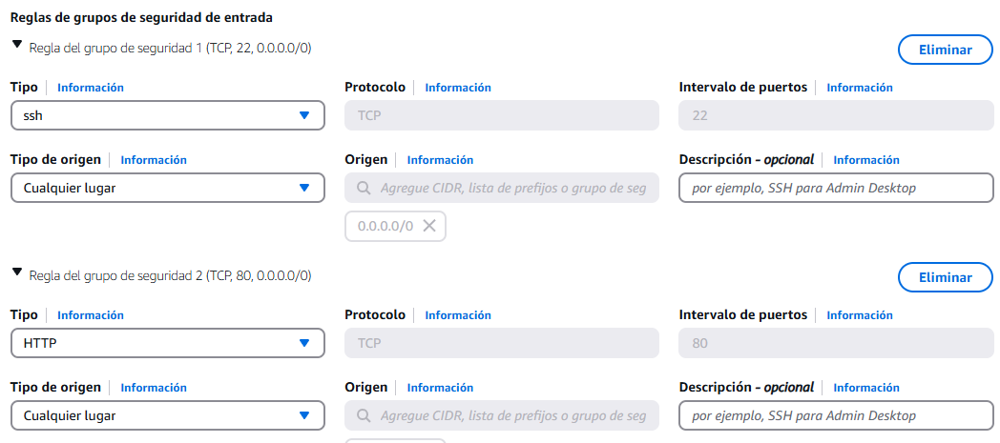

  - **Configurar almacenamiento**: `1x 10 GiB gp3`

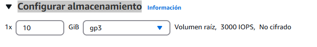

- **Revisamos el resumen y lanzamos la instancia**

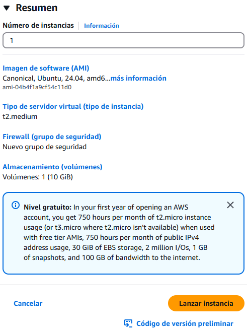

- **Verificamos que la instancia esté en ejecución**

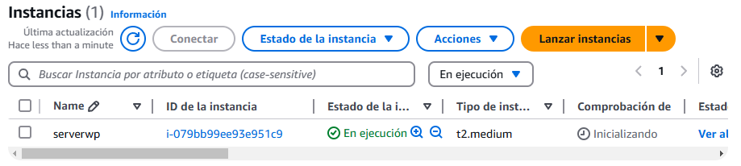

- **Conectamos a la instancia**

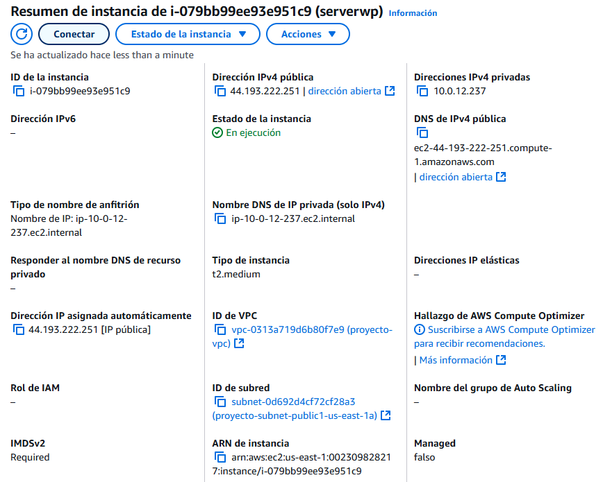

  - En la ventana **Conectarse a la instancia**
    - **Tipo de conexión**: `Conectarse mediante la Conexión de la instancia EC2`
    - Marcamos **Dirección IPv4 pública**
    - **Nombre de usuario**: `ubuntu`
  - Pulsamos en **Conectar**

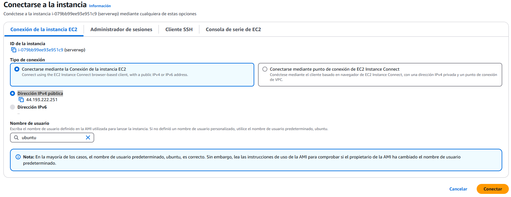


---

## 3. Instalación de WordPress en la instancia EC2

- **Actualizamos el sistema**

```bash
sudo apt update && sudo apt upgrade -y
```

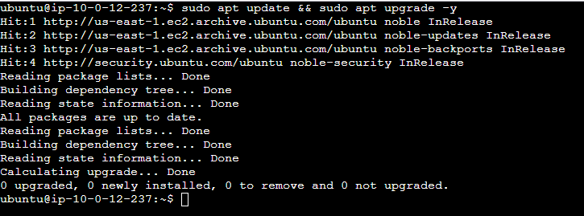

- **Instalamos Apache2**

```bash
sudo apt install apache2 -y
```

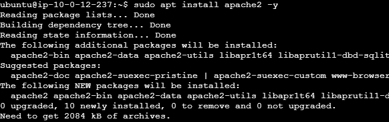

- **Activamos el servicio Apache2**

```bash
sudo systemctl start apache2 && sudo systemctl enable apache2
```

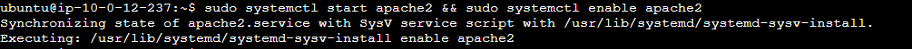

Comprobamos que todo esta correctamente configurado y que el servicio Apache2 se encuentra en ejecución, para ello, verificamos el servidor poniendo la dirección IP de la instancia EC2 en el navegador.

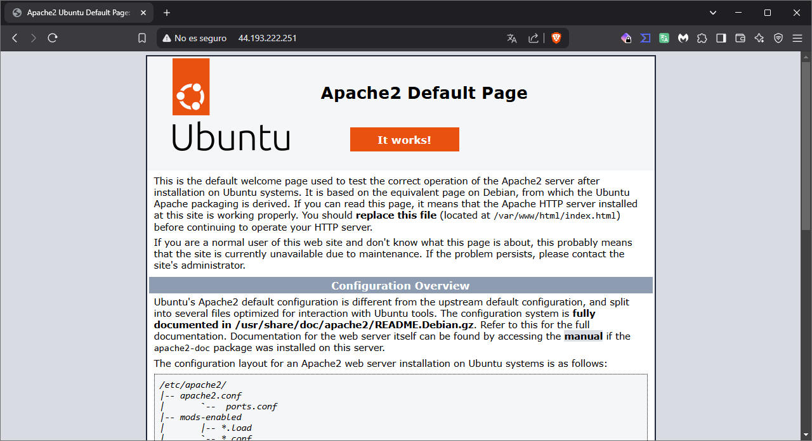

- **Añadimos el repositorio de PHP**

```bash
sudo add-apt-repository ppa:ondrej/php -y
```

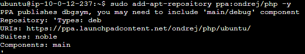

- **Instalamos PHP**

```bash
sudo apt install php7.4 libapache2-mod-php7.4 php7.4-cli -y
```

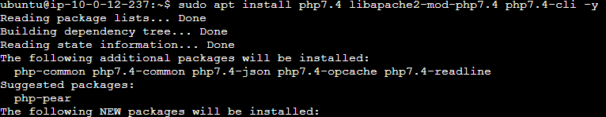

- **Instalamos MySQL**

```bash
sudo apt install php7.4-mysql -y
```

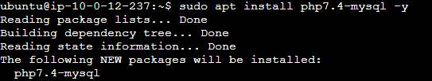

- **Reiniciamos el servicio Apache2**

```bash
sudo systemctl restart apache2
```

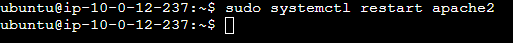

- **Comprobamos que PHP esta correctamente instalado**

```bash
php -v
```

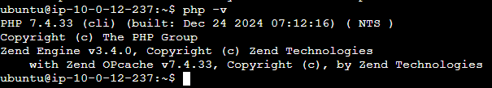

---

## 4. Creación de la base de datos

- Vamos al **menú de AWS** y buscamos **Aurora and RDS** y entramos en el servicio.

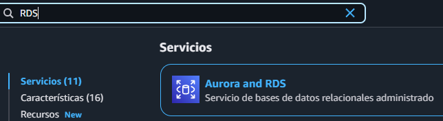

- En el menú, buscaremos **Bases de datos** y seleccionaremos **Crear base de datos**

| 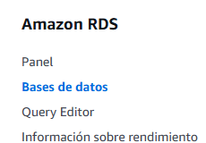 | 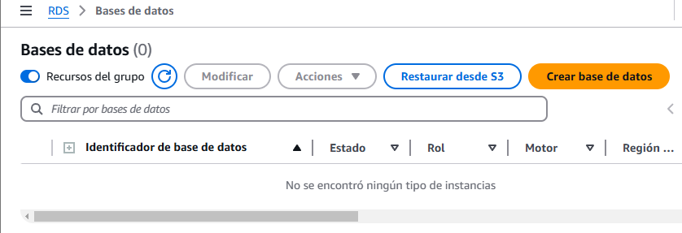 |
| --- | --- |

- En el menú de **Crear base de datos**, configuraremos los siguientes parámetros:
  - **Método de creación de base de datos**: `Creación estándar`

  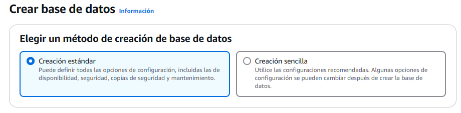

  - **Opciones del motor**
    - **Tipo de motor**: `MySQL`

    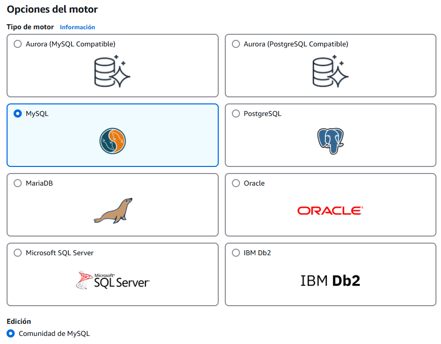

    - Dejamos el resto por defecto.

    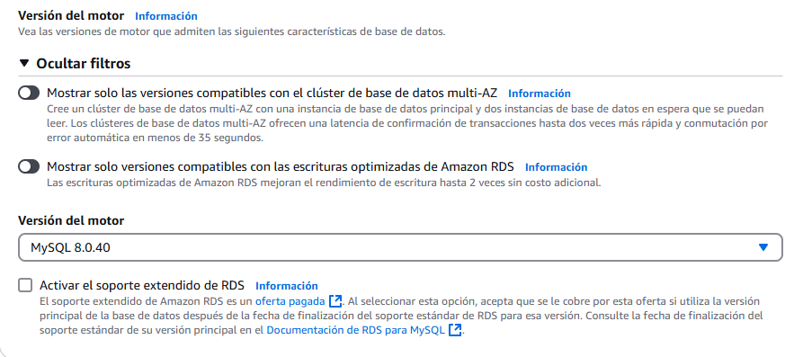

  - **Plantillas**: `Capa gratuita`
  
  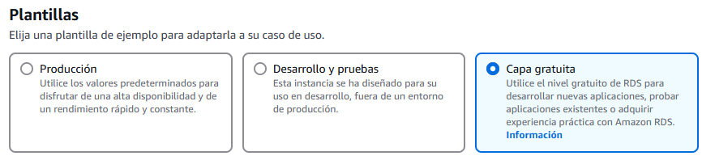

  - **Disponibilidad y durabilidad**: `Implementación de una instancia de base de datos de zona de disponibilidad única`

  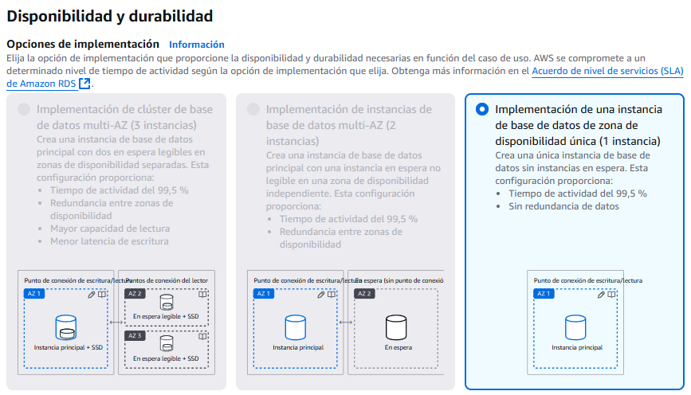

  - **Configuración**
    - **Identificador de instancias de bases de datos**: `serverwp-db`
    - **Nombre de usuario maestro**: `admin`
    - **Administración de credenciales**: `Autoadministrado`
    - **Contraseña maestra**
  
  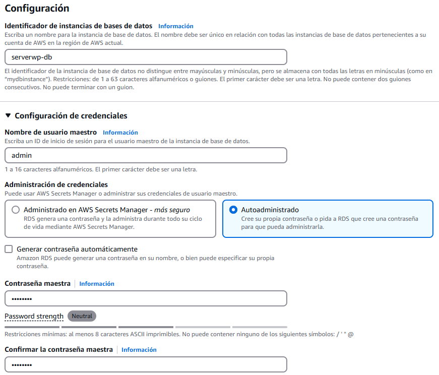

  - **Configuración de la instancia**
  
  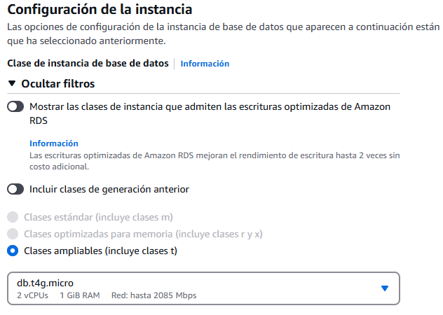

  - **Almacenamiento**
  
  

  - **Conectividad**
    - **Recurso de computación**: `No se conecte a un recurso informático EC2`
    - **Nube privada virtual (VPC)**: `proyecto-vpc`
    - **Acceso público**: `No`

  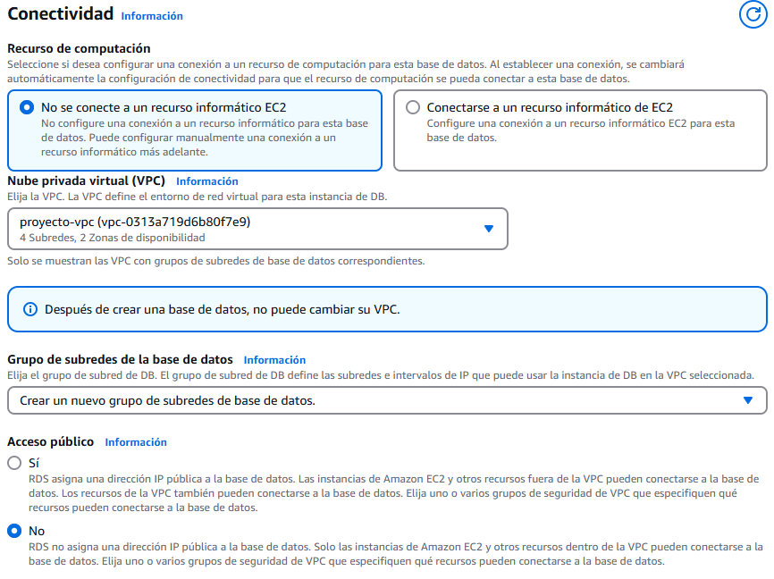

    - **Grupo de seguridad de VPC (firewall)**: `Crear nuevo`
    - **Nuevo nombre del grupo de seguridad de VPC**: `serverwp-db-sg`
  
  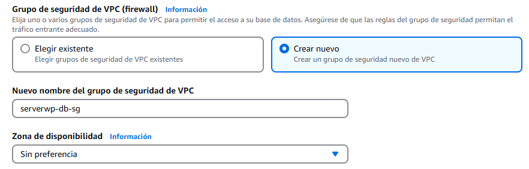

    - **Proxy de RDS**

  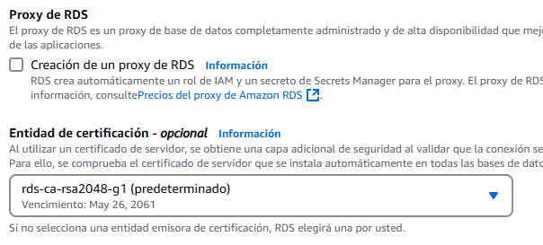

  - Bajamos hasta la pestaña **Configuración adicional** y configuramos:
    - **Nombre de base de datos inicial**: `serverwpdb`
  
  


  - **Crear base de datos**
  
  

  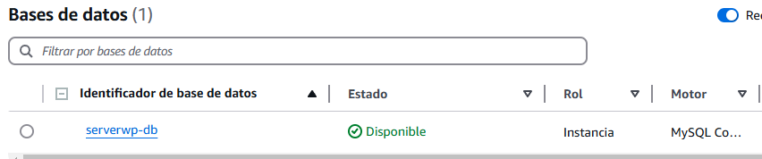

- Configuramos la **base de datos** en nuestra maquina **EC2**

  - Entramos a la base de datos **acciones > Configurar la conexión EC"**
  
  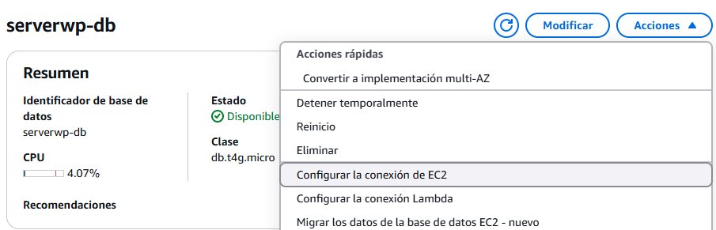

  - Elegimos nuestra **instancia EC2** `serverwp` y damos en **Continuar**
  
  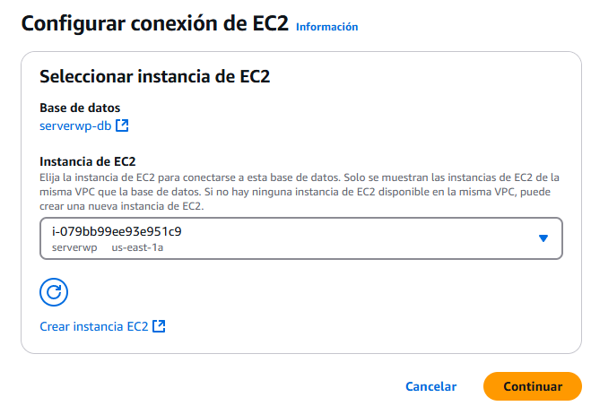

  - Revisamos la configuración y damos en **Configurar**
  
  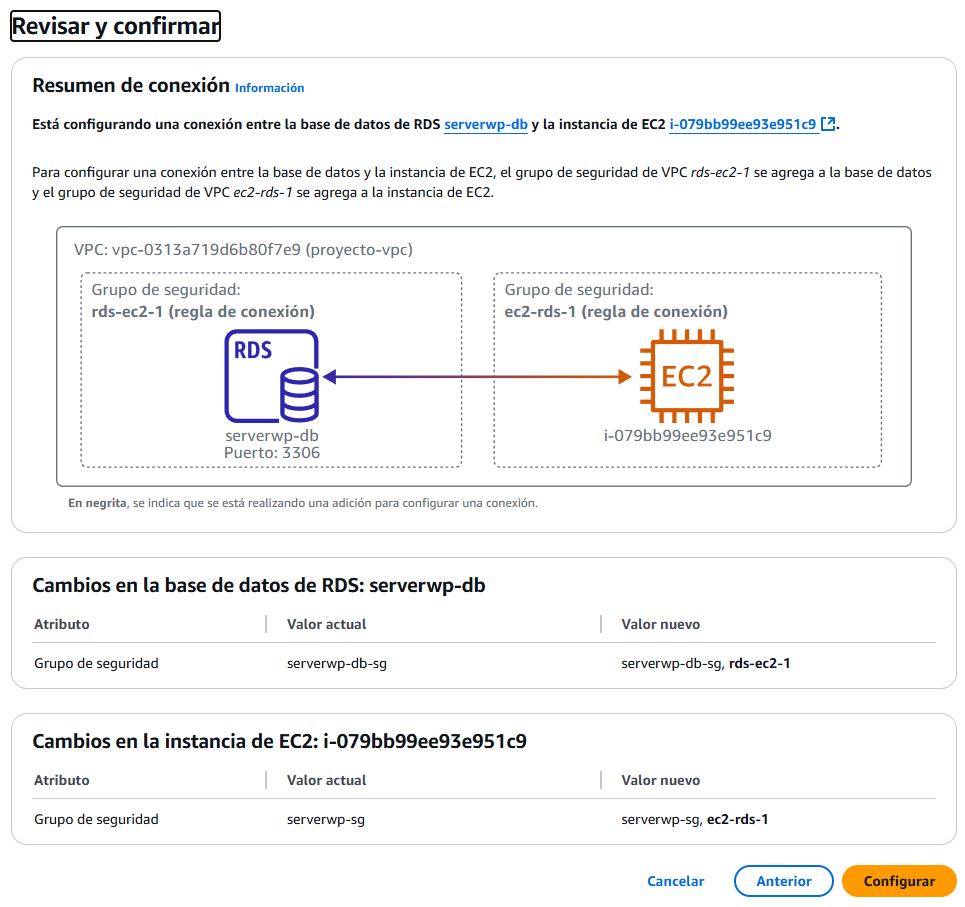

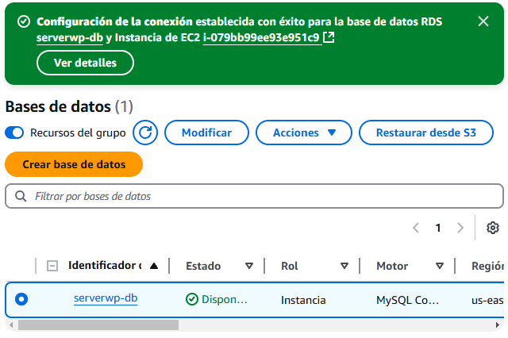

- Actualizamos mysql

```bash
sudo apt install mysql-client-core-8.0
```

- Comprobamos que funciona usando el siguiente comando en la terminal de nuestra **instancia EC2**

```bash
mysql -h puerto_de_enlace_BD -u admin -p
```

> Donde `puerto_de_enlace_BD` es el puerto de enlace de nuestra base de datos y `admin` es el usuario de la base de datos.
> 
> 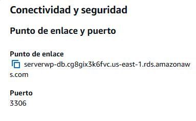


## <table style="width:100%;text-align:center;"> <tr> <th style="width:25%;"><</th> <th style="width:50%;">**EFS**</th> <th style="width:25%;">></th> </tr></table>

## <p style="text-align: center;">EFS</p> <a href="../2.efs/readme.md"></a>