<a href="/aws/readme.md"></a>

---

# Elastic File System (EFS)

EFS es un servicio de almacenamiento de archivos en la nube que permite a los usuarios almacenar y compartir archivos de manera segura y escalable.

- Vamos al menú de **AWS** y buscamos **EFS**, entramos en el servicio y seleccionamos **Crear un sistema de archivos**.

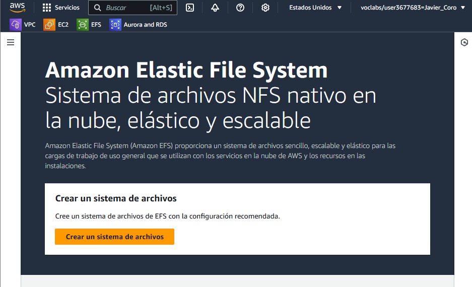

- En **Crear un sistema de archivos**
  - **Nombre**: `serverwp-efs`
  - **Virtual Private Cloud (VPC)**: `proyecto-vpc`
  
  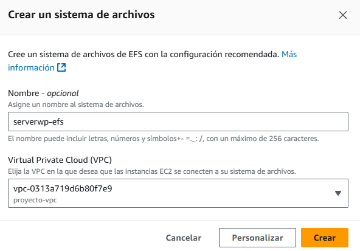

- Comprobamos que se ha creado correctamente

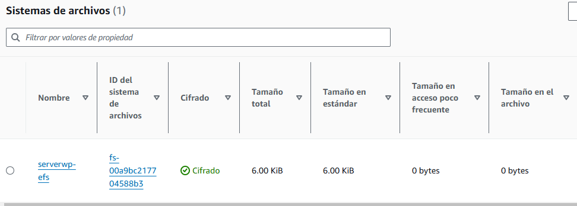

# Añadir EFS a nuestra VPC

- En el menú de **AWS** buscamos **VPC**, **Panel de VPC > Seguridad > Grupos de seguridad** y sellecionamos nuestro grupo.

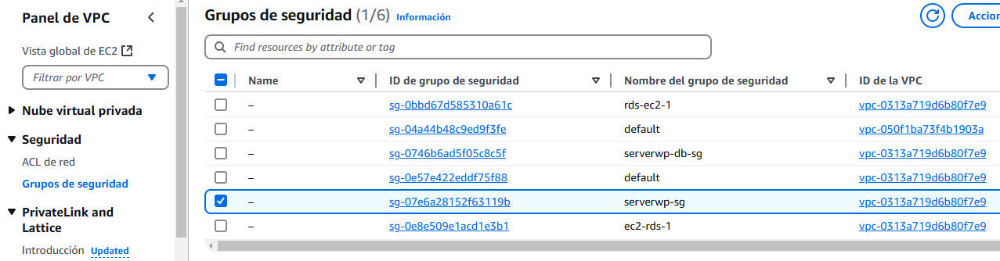

- Dentro del grupo de seguridad, seleccionamos **Reglas de entrada** y **Editar reglas de entrada**.

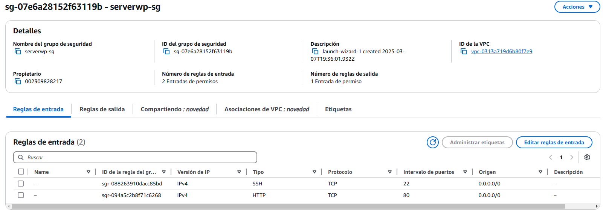

- Una vez dentro, seleccionamos **Agregar regla** y seleccionamos **EFS** como protocolo y agregamos el grupo de seguridad de `serverwp-db-sg` 

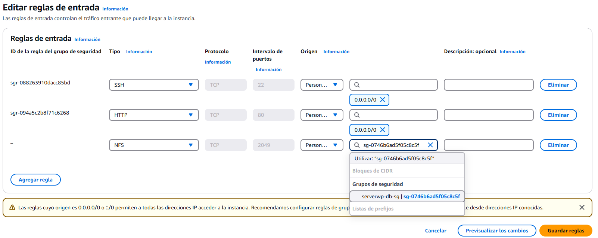

- En el menú de **EFS** entramos en nuestro sistema de archivos.

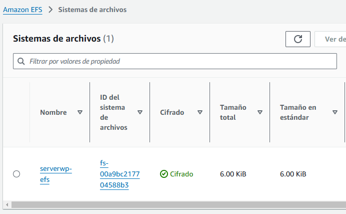

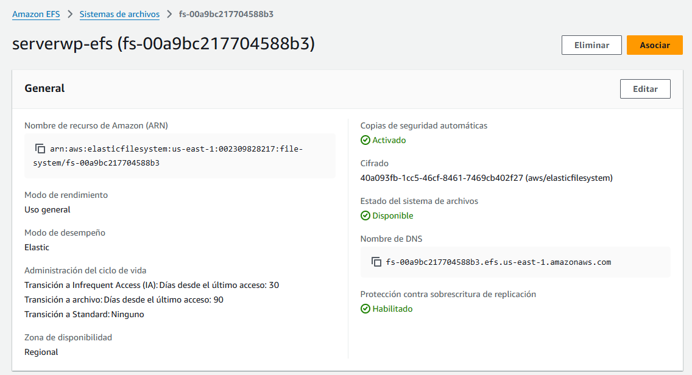

- Una vez dentro, bajamos y seleccionamos la pestaña **Red > Administrar**

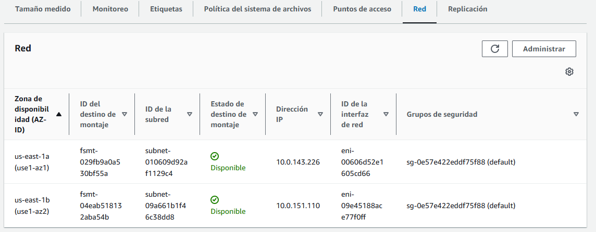

- Cambiamos la VPC por la nuestra.

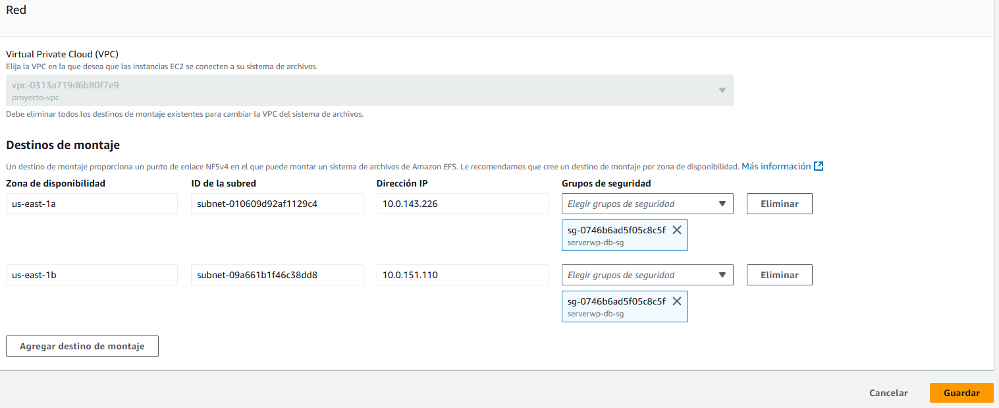

- Volvemos a la página del sistema **EFS** y pulsamos en **Asociar**

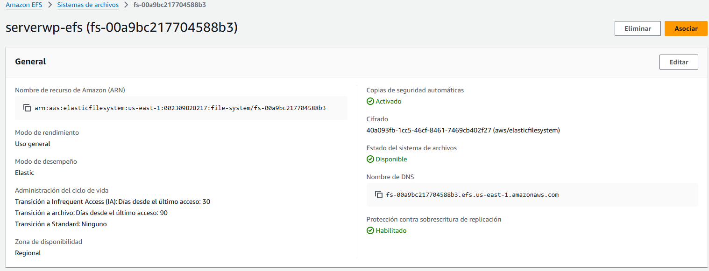

- Sellecionamos `Montaje a traves de IP` y `us-east-1a` y copiamos el código que nos aparece.

```
sudo mount -t nfs4 -o nfsvers=4.1,rsize=1048576,wsize=1048576,hard,timeo=600,retrans=2,noresvport 10.0.143.226:/ efs
```

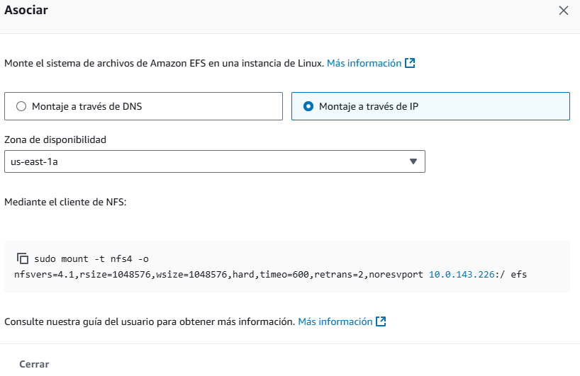

# Montar EFS en nuestro servidor

- Volvemos a nuestra **instancia EC2** e instalamos **NFS**

```
sudo apt install nfs-common -y
```

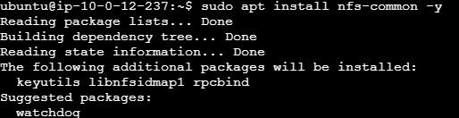

- Creamos un directorio para montar el sistema de archivos.

```
sudo mkdir -p efs
```

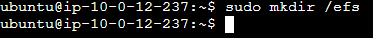

- Montamos el sistema de archivos con el comando que copiamos anteriormente.

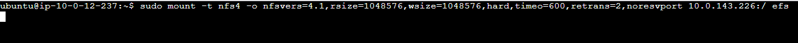

# Instalación de Wordpress