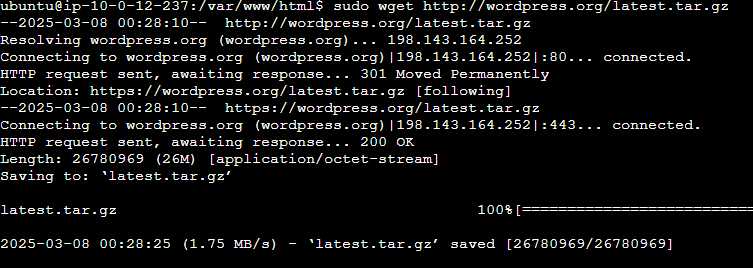
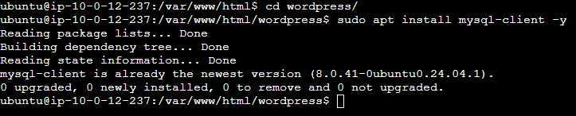
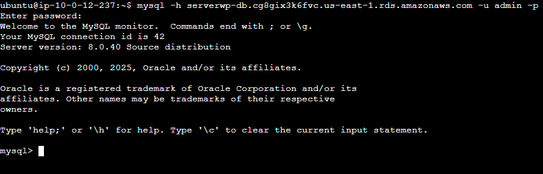
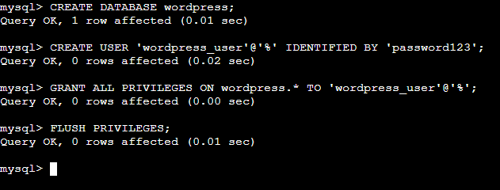
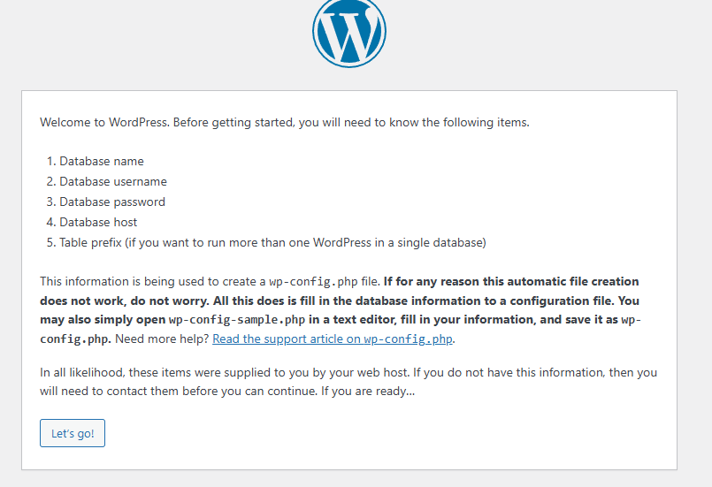
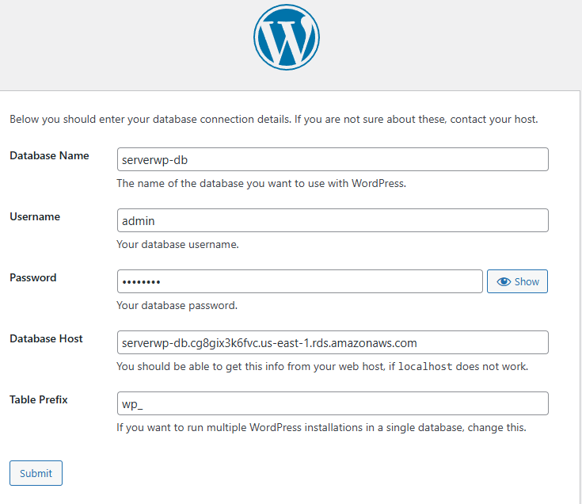

<a href="/aws/readme.md"></a>

---

# Elastic File System (EFS)

EFS es un servicio de almacenamiento de archivos en la nube que permite a los usuarios almacenar y compartir archivos de manera segura y escalable.

- Vamos al menú de **AWS** y buscamos **EFS**, entramos en el servicio y seleccionamos **Crear un sistema de archivos**.


- En **Crear un sistema de archivos**
  - **Nombre**: `serverwp-efs`
  - **Virtual Private Cloud (VPC)**: `proyecto-vpc`
  
  

- Comprobamos que se ha creado correctamente


# Añadir EFS a nuestra VPC

- En el menú de **AWS** buscamos **VPC**, **Panel de VPC > Seguridad > Grupos de seguridad** y sellecionamos nuestro grupo.


- Dentro del grupo de seguridad, seleccionamos **Reglas de entrada** y **Editar reglas de entrada**.


- Una vez dentro, seleccionamos **Agregar regla** y seleccionamos **EFS** como protocolo y agregamos el grupo de seguridad de `serverwp-db-sg` 


- En el menú de **EFS** entramos en nuestro sistema de archivos.


- Una vez dentro, bajamos y seleccionamos la pestaña **Red > Administrar**


- Cambiamos la VPC por la nuestra.


- Volvemos a la página del sistema **EFS** y pulsamos en **Asociar**


- Sellecionamos `Montaje a traves de IP` y `us-east-1a` y copiamos el código que nos aparece.

```bash
sudo mount -t nfs4 -o nfsvers=4.1,rsize=1048576,wsize=1048576,hard,timeo=600,retrans=2,noresvport 10.0.143.226:/ efs
```


# Montar EFS en nuestro servidor

- Volvemos a nuestra **instancia EC2** e instalamos **NFS**

```bash
sudo apt install nfs-common -y
```


- Creamos un directorio para montar el sistema de archivos.

```bash
sudo mkdir -p efs
```


- Montamos el sistema de archivos con el comando que copiamos anteriormente.


# Instalación de Wordpress

- Descargamos el archivo de instalación de Wordpress en la ruta `/var/www/html`.

```bash
sudo wget http://wordpress.org/latest.tar.gz
```



- Descomprimimos el archivo.

```bash
sudo tar -xvzf latest.tar.gz
```


- Creamos un cliente de MySQL para la base de datos de Wordpress.

```bash
sudo apt install mysql-client -y
```



- Entramos en MySQL.

```bash
mysql -h serverwp-db.cg8gix3k6fvc.us-east-1.rds.amazonaws.com -u admin -p
```

> Donde `serverwp-db.cg8gix3k6fvc.us-east-1.rds.amazonaws.com` es el nombre del servidor de la base de datos, `admin` es el nombre del usuario y `password` es la contraseña.



- Creamos una nueva base de datos para Wordpress.

```sql
CREATE DATABASE wordpress;
CREATE USER 'wordpress_user'@'%' IDENTIFIED BY 'password123';
GRANT ALL PRIVILEGES ON wordpress.* TO 'wordpress_user'@'%';
FLUSH PRIVILEGES;
```



- Si accedemos a la tuta `http://server_ip/wordpress/wp-admin/setup-config.php`, veremos la siguiente pantalla:





## <a href="../2.efs/readme.md"></a> <p style="text-align: center;">VPC</p>