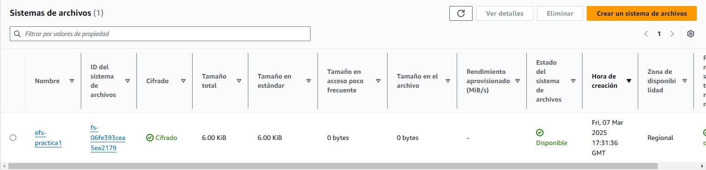
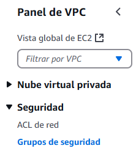

---

# Elastic File System (EFS)

## Creación de EFS

- Accedemos a la consola de **Amazon EFS** y **Crear un nuevo EFS**.

- Añadimos el **Nombre** y el **VPC**
  - **Nombre**: `efs-practica1`
  - **VPC**: `proyecto-vpc`

- Volvemos a la **VPC > Seguridad > Grupos de Seguridad** 

- Creamos un nuevo grupo de seguridad para el EFS y lo asociamos a la VPC.