<a href="/aws/readme.md"></a>

---

# Virtual Private Cloud (VPC)

## Indice

## Indice
- [Virtual Private Cloud (VPC)](#virtual-private-cloud-vpc)
  - [Indice](#indice)
  - [Indice](#indice-1)
  - [Introducción](#introducción)
  - [Requisitos](#requisitos)
  - [Creación de una VPC con el asistente](#creación-de-una-vpc-con-el-asistente)
  - [Creación de una VPC personalizada](#creación-de-una-vpc-personalizada)
  - [Creación de un Internet Gateway](#creación-de-un-internet-gateway)
  - [Creación de Subredes](#creación-de-subredes)
  - [Creación de Tablas de Rutas](#creación-de-tablas-de-rutas)
  - [Creación de Grupos de Seguridad](#creación-de-grupos-de-seguridad)
  - [Lanzamiento de Instancias EC2](#lanzamiento-de-instancias-ec2)
  - [Conexión a las Instancias EC2](#conexión-a-las-instancias-ec2)
    - [Conexión SSH a la Instancia Pública](#conexión-ssh-a-la-instancia-pública)
    - [Conexión desde la Instancia Pública a la Privada](#conexión-desde-la-instancia-pública-a-la-privada)
    - [Conexión Directa a la Instancia Privada con Port Forwarding](#conexión-directa-a-la-instancia-privada-con-port-forwarding)
  - [Limpieza de Recursos](#limpieza-de-recursos)
  - [Conclusión](#conclusión)

## Introducción
En esta guía, aprenderás a configurar una infraestructura de red segura y escalable utilizando Amazon Virtual Private Cloud (Amazon VPC). Amazon VPC permite la creación de redes privadas dentro de AWS, proporcionando control total sobre la conectividad y seguridad de los recursos en la nube. 

Siguiendo estos pasos, configurarás una VPC con subredes públicas y privadas, establecerás conectividad segura mediante instancias EC2 y aplicarás buenas prácticas para gestionar el tráfico de red. 

---

## Requisitos
- Acceso a AWS a través de AWS Academy.

## Creación de una VPC con el asistente

1. Accede a la consola de **Amazon VPC** y selecciona **Create VPC**.

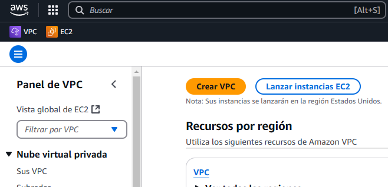

2. En **Resources to create**, elige **VPC and more**.

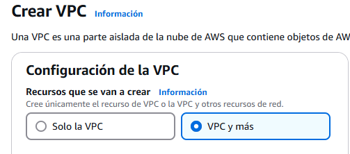

3. Configura los siguientes parámetros:
- **Name tag auto-generation**: `proyecto` (Auto-generate activado)
- **IPv4 CIDR block**: `10.2.0.0/16`
- **IPv6 CIDR block**: `No IPv6 CIDR block`
- **Tenancy**: `Default`
- **Number of Availability Zones**: `2` (us-east-1a y us-east-1b)
- **Number of public subnets**: `2`
- **Number of private subnets**: `2`
- **Customize subnets CIDR blocks**:
    - `10.2.0.0/24` (Pública - us-east-1a)
    - `10.2.1.0/24` (Pública - us-east-1b)
    - `10.2.2.0/24` (Privada - us-east-1a)
    - `10.2.3.0/24` (Privada - us-east-1b)
- **NAT gateways**: `None`
- **VPC endpoints**: `None`
- **DNS options**: Activar **Enable DNS hostnames** y **Enable DNS resolution**.

| 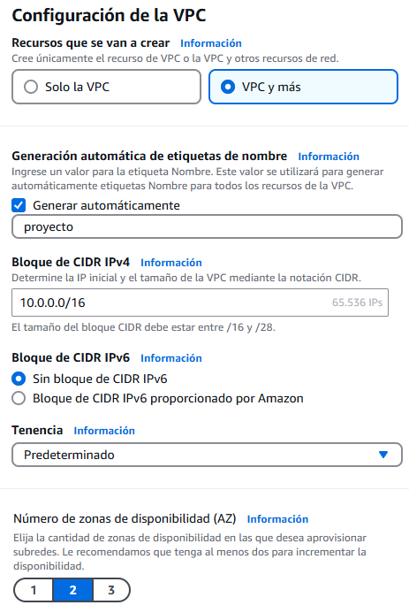 | 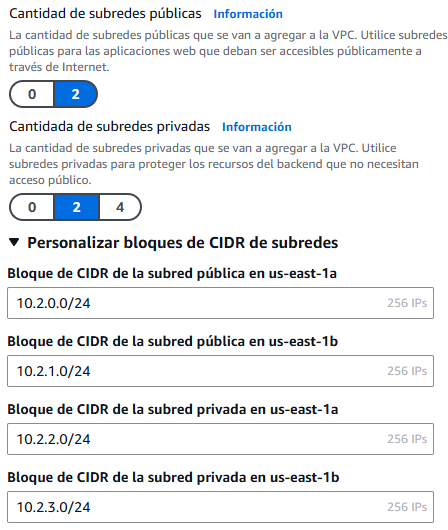 | 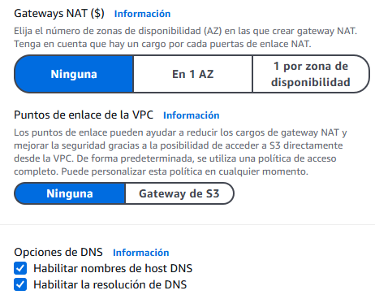 |
|:-----------------------:|:-----------------------:|:-----------------------:|

4. Haz clic en **Create VPC**.


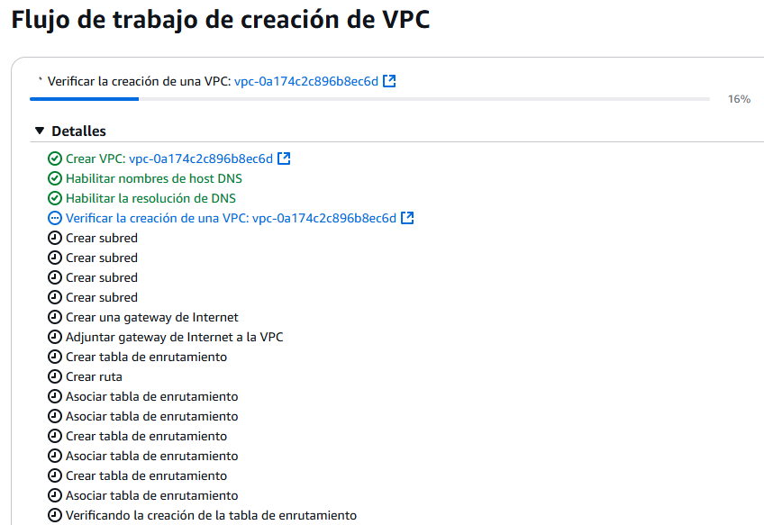
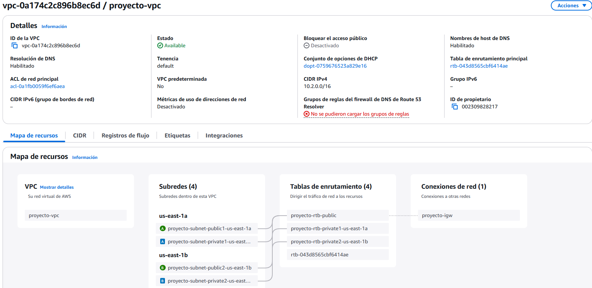

---

## Creación de una VPC personalizada
1. Accede a **Amazon VPC** y selecciona **Create VPC**.


2. En **Resources to create**, elige **VPC only**.

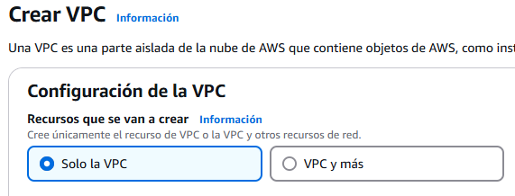

3. Configura los siguientes valores:
- **Name tag**: `custom-vpc`
- **IPv4 CIDR block**: `IPv4 CIDR manual input`
- **CIDR IPv4**: `10.2.0.0/16`
- **IPv6 CIDR block**: `No IPv6 CIDR block`
- **Tenancy**: `Default`

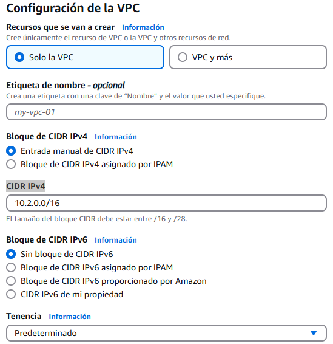

4. Haz clic en **Create VPC**.


5. Habilita **Enable DNS hostnames** y **Enable DNS resolution** en **Edit VPC settings**.

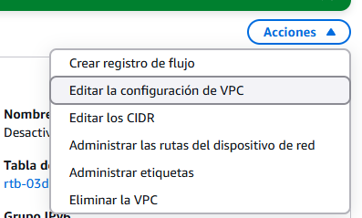

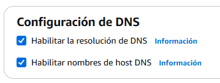

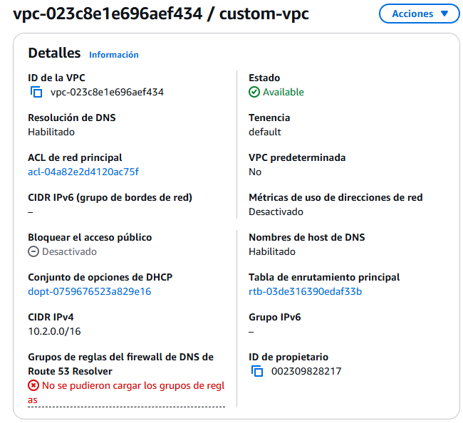

---

## Creación de un Internet Gateway
1. En **Amazon VPC**, ve a **Internet Gateways**.

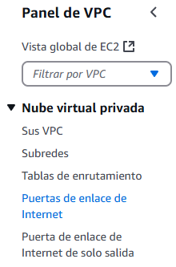

2. Haz clic en **Create Internet Gateway**.

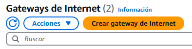

3. Asigna el nombre `custom-igw` y crea el gateway.

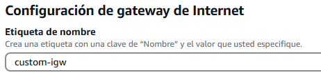

4. Adjunta el Internet Gateway a la `custom-vpc`.

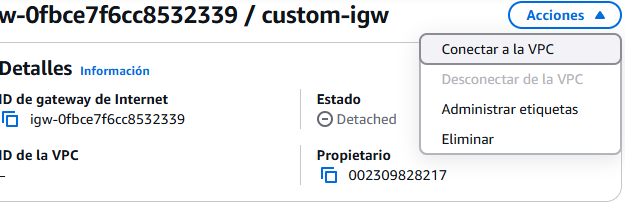

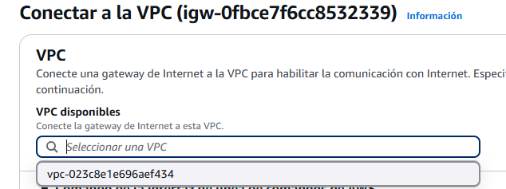

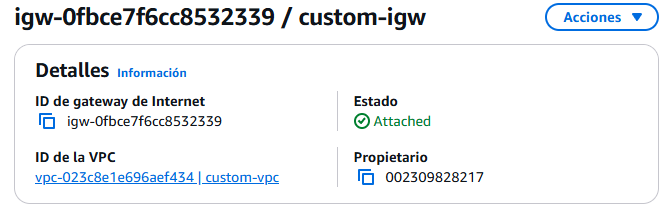

---

## Creación de Subredes
1. Accede a **Amazon VPC > Subnets**
   
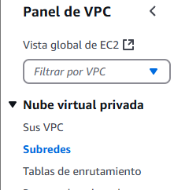

2. Haz clic en **Create Subnet**.

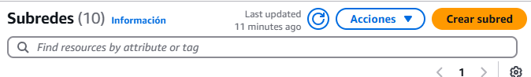
   
3. Selecciona la `custom-vpc` y añade las siguientes subredes:

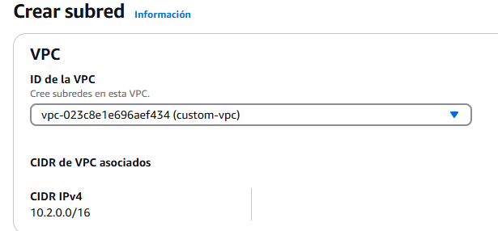

- `custom-subnet-public1-us-east-1a` → `10.2.0.0/24`

- 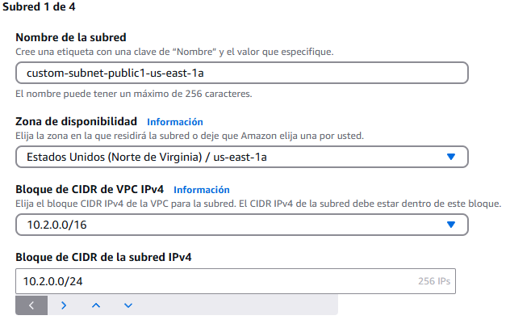

- `custom-subnet-public2-us-east-1b` → `10.2.1.0/24`

- 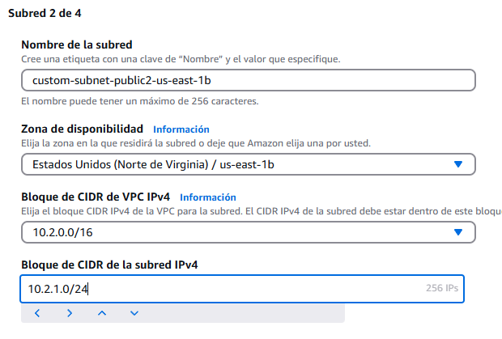

- `custom-subnet-private1-us-east-1a` → `10.2.2.0/24`
   
- 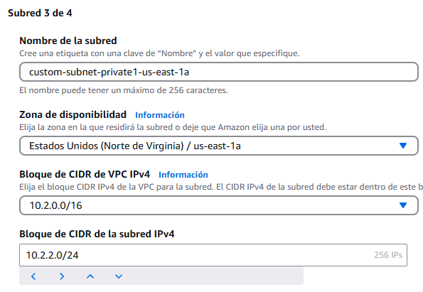

- `custom-subnet-private2-us-east-1b` → `10.2.3.0/24`
   
- 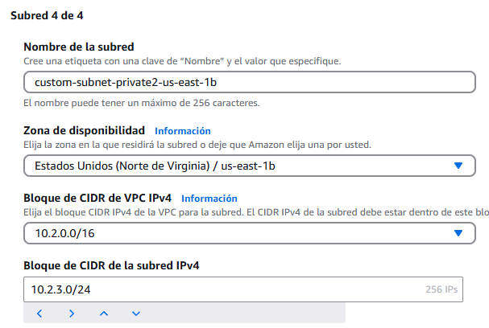

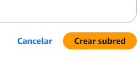

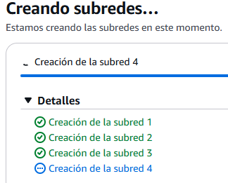

4. Habilita **Auto-assign public IPv4 address** en las subredes públicas.

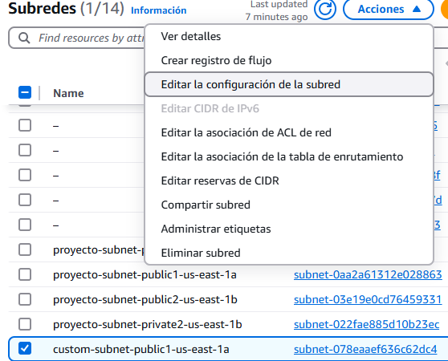

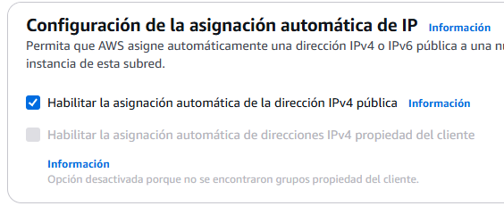

---

## Creación de Tablas de Rutas

1. Accede a **Amazon VPC > Route Tables** y selecciona **Create Route Table**.

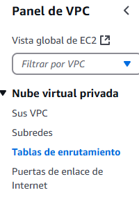


2. Crea las siguientes tablas:

- **custom-rtb-public**: Redirige tráfico `0.0.0.0/0` al Internet Gateway.

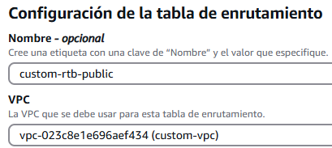
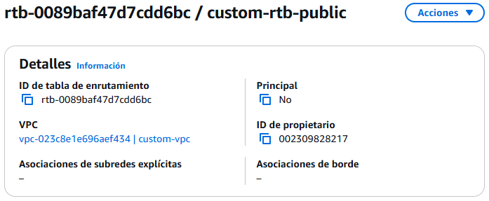
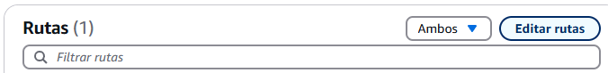
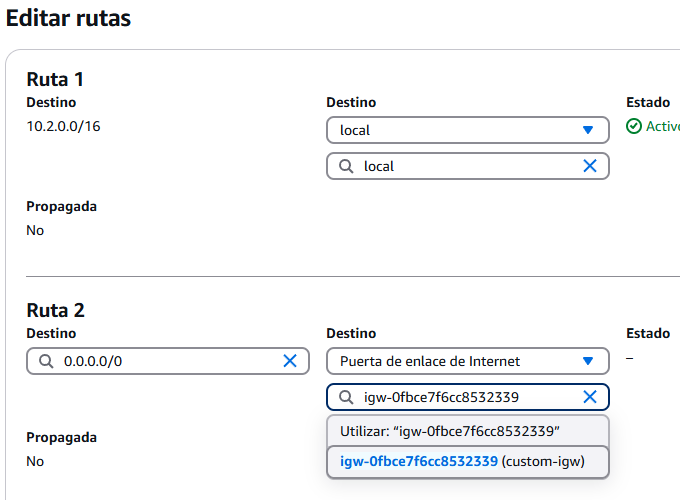
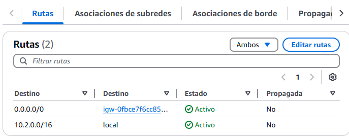

- **custom-rtb-private1-us-east-1a**: Sin acceso a Internet.Le asociamos la subred `custom-subnet-private1-us-east-1a`.

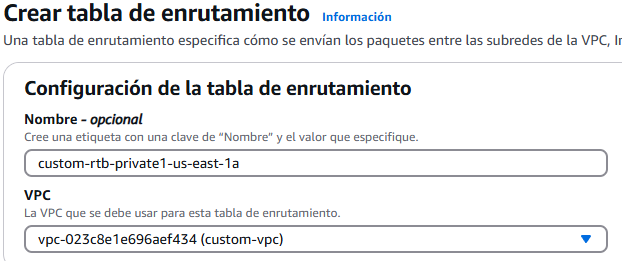
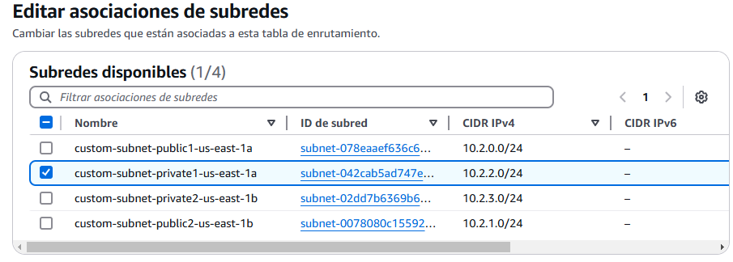
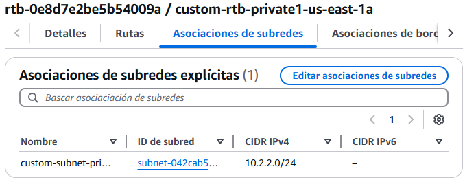

- **custom-rtb-private1-us-east-1b**: Sin acceso a Internet. Le asociamos la subred `custom-subnet-private2-us-east-1b`.

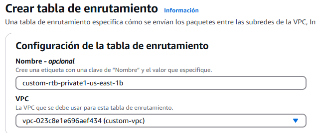
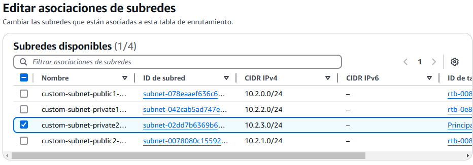
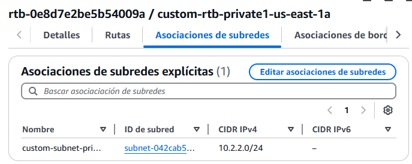

3. Asocia **custom-rtb-public** a las subredes públicas.

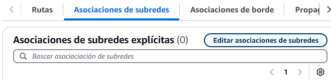
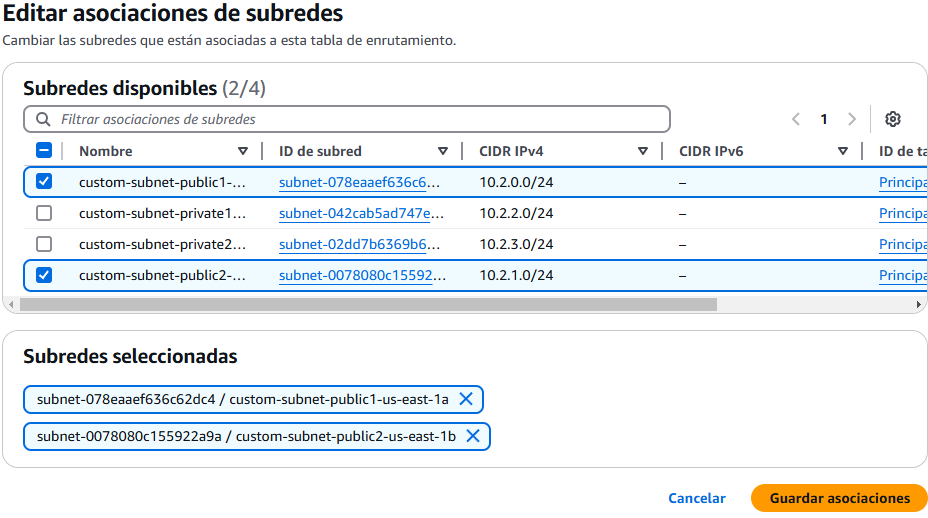
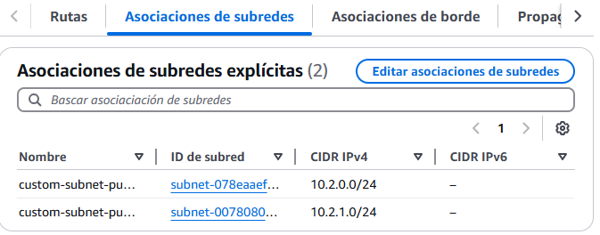


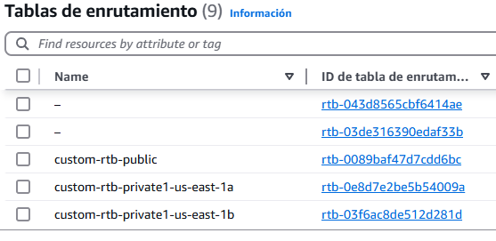

---

## Creación de Grupos de Seguridad
1. Accede a **Amazon VPC > Security Groups** y haz clic en **Create Security Group**.

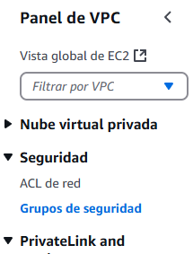

2. Configura los siguientes valores:
   - **Name**: `ssh-sg`
   - **Description**: `Grupo de seguridad para acceso SSH`
   - **VPC**: `custom-vpc`
3. En **Inbound Rules**, agrega una regla:
   - **Tipo**: SSH
   - **Protocolo**: TCP
   - **Puerto**: 22
   - **Origen**: `MyIP` (o el rango de IP permitido)
4. Guarda los cambios y asocia este grupo de seguridad a las instancias.

## Lanzamiento de Instancias EC2
1. Accede a **Amazon EC2 > Instances** y selecciona **Launch Instance**.

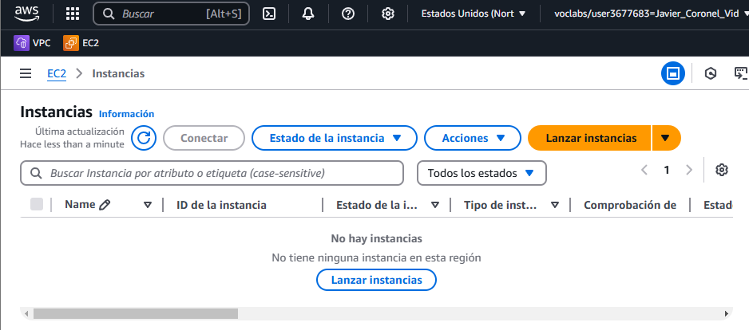

2. Configura las siguientes opciones:
- **AMI**: `Amazon Linux 2023`
- **Tipo de instancia**: `t4g.micro`
- **VPC**: `custom-vpc`
- **Subred**:
    - `custom-subnet-public1-us-east-1a` (pública)
    - `custom-subnet-private2-us-east-1b` (privada)
- **Grupos de seguridad**:
    - `ssh-sg` para acceso SSH desde fuera
    - `default` para comunicación interna
1. Asigna una IP pública a la instancia pública.
2. Lanza las instancias.

---

## Conexión a las Instancias EC2

### Conexión SSH a la Instancia Pública
```sh
ssh -i <clave-privada> ec2-user@<ip-publica>
```

### Conexión desde la Instancia Pública a la Privada
```sh
ssh ec2-user@<ip-privada>
```

### Conexión Directa a la Instancia Privada con Port Forwarding
1. En la máquina local, ejecuta:
```sh
ssh -i <clave-privada> -L 2022:<ip-privada>:22 ec2-user@<ip-publica>
```
2. En una nueva terminal, conéctate a la instancia privada:
```sh
ssh -i <clave-privada> ec2-user@localhost -p 2022
```

---

## Limpieza de Recursos
1. **Eliminar instancias EC2**:
   - Accede a **Amazon EC2** y termina las instancias.
2. **Eliminar la VPC** (opcional):
   - Accede a **Amazon VPC**, selecciona la VPC y elige **Delete VPC**.

---

## Conclusión
Esta guía proporciona una estructura sólida para configurar redes privadas con Amazon VPC, asegurando conectividad eficiente y segura en AWS.
