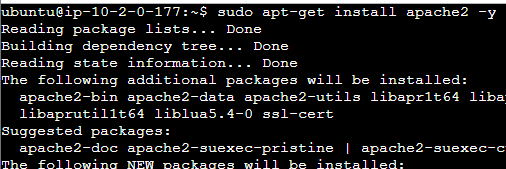

---

# Instalación de Apache y PHP

## Instalación de Apache y PHP en Ubuntu

- **Instalación de Apache**: 
  - `sudo apt-get update`
  - `sudo apt-get install apache2 -y`

- **Instalación de PHP**:
  - `sudo apt-get install php libapache2-mod-php -y`

---