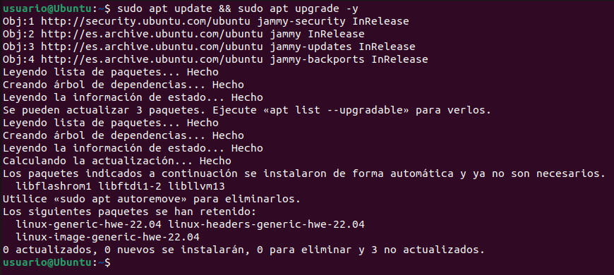

<a href="../readme.md"></a>

<a href="../2/readme.md"></a>

<br>

---

# ⚙️ Instalación de Docker

## 📌 Indice

- [⚙️ Instalación de Docker](#️-instalación-de-docker)
  - [📌 Indice](#-indice)
  - [⚡ Actualizar el sistema](#-actualizar-el-sistema)
  - [🔧 Instalar paquetes necesarios](#-instalar-paquetes-necesarios)
  - [🔑 Agregar la clave GPG de Docker](#-agregar-la-clave-gpg-de-docker)
  - [📦 Agregar el repositorio de Docker](#-agregar-el-repositorio-de-docker)
  - [🔄 Actualizar la lista de paquetes](#-actualizar-la-lista-de-paquetes)
  - [🔍 Descargamos las politicas de Docker](#-descargamos-las-politicas-de-docker)
  - [🐳 Instalar Docker](#-instalar-docker)
  - [✅ Verificar la instalación de Docker](#-verificar-la-instalación-de-docker)
  - [🚀 Habilitar y arrancar Docker](#-habilitar-y-arrancar-docker)
  - [🏗️ Probar Docker con un contenedor de prueba](#️-probar-docker-con-un-contenedor-de-prueba)
- [📚 Recursos](#-recursos)

## ⚡ Actualizar el sistema

```bash
sudo apt update
```



## 🔧 Instalar paquetes necesarios

```bash
sudo apt install apt-transport-https ca-certificates curl software-properties-common
```

## 🔑 Agregar la clave GPG de Docker

```bash
curl -fsSL https://download.docker.com/linux/ubuntu/gpg | sudo apt-key add -
```

## 📦 Agregar el repositorio de Docker

```bash
sudo add-apt-repository "deb [arch=amd64] https://download.docker.com/linux/ubuntu focal stable"
```

## 🔄 Actualizar la lista de paquetes

```bash
sudo apt update
```

## 🔍 Descargamos las politicas de Docker

```bash
apt-cache policy docker-ce
```

## 🐳 Instalar Docker

```bash
sudo apt install docker-ce -y
```

## ✅ Verificar la instalación de Docker

```bash
docker --version
```

## 🚀 Habilitar y arrancar Docker

```bash
sudo systemctl enable docker
sudo systemctl start docker
```

## 🏗️ Probar Docker con un contenedor de prueba
```bash
sudo docker run hello-world
```

# 📚 Recursos

- [Docker Docs](https://docs.docker.com/install/linux/docker-ce/ubuntu/)
- [Medium Article](https://medium.com/@Grigorkh/how-to-install-docker-on-ubuntu-16-04-3f509070d29c)
- [Tecmint Guide](https://www.tecmint.com/install-docker-and-run-docker-containers-in-ubuntu/)
