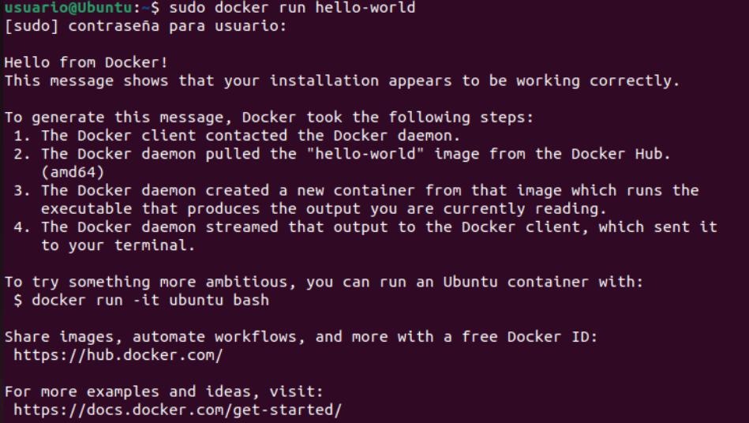
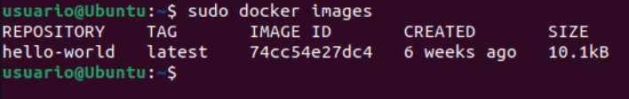
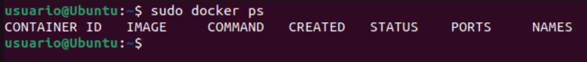
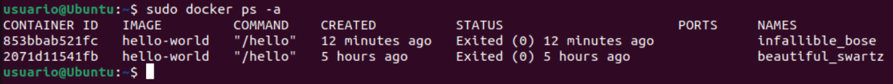
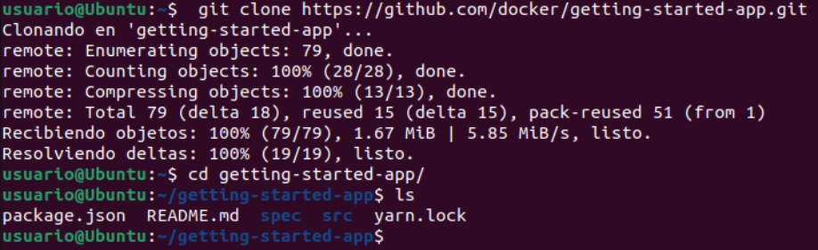
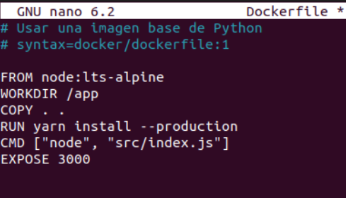

<a href="../readme.md"></a>

<a href="../1/readme.md"></a>
<a href="../3/readme.md"></a>

<br>

---

# 🔨 Construcción y Publicación de Imágenes Docker

<details>

<summary>

## 📌 Indice

</summary>

- [🔨 Construcción y Publicación de Imágenes Docker](#-construcción-y-publicación-de-imágenes-docker)
  - [📌 Indice](#-indice)
  - [🏗️ Primeros pasos con Docker](#️-primeros-pasos-con-docker)
    - [✅ 1. Ejecutar la imagen "hello-world"](#-1-ejecutar-la-imagen-hello-world)
    - [📸 2. Mostrar las imágenes de Docker instaladas](#-2-mostrar-las-imágenes-de-docker-instaladas)
    - [📦 3. Mostrar los contenedores Docker](#-3-mostrar-los-contenedores-docker)
  - [🏗️ Construcción y publicación de una imagen Docker](#️-construcción-y-publicación-de-una-imagen-docker)
    - [📂 1. Clonamos el repositorio de ejemplo](#-1-clonamos-el-repositorio-de-ejemplo)
    - [🔨 2. Construir el contenedor](#-2-construir-el-contenedor)
    - [▶️ 3. Ejecutar el contenedor](#️-3-ejecutar-el-contenedor)
    - [🔑 4. Crear una cuenta en Docker Hub](#-4-crear-una-cuenta-en-docker-hub)
    - [☁️ 5. Publicar la imagen en Docker Hub](#️-5-publicar-la-imagen-en-docker-hub)
    - [🌍 6. Probar la imagen desde Docker Hub](#-6-probar-la-imagen-desde-docker-hub)
  - [🎯 Conclusión](#-conclusión)
- [📚 Recursos](#-recursos)

</details>

## 🏗️ Primeros pasos con Docker

### ✅ 1. Ejecutar la imagen "hello-world"
Ejecuta el siguiente comando para descargar y correr la imagen oficial de "hello-world":

```sh
sudo docker run hello-world
```



### 📸 2. Mostrar las imágenes de Docker instaladas
Para listar las imágenes instaladas en tu sistema, usa:

```sh
sudo docker images
```



### 📦 3. Mostrar los contenedores Docker
Para ver los contenedores en ejecución, usa:

```sh
sudo docker ps
```



Si deseas ver todos los contenedores, incluidos los detenidos, ejecuta:

```sh
sudo docker ps -a
```



---

## 🏗️ Construcción y publicación de una imagen Docker

### 📂 1. Clonamos el repositorio de ejemplo
Antes de poder ejecutar la aplicación, debe obtener el código fuente de la aplicación en su máquina.

```sh
 git clone https://github.com/docker/getting-started-app.git
```



Crea un archivo `Dockerfile` dentro del directorio con el siguiente contenido:

```bash
sudo nano Dockerfile
```

```Dockerfile
# Usar una imagen base de Python
# syntax=docker/dockerfile:1

FROM node:lts-alpine
WORKDIR /app
COPY . .
RUN yarn install --production
CMD ["node", "src/index.js"]
EXPOSE 3000
```



### 🔨 2. Construir el contenedor
Ejecuta el siguiente comando para construir la imagen Docker:

```sh
sudo docker build -t miapp .
```

### ▶️ 3. Ejecutar el contenedor
Ejecuta el contenedor con el siguiente comando:

```sh
sudo docker run -d -p 8000:8000 miapp
```

Verifica que esté en ejecución:

```sh
sudo docker ps
```

Abre un navegador y ve a `http://localhost:8000` para comprobar que el servidor está funcionando.

### 🔑 4. Crear una cuenta en Docker Hub

- Ve a [hub.docker.com](https://hub.docker.com/)
- Regístrate y verifica tu cuenta
- Inicia sesión en Docker desde la terminal:

```sh
sudo docker login
```

Introduce tus credenciales cuando se te solicite.

### ☁️ 5. Publicar la imagen en Docker Hub

1. Etiqueta la imagen con tu usuario de Docker Hub:

```sh
sudo docker tag miapp tu_usuario/miapp
```

2. Sube la imagen a Docker Hub:

```sh
sudo docker push tu_usuario/miapp
```

3. Para verificar que la imagen se subió correctamente, ve a [hub.docker.com](https://hub.docker.com/) y busca en tu repositorio.

### 🌍 6. Probar la imagen desde Docker Hub

Desde cualquier otra máquina con Docker instalado, puedes ejecutar:

```sh
sudo docker run -d -p 8000:8000 tu_usuario/miapp
```

Esto descargará la imagen de Docker Hub y la ejecutará.

---

## 🎯 Conclusión
En esta práctica aprendimos a:

- ✅ Ejecutar una imagen Docker (`hello-world`)
- 📸 Listar imágenes y contenedores
- 🏗️ Construir una imagen personalizada con un `Dockerfile`
- ▶️ Ejecutar un contenedor basado en nuestra imagen
- ☁️ Publicar una imagen en Docker Hub

# 📚 Recursos

- [Docker Docs](https://docs.docker.com/get-started/)
- [Docker Docs](https://docs.docker.com/get-started/part2/)