<a href="../readme.md"></a>

<a href="../2/readme.md"></a>
<a href="../4/readme.md"></a>

<br>

---

# 📦 Gestion de imágenes y contenedores Docker

<details>

<summary>

## 📌 Indice

</summary>

- [📦 Gestion de imágenes y contenedores Docker](#-gestion-de-imágenes-y-contenedores-docker)
  - [📌 Indice](#-indice)
  - [🐧 1. Descarga la imagen de Ubuntu](#-1-descarga-la-imagen-de-ubuntu)
  - [🌍 2. Descarga la imagen de hello-world](#-2-descarga-la-imagen-de-hello-world)
  - [🚀 3. Descarga la imagen de Nginx](#-3-descarga-la-imagen-de-nginx)
  - [📸 4. Muestra un listado de todas las imágenes](#-4-muestra-un-listado-de-todas-las-imágenes)
  - [🔄 5. Ejecuta un contenedor hello-world y dale nombre "myhello1"](#-5-ejecuta-un-contenedor-hello-world-y-dale-nombre-myhello1)
  - [🔄 6. Ejecuta un contenedor hello-world y dale nombre "myhello2"](#-6-ejecuta-un-contenedor-hello-world-y-dale-nombre-myhello2)
  - [🔄 7. Ejecuta un contenedor hello-world y dale nombre "myhello3"](#-7-ejecuta-un-contenedor-hello-world-y-dale-nombre-myhello3)
  - [📋 8. Muestra los contenedores que se están ejecutando](#-8-muestra-los-contenedores-que-se-están-ejecutando)
  - [⏹️ 9. Para el contenedor "myhello1"](#️-9-para-el-contenedor-myhello1)
  - [⏹️ 10. Para el contenedor "myhello2"](#️-10-para-el-contenedor-myhello2)
  - [🗑️ 11. Borra el contenedor "myhello1"](#️-11-borra-el-contenedor-myhello1)
  - [📋 12. Muestra los contenedores que se están ejecutando](#-12-muestra-los-contenedores-que-se-están-ejecutando)
  - [🧹 13. Borra todos los contenedores](#-13-borra-todos-los-contenedores)
  - [📚 Recursos](#-recursos)

</details>

## 🐧 1. Descarga la imagen de Ubuntu
```bash
sudo docker pull ubuntu
```

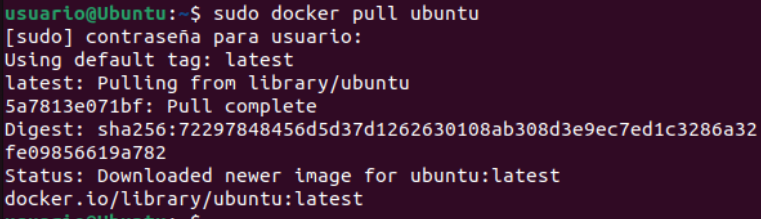

## 🌍 2. Descarga la imagen de hello-world
```bash
sudo docker pull hello-world
```

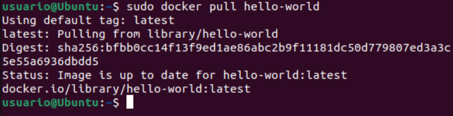

## 🚀 3. Descarga la imagen de Nginx
```bash
sudo docker pull nginx
```

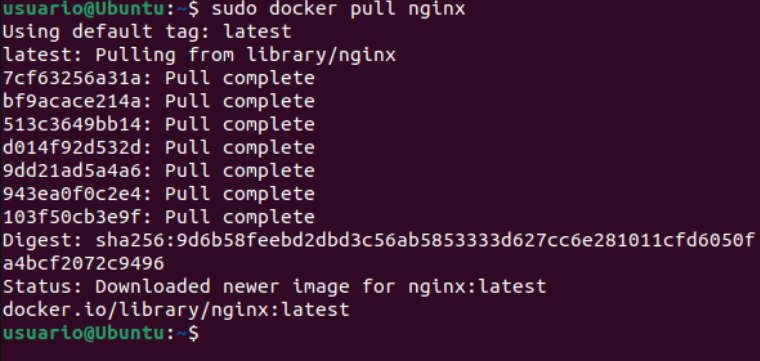

## 📸 4. Muestra un listado de todas las imágenes
```bash
sudo docker images
```

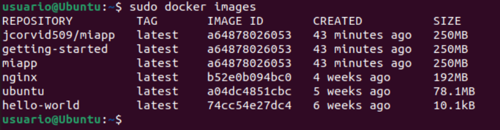

## 🔄 5. Ejecuta un contenedor hello-world y dale nombre "myhello1"
```bash
sudo docker run --name myhello1 hello-world
```

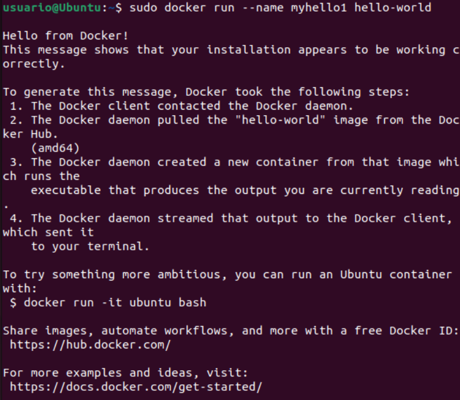

<!-- Comprobamos que el contenedor se ha creado correctamente con el comando

```bash
sudo docker ps -a
```

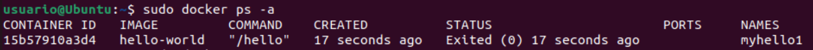 -->

## 🔄 6. Ejecuta un contenedor hello-world y dale nombre "myhello2"
```bash
sudo docker run --name myhello2 hello-world
```

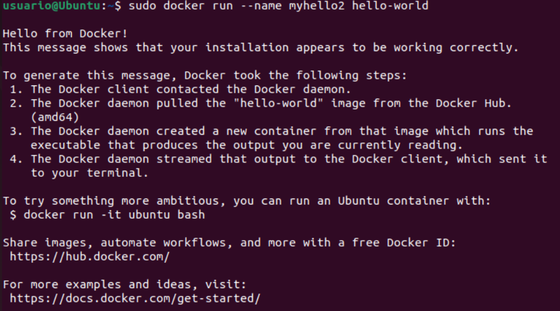

<!-- Comprobamos que el contenedor se ha creado correctamente con el comando

```bash
sudo docker ps -a
```

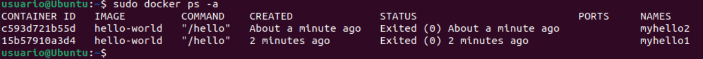 -->

## 🔄 7. Ejecuta un contenedor hello-world y dale nombre "myhello3"
```bash
sudo docker run --name myhello3 hello-world
```


<!-- Comprobamos que el contenedor se ha creado correctamente con el comando

```bash
sudo docker ps -a
```

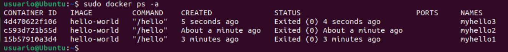 -->


## 📋 8. Muestra los contenedores que se están ejecutando
```bash
sudo docker ps -a
```

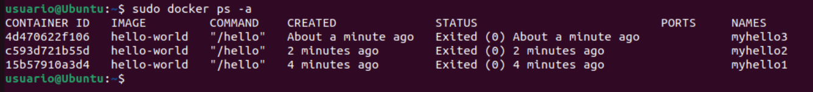

## ⏹️ 9. Para el contenedor "myhello1"
```bash
sudo docker stop myhello1
```

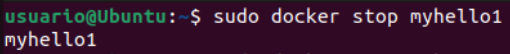

## ⏹️ 10. Para el contenedor "myhello2"
```bash
sudo docker stop myhello2
```
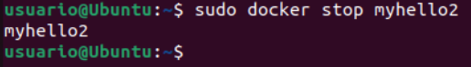

## 🗑️ 11. Borra el contenedor "myhello1"
```bash
sudo docker rm myhello1
```

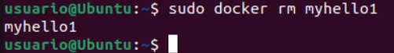

## 📋 12. Muestra los contenedores que se están ejecutando
```bash
sudo docker ps -a
```

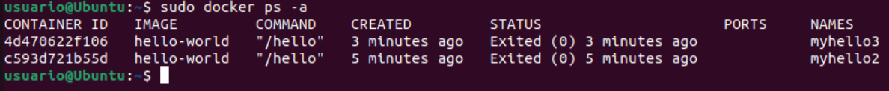

## 🧹 13. Borra todos los contenedores
```bash
sudo docker rm $(docker ps -aq)
```

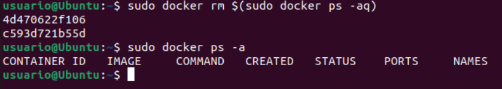

## 📚 Recursos
- [Pull Docker images & run Docker containers](http://www.servermom.org/pull-docker-images-run-docker-containers/3225/)
- [Borrar imágenes y contenedores Docker](https://www.tecmint.com/remove-docker-images-containers-and-volumes/)
- [Dar nombre a contenedores Docker](https://www.tecmint.com/name-docker-containers/)
- [Ejercicio recomendado - Play with Docker](https://training.play-with-docker.com/ops-s1-hello/)