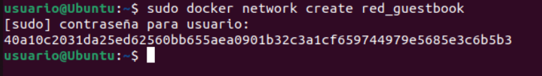

<a href="../readme.md"></a>

<a href="../3/readme.md"></a>
<a href="../5/readme.md"></a>

<br>

---

# 🗂️ Gestión de Almacenamiento y Redes en Docker

<details>

<summary>

## 📌 Indice

</summary>

- [🗂️ Gestión de Almacenamiento y Redes en Docker](#️-gestión-de-almacenamiento-y-redes-en-docker)
  - [📌 Indice](#-indice)
  - [🚀 Ejemplo 1: Despliegue de la aplicación Guestbook](#-ejemplo-1-despliegue-de-la-aplicación-guestbook)
    - [1️⃣ Crear una red Docker](#1️⃣-crear-una-red-docker)
    - [2️⃣ Desplegar la Base de Datos Redis](#2️⃣-desplegar-la-base-de-datos-redis)
    - [3️⃣ Desplegar la Aplicación Guestbook](#3️⃣-desplegar-la-aplicación-guestbook)
    - [4️⃣ Verificar el Despliegue](#4️⃣-verificar-el-despliegue)
    - [🔄 Configuración Alternativa: Cambio de Nombre del Contenedor Redis](#-configuración-alternativa-cambio-de-nombre-del-contenedor-redis)
  - [🌡️ Ejemplo 2: Despliegue de la aplicación Temperaturas](#️-ejemplo-2-despliegue-de-la-aplicación-temperaturas)
  - [🌐 Ejemplo 3: Despliegue de Wordpress + MariaDB](#-ejemplo-3-despliegue-de-wordpress--mariadb)
  - [🚀 Ejemplo 4: Despliegue de Tomcat + Nginx](#-ejemplo-4-despliegue-de-tomcat--nginx)

</details>

## 🚀 Ejemplo 1: Despliegue de la aplicación Guestbook

### 1️⃣ Crear una red Docker
Para que los contenedores se comuniquen entre sí, creamos una red llamada `red_guestbook`:

```bash
sudo docker network create red_guestbook
```



### 2️⃣ Desplegar la Base de Datos Redis
Ejecutamos el contenedor de Redis asegurándonos de que los datos se almacenen de forma persistente en `/opt/redis`:

```bash
sudo docker run -d --name redis --network red_guestbook -v /opt/redis:/data redis redis-server --appendonly yes
```

### 3️⃣ Desplegar la Aplicación Guestbook
Ejecutamos el contenedor de la aplicación Guestbook y lo exponemos en el puerto 80:

```bash
sudo docker run -d -p 80:5000 --name guestbook --network red_guestbook iesgn/guestbook
```

### 4️⃣ Verificar el Despliegue
Para comprobar que los contenedores están corriendo, usamos:

```bash
sudo docker ps
```

Si todo está configurado correctamente, deberíamos ver los contenedores `redis` y `guestbook` en ejecución.

### 🔄 Configuración Alternativa: Cambio de Nombre del Contenedor Redis
Si por alguna razón deseas utilizar un nombre diferente para el contenedor Redis, sigue estos pasos:

1. Crea el contenedor con un nombre distinto (ejemplo: `contenedor_redis`):

```bash
sudo docker run -d --name contenedor_redis --network red_guestbook -v /opt/redis:/data redis redis-server --appendonly yes
```

2. Ejecuta la aplicación Guestbook configurando la variable de entorno `REDIS_SERVER`:

```bash
sudo docker run -d -p 80:5000 --name guestbook -e REDIS_SERVER=contenedor_redis --network red_guestbook iesgn/guestbook
```

---

## 🌡️ Ejemplo 2: Despliegue de la aplicación Temperaturas


## 🌐 Ejemplo 3: Despliegue de Wordpress + MariaDB


## 🚀 Ejemplo 4: Despliegue de Tomcat + Nginx

