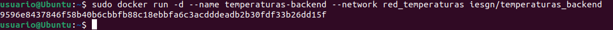
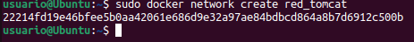

<a href="../readme.md"></a>

<a href="../3/readme.md"></a>
<a href="../5/readme.md"></a>

<br>

---

# 🗂️ Gestión de Almacenamiento y Redes en Docker

<details>

<summary>

## 📌 Indice

</summary>

- [🗂️ Gestión de Almacenamiento y Redes en Docker](#️-gestión-de-almacenamiento-y-redes-en-docker)
  - [📌 Indice](#-indice)
  - [🚀 Ejemplo 1: Despliegue de la aplicación Guestbook](#-ejemplo-1-despliegue-de-la-aplicación-guestbook)
    - [1️⃣ Crear una red Docker](#1️⃣-crear-una-red-docker)
    - [2️⃣ Desplegar la Base de Datos Redis](#2️⃣-desplegar-la-base-de-datos-redis)
    - [3️⃣ Desplegar la Aplicación Guestbook](#3️⃣-desplegar-la-aplicación-guestbook)
    - [4️⃣ Verificar el Despliegue](#4️⃣-verificar-el-despliegue)
  - [🌡️ Ejemplo 2: Despliegue de la aplicación Temperaturas](#️-ejemplo-2-despliegue-de-la-aplicación-temperaturas)
    - [1️⃣ Crear una red Docker](#1️⃣-crear-una-red-docker-1)
    - [2️⃣ Desplegar el Backend](#2️⃣-desplegar-el-backend)
    - [3️⃣ Desplegar el Frontend](#3️⃣-desplegar-el-frontend)
    - [4️⃣ Verificar el Despliegue](#4️⃣-verificar-el-despliegue-1)
  - [🌍 Ejemplo 3: Despliegue de Wordpress + MariaDB](#-ejemplo-3-despliegue-de-wordpress--mariadb)
    - [1️⃣ Crear una red Docker](#1️⃣-crear-una-red-docker-2)
    - [2️⃣ Desplegar el Contenedor de Base de Datos MariaDB](#2️⃣-desplegar-el-contenedor-de-base-de-datos-mariadb)
    - [3️⃣ Desplegar el Contenedor de WordPress](#3️⃣-desplegar-el-contenedor-de-wordpress)
    - [4️⃣ Verificar el Despliegue](#4️⃣-verificar-el-despliegue-2)
    - [🔍 Observaciones](#-observaciones)
  - [🐱‍💻 Ejemplo 4: Despliegue de Tomcat + Nginx](#-ejemplo-4-despliegue-de-tomcat--nginx)
    - [1️⃣ Crear una red Docker](#1️⃣-crear-una-red-docker-3)
    - [2️⃣ Desplegar Tomcat](#2️⃣-desplegar-tomcat)
    - [3️⃣ Desplegar Nginx como Proxy Inverso](#3️⃣-desplegar-nginx-como-proxy-inverso)
    - [4️⃣ Verificar el Despliegue](#4️⃣-verificar-el-despliegue-3)

</details>

---

## 🚀 Ejemplo 1: Despliegue de la aplicación Guestbook

### 1️⃣ Crear una red Docker
Para que los contenedores se comuniquen entre sí, creamos una red llamada `red_guestbook`:

```bash
sudo docker network create red_guestbook
```


### 2️⃣ Desplegar la Base de Datos Redis
Ejecutamos el contenedor de Redis asegurándonos de que los datos se almacenen de forma persistente en `/opt/redis`:

```bash
sudo docker run -d --name redis --network red_guestbook -v /opt/redis:/data redis redis-server --appendonly yes
```


### 3️⃣ Desplegar la Aplicación Guestbook
Ejecutamos el contenedor de la aplicación Guestbook y lo exponemos en el puerto 80:

```bash
sudo docker run -d -p 80:5000 --name guestbook --network red_guestbook iesgn/guestbook
```


### 4️⃣ Verificar el Despliegue
Para comprobar que los contenedores están corriendo, usamos:

```bash
sudo docker ps
```

Si todo está configurado correctamente, deberíamos ver los contenedores `redis` y `guestbook` en ejecución.


Ademas de que podremos ver lo siguiente si accedemos a la url `http://localhost:80`:


---

## 🌡️ Ejemplo 2: Despliegue de la aplicación Temperaturas

> [!IMPORTANT]  
> Antes de realizar este ejemplo, deberemos de cerrar las aplicaciones Guestbook y Redis que se ejecutaron en el ejemplo anterior.

```bash
sudo docker stop $(sudo docker ps -aq)
```

### 1️⃣ Crear una red Docker

```bash
sudo docker network create red_temperaturas
```


### 2️⃣ Desplegar el Backend

```bash
sudo docker run -d --name temperaturas-backend --network red_temperaturas iesgn/temperaturas_backend
```



### 3️⃣ Desplegar el Frontend

```bash
sudo docker run -d -p 80:3000 --name temperaturas-frontend --network red_temperaturas iesgn/temperaturas_frontend
```


### 4️⃣ Verificar el Despliegue
Para comprobar que los contenedores están corriendo, usamos:

```bash
sudo docker ps
```

Si todo está configurado correctamente, deberíamos ver el contendor `temperaturas-frontend` en la lista de contenedores en ejecución.


Ademas de que podremos ver lo siguiente si accedemos a la url `http://localhost:80`:


---

## 🌍 Ejemplo 3: Despliegue de Wordpress + MariaDB

> [!IMPORTANT]  
> Antes de realizar este ejemplo, deberemos de cerrar las aplicaciones Guestbook y Redis que se ejecutaron en el ejemplo anterior.

```bash
sudo docker stop $(sudo docker ps -aq)
```

### 1️⃣ Crear una red Docker

```bash
sudo docker network create red_wp
```


### 2️⃣ Desplegar el Contenedor de Base de Datos MariaDB

```bash
sudo docker run -d --name servidor_mysql \
                --network red_wp \
                -v /opt/mysql_wp:/var/lib/mysql \
                -e MYSQL_DATABASE=bd_wp \
                -e MYSQL_USER=user_wp \
                -e MYSQL_PASSWORD=asdasd \
                -e MYSQL_ROOT_PASSWORD=asdasd \
                mariadb
```


### 3️⃣ Desplegar el Contenedor de WordPress

```bash
sudo docker run -d --name servidor_wp \
                --network red_wp \
                -v /opt/wordpress:/var/www/html/wp-content \
                -e WORDPRESS_DB_HOST=servidor_mysql \
                -e WORDPRESS_DB_USER=user_wp \
                -e WORDPRESS_DB_PASSWORD=asdasd \
                -e WORDPRESS_DB_NAME=bd_wp \
                -p 80:80 \
                wordpress
```


### 4️⃣ Verificar el Despliegue

Para comprobar que los contenedores están corriendo, usamos:

```bash
sudo docker ps
```

Si todo está configurado correctamente, deberíamos ver los contenedores `servidor_wp` y `servidor_mysql` en ejecución.


Ademas de que podremos ver lo siguiente si accedemos a la url `http://localhost:80`:


### 🔍 Observaciones

- **MariaDB** ejecuta un script `docker-entrypoint.sh` que configura la base de datos según las variables de entorno proporcionadas.
- **WordPress** también ejecuta su propio script `docker-entrypoint.sh`, que genera el archivo `wp-config.php` automáticamente.
- La variable `WORDPRESS_DB_HOST` se configura con el nombre del contenedor de la base de datos (`servidor_mysql`).
- Solo se expone el puerto del contenedor de **WordPress** (`80`), ya que la base de datos solo necesita ser accesible dentro de la red Docker.

---

## 🐱‍💻 Ejemplo 4: Despliegue de Tomcat + Nginx

> [!IMPORTANT]  
> Antes de realizar este ejemplo, deberemos de cerrar las aplicaciones Guestbook y Redis que se ejecutaron en el ejemplo anterior.

```bash
sudo docker stop $(sudo docker ps -aq)
```

### 1️⃣ Crear una red Docker

```bash
sudo docker network create red_tomcat
```



### 2️⃣ Desplegar Tomcat

Antes de desplegar Tomcat, asegurémonos de tener el archivo de la aplicación (`sample.war`) en un directorio específico:

```bash
sudo cd tomcat
```
```bash
ls
```

Deberíamos ver los siguientes archivos:

```bash
default.conf  sample.war
```

Creamos el contenedor Tomcat y montamos el archivo WAR en el directorio de despliegue:

```bash
sudo docker run -d --name aplicacionjava \
                --network red_tomcat \
                -v /home/vagrant/tomcat/sample.war:/usr/local/tomcat/webapps/sample.war:ro \
                tomcat:9.0
```

### 3️⃣ Desplegar Nginx como Proxy Inverso

Tenemos el siguiente archivo de configuración `default.conf` para Nginx:

```nginx
server {
    listen       80;
    listen  [::]:80;
    server_name  localhost;

    location / {
        root   /usr/share/nginx/html;
        proxy_pass http://aplicacionjava:8080/sample/;
    }
    error_page   500 502 503 504  /50x.html;
    location = /50x.html {
        root   /usr/share/nginx/html;
    }
}
```

Ahora creamos el contenedor Nginx y montamos el archivo de configuración:

```bash
sudo docker run -d --name proxy \
                -p 80:80 \
                --network red_tomcat \
                -v /home/vagrant/tomcat/default.conf:/etc/nginx/conf.d/default.conf:ro \
                nginx
```

### 4️⃣ Verificar el Despliegue

Para comprobar que los contenedores están corriendo, usamos:

```bash
sudo docker ps
```

Si todo está configurado correctamente, deberíamos ver los contenedores `servidor_wp` y `servidor_mysql` en ejecución.


Ademas de que podremos ver lo siguiente si accedemos a la url `http://localhost:80`:

