<a href="../readme.md"></a>

<a href="../4/readme.md"></a>
<a href="../6/readme.md"></a>

<br>

---

# 📋 Docker-Compose

<details>

<summary>

## 📌 Indice

</summary>

- [📋 Docker-Compose](#-docker-compose)
  - [📌 Indice](#-indice)
  - [📖 Ejemplo 1: Despliegue de la aplicación Guestbook](#-ejemplo-1-despliegue-de-la-aplicación-guestbook)
    - [⚙️ Configuración con Docker Compose](#️-configuración-con-docker-compose)
    - [🏗️ Despliegue de la Aplicación](#️-despliegue-de-la-aplicación)
    - [📊 Verificar el Estado de los Contenedores](#-verificar-el-estado-de-los-contenedores)
    - [🌍 Prueba de Acceso](#-prueba-de-acceso)
    - [🛑 Detener y Eliminar Contenedores](#-detener-y-eliminar-contenedores)
  - [🌡️ Ejemplo 2: Despliegue de la aplicación Temperaturas](#️-ejemplo-2-despliegue-de-la-aplicación-temperaturas)
    - [⚙️ Configuración con Docker Compose](#️-configuración-con-docker-compose-1)
    - [🏗️ Despliegue de la Aplicación](#️-despliegue-de-la-aplicación-1)
    - [📊 Verificar el Estado de los Contenedores](#-verificar-el-estado-de-los-contenedores-1)
    - [🌍 Prueba de Acceso](#-prueba-de-acceso-1)
    - [🛑 Detener y Eliminar Contenedores](#-detener-y-eliminar-contenedores-1)
  - [✒️ Ejemplo 3: Despliegue de Wordpress + MariaDB](#️-ejemplo-3-despliegue-de-wordpress--mariadb)
    - [⚙️📦 Configuración con Docker Compose usando volumenes Docker](#️-configuración-con-docker-compose-usando-volumenes-docker)
    - [⚙️🔗 Configuración con Docker Compose usando Bind Mounts](#️-configuración-con-docker-compose-usando-bind-mounts)
    - [🏗️ Despliegue de la Aplicación](#️-despliegue-de-la-aplicación-2)
    - [📊 Verificación del Despliegue](#-verificación-del-despliegue)
    - [🌍 Acceder a WordPress](#-acceder-a-wordpress)
  - [🐱 Ejemplo 4: Despliegue de Tomcat + Nginx.](#-ejemplo-4-despliegue-de-tomcat--nginx)
    - [⚙️ Configuración con Docker Compose](#️-configuración-con-docker-compose-2)
    - [🏗️ Despliegue de la Aplicación](#️-despliegue-de-la-aplicación-3)
    - [📊 Verificar el Estado de los Contenedores](#-verificar-el-estado-de-los-contenedores-2)
    - [🌍 Prueba de Acceso](#-prueba-de-acceso-2)
    - [🛑 Detener y Eliminar Contenedores](#-detener-y-eliminar-contenedores-2)

</details>

> [!TIP]
> Para volver a desplegar una aplicación de Docker, primero hemos de eliminar **todos** los contenedores existentes y volverlos a desplegar:
> 
> ```bash
> # Parar todos los contenedores
> sudo docker stop $(sudo docker ps -q)
> ```
>
> ```bash
> # Eliminar todos los contenedores
> sudo docker rm $(sudo docker ps -aq)
> ```

## 📖 Ejemplo 1: Despliegue de la aplicación Guestbook

### ⚙️ Configuración con Docker Compose

Para definir y gestionar el despliegue de los servicios, utilizaremos el siguiente archivo [`docker-compose.yaml`](https://github.com/josedom24/curso_docker_ies/blob/main/ejemplos/modulo4/ejemplo1/docker-compose.yaml):

```yaml
version: '3.1'
services:
  app:
    container_name: guestbook
    image: iesgn/guestbook
    restart: always
    environment:
      REDIS_SERVER: redis
    ports:
      - "8080:5000"
  db:
    container_name: redis
    image: redis
    restart: always
    command: redis-server --appendonly yes
    volumes:
      - redis:/data

volumes:
  redis:
```

### 🏗️ Despliegue de la Aplicación

> [!IMPORTANT]  
> Para desplegar la aplicación, ejecutamos el siguiente comando en el directorio donde se encuentra el archivo `docker-compose.yaml`:

```bash
sudo docker compose up -d
```

Esto creará la red por defecto, los volúmenes necesarios y levantará los contenedores:

```bash
[+] Running 4/4
 ✔ Network guestbook_default  Created
 ✔ Volume "guestbook_redis"   Created
 ✔ Container redis            Started
 ✔ Container guestbook        Started
```


### 📊 Verificar el Estado de los Contenedores

Para listar los contenedores en ejecución:

```bash
sudo docker compose ps
```

Salida esperada:

```bash
NAME        IMAGE             COMMAND                                                SERVICE   CREATED          STATUS          PORTS
guestbook   iesgn/guestbook   "python3 app.py"                                       app       18 seconds ago   Up 16 seconds   0.0.0.0:8080->5000/tcp, :::8080->5000/tcp
redis       redis             "docker-entrypoint.sh redis-server --appendonly yes"   db        18 seconds ago   Up 16 seconds   6379/tcp
```


### 🌍 Prueba de Acceso

Podemos acceder a la aplicación a través del navegador ingresando:

```
http://localhost:8080
```


### 🛑 Detener y Eliminar Contenedores

Para detener los contenedores sin eliminarlos:

```bash
sudo docker compose stop
```

Salida esperada:

```bash
[+] Stopping 2/2
 ✔ Container guestbook  Stopped  
 ✔ Container redis      Stopped  
```


Para eliminar completamente los contenedores, la red y los volúmenes:

```bash
sudo docker compose down -v
```

Salida esperada:

```bash
[+] Running 3/3
 ✔ Container redis            Removed  
 ✔ Container guestbook        Removed  
 ✔ Network guestbook_default  Removed  
```


## 🌡️ Ejemplo 2: Despliegue de la aplicación Temperaturas

### ⚙️ Configuración con Docker Compose

Para definir y gestionar el despliegue de los servicios, utilizaremos el siguiente archivo [`docker-compose.yaml`](https://github.com/josedom24/curso_docker_ies/blob/main/ejemplos/modulo4/ejemplo2/docker-compose.yaml):

```yaml
version: '3.1'
services:
  frontend:
    container_name: temperaturas-frontend
    image: iesgn/temperaturas_frontend
    restart: always
    ports:
      - "8081:3000"
    environment:
      TEMP_SERVER: temperaturas-backend:5000
    depends_on:
      - backend
  backend:
    container_name: temperaturas-backend
    image: iesgn/temperaturas_backend
    restart: always
```

### 🏗️ Despliegue de la Aplicación

> [!IMPORTANT]  
> Para desplegar la aplicación, ejecutamos el siguiente comando en el directorio donde se encuentra el archivo `docker-compose.yaml`:

```bash
sudo docker compose up -d
```

Esto creará la red por defecto y levantará los contenedores:

```bash
[+] Running 3/3  
 ✔ Network temperaturas_default     Created  
 ✔ Container temperaturas-backend   Started  
 ✔ Container temperaturas-frontend  Started  
```


### 📊 Verificar el Estado de los Contenedores

Para listar los contenedores en ejecución:

```bash
sudo docker compose ps
```

Salida esperada:

```bash
NAME                    IMAGE                         COMMAND            SERVICE    CREATED          STATUS          PORTS  
temperaturas-backend    iesgn/temperaturas_backend    "python3 app.py"   backend    20 seconds ago   Up 18 seconds   5000/tcp  
temperaturas-frontend   iesgn/temperaturas_frontend   "python3 app.py"   frontend   20 seconds ago   Up 17 seconds   0.0.0.0:8081->3000/tcp, :::8081->3000/tcp  
```

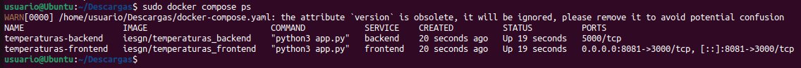

### 🌍 Prueba de Acceso

Podemos acceder a la aplicación a través del navegador ingresando:

```
http://localhost:8081
```

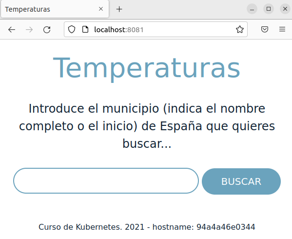

### 🛑 Detener y Eliminar Contenedores

Para detener los contenedores sin eliminarlos:

```bash
sudo docker compose stop
```

Salida esperada:

```bash
[+] Stopping 2/2  
 ✔ Container temperaturas-frontend  Stopped  
 ✔ Container temperaturas-backend   Stopped  
```

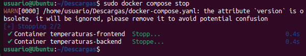

Para eliminar completamente los contenedores y la red:

```bash
sudo docker compose down
```

Salida esperada:

```bash
[+] Running 3/3  
 ✔ Container temperaturas-frontend  Removed  
 ✔ Container temperaturas-backend   Removed  
 ✔ Network temperaturas_default     Removed  
```

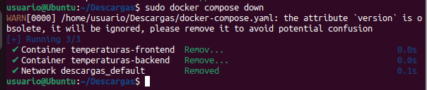

## ✒️ Ejemplo 3: Despliegue de Wordpress + MariaDB

### ⚙️📦 Configuración con Docker Compose usando volumenes Docker

Para definir y gestionar el despliegue de los servicios, utilizaremos el siguiente archivo [`docker-compose.yaml`](https://github.com/josedom24/curso_docker_ies/blob/main/ejemplos/modulo4/ejemplo3/volumen/docker-compose.yaml), este método garantiza que los datos persistan entre reinicios sin necesidad de gestionar manualmente los archivos del sistema host.


```yaml
version: '3.1'
services:
  wordpress:
    container_name: servidor_wp
    image: wordpress
    restart: always
    environment:
      WORDPRESS_DB_HOST: db
      WORDPRESS_DB_USER: user_wp
      WORDPRESS_DB_PASSWORD: asdasd
      WORDPRESS_DB_NAME: bd_wp
    ports:
      - 80:80
    volumes:
      - wordpress_data:/var/www/html/wp-content
  db:
    container_name: servidor_mysql
    image: mariadb
    restart: always
    environment:
      MYSQL_DATABASE: bd_wp
      MYSQL_USER: user_wp
      MYSQL_PASSWORD: asdasd
      MYSQL_ROOT_PASSWORD: asdasd
    volumes:
      - mariadb_data:/var/lib/mysql
volumes:
    wordpress_data:
    mariadb_data:
```

### ⚙️🔗 Configuración con Docker Compose usando Bind Mounts

Para definir y gestionar el despliegue de los servicios, utilizaremos el siguiente archivo [`docker-compose.yaml`](https://github.com/josedom24/curso_docker_ies/blob/main/ejemplos/modulo4/ejemplo3/bindmount/docker-compose.yaml), este método permite gestionar los datos directamente desde el sistema de archivos del host.

```yaml
version: '3.1'
services:
  wordpress:
    container_name: servidor_wp
    image: wordpress
    restart: always
    environment:
      WORDPRESS_DB_HOST: db
      WORDPRESS_DB_USER: user_wp
      WORDPRESS_DB_PASSWORD: asdasd
      WORDPRESS_DB_NAME: bd_wp
    ports:
      - "80:80"
    volumes:
      - ./wordpress:/var/www/html/wp-content
  db:
    container_name: servidor_mysql
    image: mariadb
    restart: always
    environment:
      MYSQL_DATABASE: bd_wp
      MYSQL_USER: user_wp
      MYSQL_PASSWORD: asdasd
      MYSQL_ROOT_PASSWORD: asdasd
    volumes:
      - ./mysql:/var/lib/mysql
```

### 🏗️ Despliegue de la Aplicación

> [!IMPORTANT]  
> Para desplegar la aplicación, ejecutamos el siguiente comando en el directorio donde se encuentra el archivo `docker-compose.yaml`:

```bash
sudo docker compose up -d
```

Salida esperada:

```bash
[+] Running 5/5
 ✔ Network wordpress_default          Created   
 ✔ Volume "wordpress_wordpress_data"  Created   
 ✔ Volume "wordpress_mariadb_data"    Created   
 ✔ Container servidor_mysql           Started   
 ✔ Container servidor_wp              Started   
```

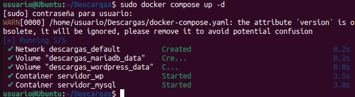

### 📊 Verificación del Despliegue

Para listar los contenedores en ejecución:

```bash
sudo docker compose ps
```

Salida esperada:

```bash
NAME             IMAGE       COMMAND                                     SERVICE     CREATED          STATUS          PORTS
servidor_mysql   mariadb     "docker-entrypoint.sh mariadbd"             db          21 seconds ago   Up 19 seconds   3306/tcp
servidor_wp      wordpress   "docker-entrypoint.sh apache2-foreground"   wordpress   21 seconds ago   Up 19 seconds   0.0.0.0:80->80/tcp, :::80->80/tcp
```

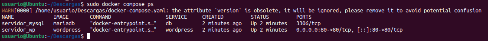

### 🌍 Acceder a WordPress

Una vez desplegado el entorno, podemos acceder a **WordPress** a través del navegador en la siguiente URL:

```
http://localhost
```


## 🐱 Ejemplo 4: Despliegue de Tomcat + Nginx.

### ⚙️ Configuración con Docker Compose

Para definir y gestionar el despliegue de los servicios, utilizaremos el siguiente archivo [`docker-compose.yaml`](https://github.com/josedom24/curso_docker_ies/blob/main/ejemplos/modulo4/ejemplo4/docker-compose.yaml):

```yaml
version: '3.1'
services:
  aplicacionjava:
    container_name: tomcat
    image: tomcat:9.0
    restart: always
    volumes:
      - ./sample.war:/usr/local/tomcat/webapps/sample.war:ro
  proxy:
    container_name: nginx
    image: nginx
    ports:
      - 80:80
    volumes:
      - ./default.conf:/etc/nginx/conf.d/default.conf:ro
```

> [!IMPORTANT]  
> En el mismo directorio en el que se encuentra el archivo `docker-compose.yaml`, tambien debemos de tener:
> - [`default.conf`](https://github.com/josedom24/curso_docker_ies/blob/main/ejemplos/modulo4/ejemplo4/default.conf)
> - [`sample.war`](https://github.com/josedom24/curso_docker_ies/raw/refs/heads/main/ejemplos/modulo4/ejemplo4/sample.war)

### 🏗️ Despliegue de la Aplicación

> [!IMPORTANT]  
> Para desplegar la aplicación, ejecutamos el siguiente comando en el directorio donde se encuentra el archivo `docker-compose.yaml`:

```bash
sudo docker compose up -d
```

Esto creará la red por defecto y levantará los contenedores:

```bash
[+] Running 3/3  
 ✔ Network     descargas_default   Created  
 ✔ Container   tomcat              Started  
 ✔ Container   nginx               Started  
```

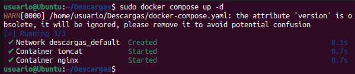

### 📊 Verificar el Estado de los Contenedores

Para listar los contenedores en ejecución:

```bash
sudo docker compose ps
```

Salida esperada:

```bash
NAME    IMAGE       COMMAND                 SERVICE         CREATED             STATUS              PORTS  
nginx   nginx       "/docker-entrypoint.…"  proxy           About a minute ago  Up About a minute   0.0.0.0:80->80/tcp, [::]:80->80/tcp
tomcat  tomcat:9.0  "catalina.sh run"       aplicacionjava  About a minute ago  Up About a minute   8080/tcp
```

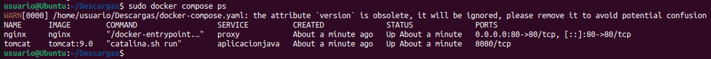

### 🌍 Prueba de Acceso

Podemos acceder a la aplicación a través del navegador ingresando:

```
http://localhost:80
```

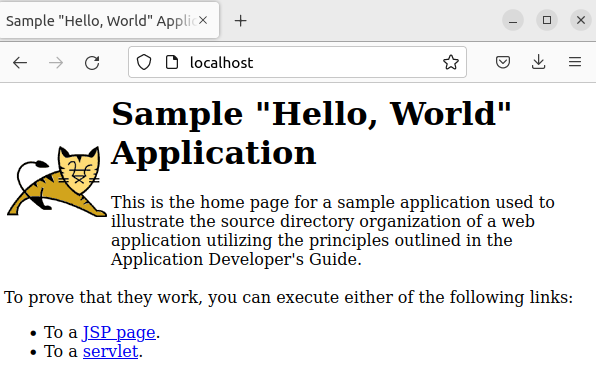

### 🛑 Detener y Eliminar Contenedores

Para detener los contenedores sin eliminarlos:

```bash
sudo docker compose stop
```

Salida esperada:

```bash
[+] Stopping 2/2  
 ✔ Container temperaturas-frontend  Stopped  
 ✔ Container temperaturas-backend   Stopped  
```

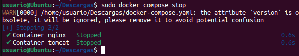

Para eliminar completamente los contenedores y la red:

```bash
sudo docker compose down
```

Salida esperada:

```bash
[+] Running 3/3  
 ✔ Container temperaturas-frontend  Removed  
 ✔ Container temperaturas-backend   Removed  
 ✔ Network temperaturas_default     Removed  
```

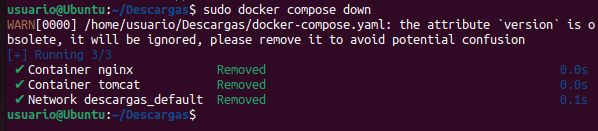