<a href="../readme.md"></a>

<a href="../5/readme.md"></a>

<br>

---

# 🖼️ Creación de Imágenes Docker

<details>

<summary>

## 📌 Indice

</summary>

- [🖼️ Creación de Imágenes Docker](#️-creación-de-imágenes-docker)
  - [📌 Indice](#-indice)
  - [🗑️ Borrar Imágenes Docker](#️-borrar-imágenes-docker)
  - [🏗️ Ejemplo 1: Construcción de imágenes con una página estática](#️-ejemplo-1-construcción-de-imágenes-con-una-página-estática)
    - [🛠️ Versión 1: Desde una Imagen Base](#️-versión-1-desde-una-imagen-base)
    - [🪶 Versión 2: Desde una Imagen con Apache2](#-versión-2-desde-una-imagen-con-apache2)
    - [🌍 Versión 3: Desde una Imagen con Nginx](#-versión-3-desde-una-imagen-con-nginx)
  - [🏗️ Construcción de Imágenes Docker con una Aplicación PHP](#️-construcción-de-imágenes-docker-con-una-aplicación-php)
    - [🛠️ Versión 1: Desde una Imagen Base](#️-versión-1-desde-una-imagen-base-1)
    - [🖥️ Versión 2: Desde una Imagen con PHP Instalado](#️-versión-2-desde-una-imagen-con-php-instalado)

</details>

---

## 🗑️ Borrar Imágenes Docker

> [!TIP]
> Para borrar todas las imagenes de Docker, puedes utilizar el comando
>
> ```bash
> sudo docker ps -aq | xargs sudo docker stop
> ```
> ```bash
> sudo docker ps -aq | xargs sudo docker rm
> ```


## 🏗️ Ejemplo 1: Construcción de imágenes con una página estática

### 🛠️ Versión 1: Desde una Imagen Base

Para esta versión, partimos de una imagen base **Debian** sin servicios adicionales y agregamos manualmente el servidor web **Apache**.

Descargamos los siguientes [archivos](https://downgit.github.io/#/home?url=https://github.com/josedom24/curso_docker_ies/tree/main/ejemplos/modulo5/ejemplo1/version1), estos contienen el fichero `Dockerfile` y un directorio `public_html` con la página web:

Descomprimos el archivo `version1.zip`.

```bash
sudo unzip Descargas/version1.zip
```

```bash
cd version1
ls
```

```bash
Dockerfile  public_html
```

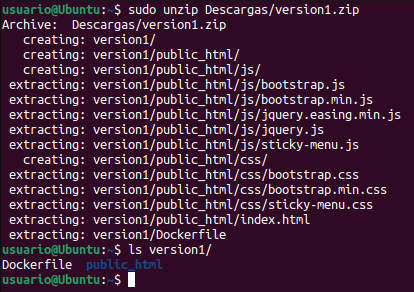

El `Dockerfile` será:

```dockerfile
# syntax=docker/dockerfile:1
FROM debian:stable-slim
RUN apt-get update && apt-get install -y apache2 && apt-get clean && rm -rf /var/lib/apt/lists/*
WORKDIR /var/www/html/
COPY public_html .
EXPOSE 80
CMD apache2ctl -D FOREGROUND
```

Para crear la imagen:

> [!IMPORTANT]  
> Para crear la imagen, debemos estar en el directorio donde se encuentra el archivo `Dockerfile`.

```bash
sudo docker build -t josedom24/ejemplo1:v1 .
```

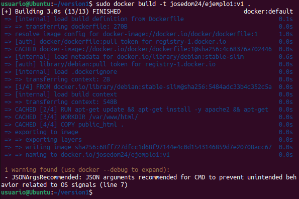

Verificamos que la imagen se ha creado:

```bash
sudo docker images
```

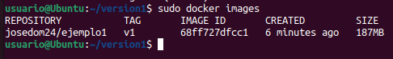

Ejecutamos un contenedor:

```bash
sudo docker run -d -p 80:80 --name ejemplo1 josedom24/ejemplo1:v1
```

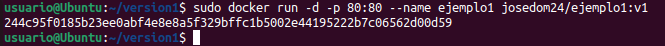

Comprobamos `http://localhost:80`

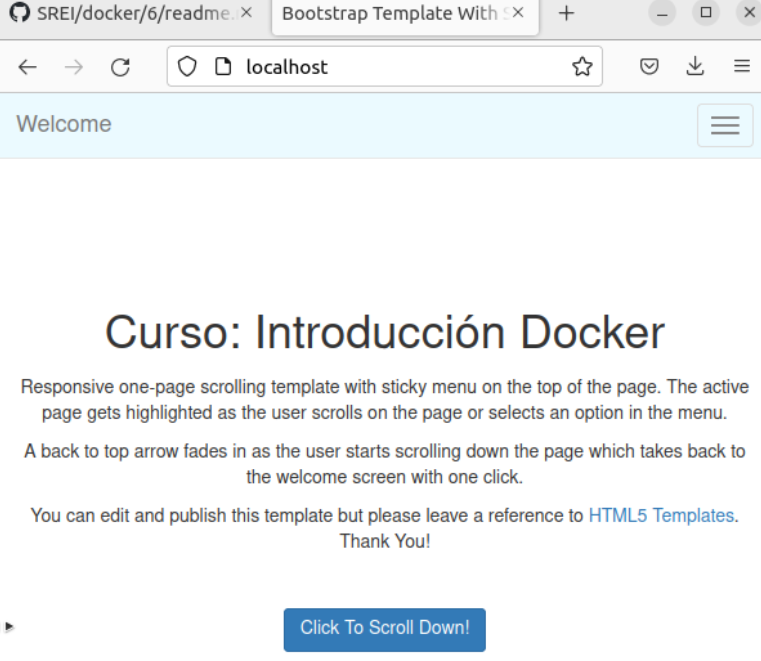

---

### 🪶 Versión 2: Desde una Imagen con Apache2

Descargamos los siguientes [archivos](https://downgit.github.io/#/home?url=https://github.com/josedom24/curso_docker_ies/tree/main/ejemplos/modulo5/ejemplo1/version2), estos contienen el fichero `Dockerfile` y un directorio `public_html` con la página web:

Descomprimos el archivo `version2.zip`.

```bash
sudo unzip Descargas/version2.zip
```

```bash
cd version2
ls
```

```bash
Dockerfile  public_html
```

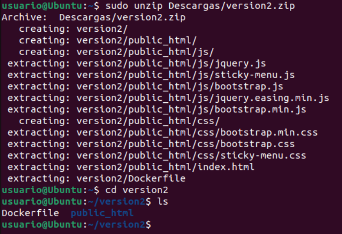

`Dockerfile` para esta versión:

```dockerfile
# syntax=docker/dockerfile:1
FROM httpd:2.4
COPY public_html /usr/local/apache2/htdocs/
EXPOSE 80
```

Construcción y ejecución:

> [!IMPORTANT]  
> Para crear la imagen, debemos estar en el directorio donde se encuentra el archivo `Dockerfile`.

```bash
sudo docker build -t josedom24/ejemplo1:v2 .
```

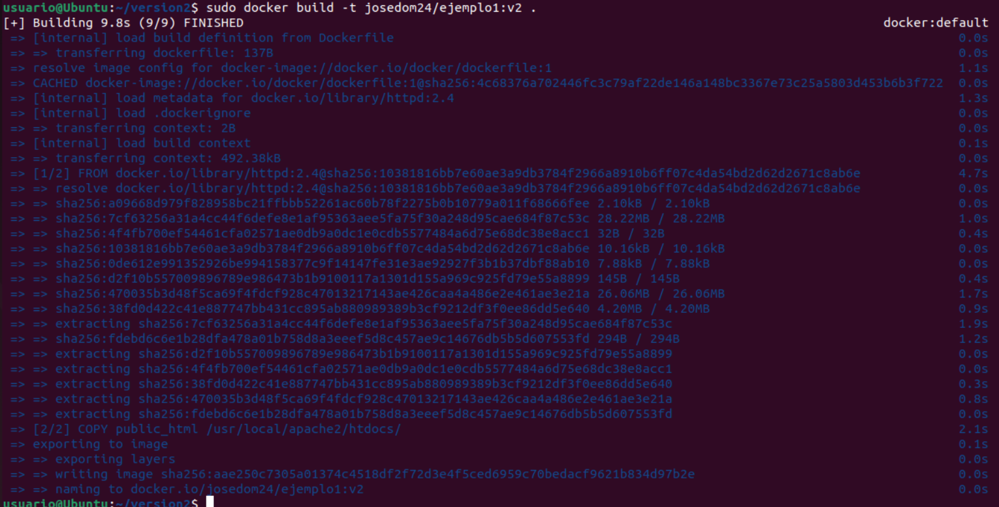

```bash
sudo docker run -d -p 80:80 --name ejemplo1 josedom24/ejemplo1:v2
```

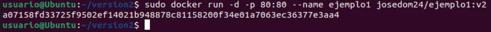

Comprobamos `http://localhost:80`

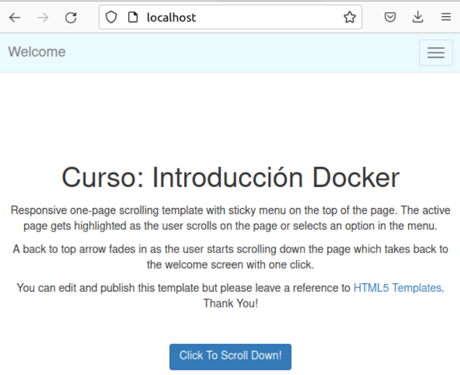

### 🌍 Versión 3: Desde una Imagen con Nginx
Descargamos los siguientes [archivos](https://downgit.github.io/#/home?url=https://github.com/josedom24/curso_docker_ies/tree/main/ejemplos/modulo5/ejemplo1/version3), estos contienen el fichero `Dockerfile` y un directorio `public_html` con la página web:

Descomprimos el archivo `version2.zip`.

```bash
sudo unzip Descargas/version3.zip
```

```bash
cd version3
ls
```

```bash
Dockerfile  public_html
```

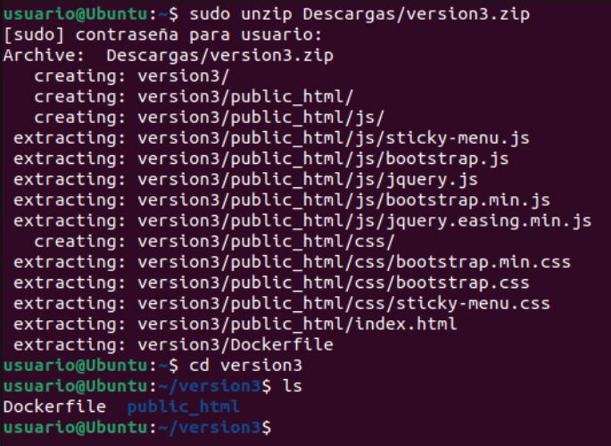

`Dockerfile` para esta versión:

```dockerfile
# syntax=docker/dockerfile:1
FROM nginx:1.24
COPY public_html /usr/share/nginx/html
EXPOSE 80
```

Construcción y ejecución:

> [!IMPORTANT]  
> Para crear la imagen, debemos estar en el directorio donde se encuentra el archivo `Dockerfile`.

```bash
sudo docker build -t josedom24/ejemplo1:v3 .
```

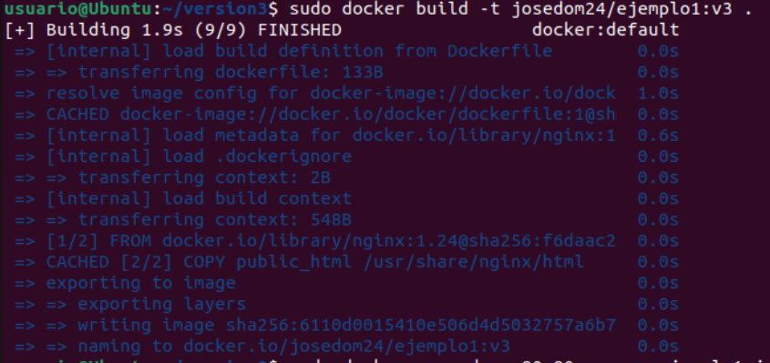

```bash
sudo docker run -d -p 80:80 --name ejemplo1 josedom24/ejemplo1:v3
```

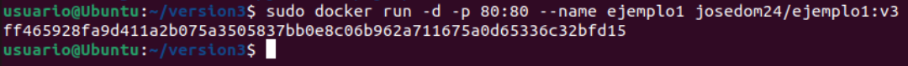


## 🏗️ Construcción de Imágenes Docker con una Aplicación PHP

### 🛠️ Versión 1: Desde una Imagen Base

Para este enfoque, en el directorio del proyecto tenemos el fichero `Dockerfile` y un directorio llamado `app` con nuestra aplicación.

Descargamos los siguientes [archivos](https://downgit.github.io/#/home?url=https://github.com/josedom24/curso_docker_ies/tree/main/ejemplos/modulo5/ejemplo2/version1), estos contienen el fichero `Dockerfile` y un directorio `public_html` con la página web:

Descomprimos el archivo `version1.zip`.

```bash
sudo unzip Descargas/version1.zip
```

```bash
cd version1
ls
```

```bash
Dockerfile  public_html
```

El contenido del `Dockerfile` es el siguiente:

```dockerfile
# syntax=docker/dockerfile:1
FROM debian:stable-slim
RUN apt-get update && apt-get install -y apache2 libapache2-mod-php7.4 php7.4 \
    && apt-get clean && rm -rf /var/lib/apt/lists/* && rm /var/www/html/index.html
COPY app /var/www/html/
EXPOSE 80
CMD apache2ctl -D FOREGROUND
```

Explicación

- Usamos `debian:stable-slim` como imagen base.
- Instalamos **Apache** y **PHP** junto con las librerías necesarias.
- Eliminamos el archivo `index.html` por defecto de Apache.
- Copiamos la aplicación desde el directorio `app` al contenedor.
- Exponemos el puerto **80** para el acceso HTTP.
- Definimos el comando para ejecutar Apache en segundo plano.

Construcción y Ejecución

Para construir la imagen ejecutamos:

```bash
$ docker build -t josedom24/ejemplo2:v1 .
```

Comprobamos que la imagen se ha creado correctamente:

```bash
$ docker images
REPOSITORY             TAG    IMAGE ID       CREATED         SIZE
josedom24/ejemplo2     v1     8c3275799063   1 minute ago   226MB
```

Creamos y ejecutamos un contenedor basado en la imagen:

```bash
$ docker run -d -p 80:80 --name ejemplo2 josedom24/ejemplo2:v1
```

Ahora podemos acceder a nuestra página en el navegador.

La aplicación incluye un archivo `info.php` que nos proporciona información sobre PHP. En esta versión, observamos que estamos usando **PHP 7.4**.

---

### 🖥️ Versión 2: Desde una Imagen con PHP Instalado

Descargamos los siguientes [archivos](https://downgit.github.io/#/home?url=https://github.com/josedom24/curso_docker_ies/tree/main/ejemplos/modulo5/ejemplo2/version2), estos contienen el fichero `Dockerfile` y un directorio `public_html` con la página web:

Descomprimos el archivo `version2.zip`.

```bash
sudo unzip Descargas/version2.zip
```

```bash
cd version2
ls
```

```bash
Dockerfile  public_html
```


En este caso, utilizamos una imagen de Docker que ya incluye **Apache y PHP**. El `Dockerfile` es más simple:

```dockerfile
# syntax=docker/dockerfile:1
FROM php:7.4-apache
COPY app /var/www/html/
EXPOSE 80
```

Explicación

- Usamos `php:7.4-apache`, que ya tiene PHP y Apache instalados.
- Copiamos la aplicación en el directorio correcto.
- Exponemos el puerto **80**.
- No es necesario definir el `CMD`, ya que la imagen base ejecuta Apache por defecto.

Construcción y Ejecución

```bash
$ docker build -t josedom24/ejemplo2:v2 .
$ docker run -d -p 80:80 --name ejemplo2 josedom24/ejemplo2:v2
```

Podemos acceder al archivo `info.php` para comprobar la versión de PHP en uso.

